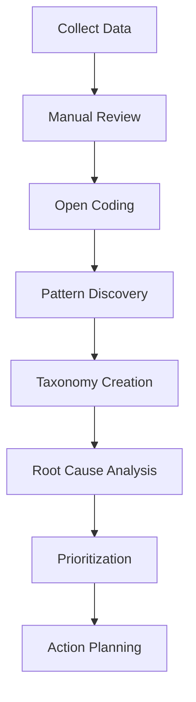

# Three Gulfs - Analyze Phase

## Overview

The Analyze phase is the foundation of the Three Gulfs Framework. It transforms vague intuitions about system behavior into concrete, actionable insights through systematic data examination.

## Core Principle

> "You cannot improve what you don't understand, and you cannot understand what you don't analyze."

This phase rejects "vibes-based" assessment in favor of rigorous, systematic analysis.

## The Analysis Workflow



## Step 1: Data Collection

### Setting Up Comprehensive Logging

```python
class InteractionLogger:
    """Log everything needed for analysis"""
    
    def log_interaction(self, interaction):
        log_entry = {
            # Identifiers
            "id": generate_uuid(),
            "timestamp": datetime.utcnow().isoformat(),
            "session_id": interaction.session_id,
            "user_id": hash_user_id(interaction.user_id),
            
            # Input
            "user_input": interaction.user_input,
            "input_length": len(interaction.user_input),
            "input_type": classify_input(interaction.user_input),
            
            # Context
            "conversation_history": interaction.history,
            "user_metadata": {
                "account_type": interaction.user.account_type,
                "usage_frequency": interaction.user.usage_frequency,
                "first_time_user": interaction.user.is_new
            },
            
            # Processing
            "prompt_template": interaction.prompt_template_id,
            "prompt_version": interaction.prompt_version,
            "model_name": interaction.model,
            "model_parameters": {
                "temperature": interaction.temperature,
                "max_tokens": interaction.max_tokens
            },
            
            # Output
            "model_output": interaction.output,
            "output_length": len(interaction.output),
            "confidence_score": interaction.confidence,
            
            # Performance
            "latency_ms": interaction.latency,
            "token_count": interaction.tokens_used,
            "api_calls": interaction.api_call_count,
            
            # Outcome
            "user_feedback": interaction.feedback,
            "goal_achieved": interaction.goal_completed,
            "escalated": interaction.was_escalated,
            "error_occurred": interaction.error is not None,
            "error_type": classify_error(interaction.error)
        }
        
        # Store in multiple places for redundancy
        self.write_to_database(log_entry)
        self.write_to_file(log_entry)
        self.send_to_analytics(log_entry)
        
        return log_entry
```

### Sampling Strategy

```python
class DataSampler:
    """Strategic sampling for analysis"""
    
    def get_analysis_sample(self, size=1000):
        """Get representative sample for analysis"""
        
        samples = []
        
        # Stratified sampling by key dimensions
        strata = {
            "user_type": ["new", "regular", "power"],
            "input_length": ["short", "medium", "long"],
            "time_period": ["peak", "normal", "off-peak"],
            "outcome": ["success", "failure", "partial"]
        }
        
        # Calculate samples per stratum
        strata_size = size // (
            len(strata["user_type"]) * 
            len(strata["input_length"]) * 
            len(strata["time_period"]) * 
            len(strata["outcome"])
        )
        
        # Sample from each stratum
        for user_type in strata["user_type"]:
            for input_length in strata["input_length"]:
                for time_period in strata["time_period"]:
                    for outcome in strata["outcome"]:
                        stratum_samples = self.query_samples(
                            user_type=user_type,
                            input_length=input_length,
                            time_period=time_period,
                            outcome=outcome,
                            limit=strata_size
                        )
                        samples.extend(stratum_samples)
        
        # Add random sample to catch unexpected patterns
        random_samples = self.get_random_samples(size // 10)
        samples.extend(random_samples)
        
        return samples
```

## Step 2: Manual Review Process

### Creating a Data Viewer

```python
class DataViewer:
    """Interface for manual data review"""
    
    def display_interaction(self, interaction):
        """Show interaction in readable format"""
        
        print("=" * 80)
        print(f"ID: {interaction['id']}")
        print(f"Time: {interaction['timestamp']}")
        print(f"User Type: {interaction['user_metadata']['account_type']}")
        print("-" * 40)
        
        print(f"INPUT ({interaction['input_length']} chars):")
        print(interaction['user_input'])
        print("-" * 40)
        
        if interaction.get('conversation_history'):
            print("CONTEXT:")
            for msg in interaction['conversation_history'][-3:]:
                print(f"  {msg['role']}: {msg['content'][:100]}...")
            print("-" * 40)
        
        print(f"OUTPUT ({interaction['output_length']} chars):")
        print(interaction['model_output'])
        print("-" * 40)
        
        print(f"OUTCOME:")
        print(f"  Goal Achieved: {interaction['goal_achieved']}")
        print(f"  User Feedback: {interaction['user_feedback']}")
        print(f"  Escalated: {interaction['escalated']}")
        print(f"  Error: {interaction['error_type']}")
        print("=" * 80)
    
    def annotate_interaction(self, interaction):
        """Allow manual annotation"""
        
        self.display_interaction(interaction)
        
        annotation = {
            "interaction_id": interaction['id'],
            "annotator": get_current_user(),
            "timestamp": datetime.now(),
            "quality": input("Quality (1-5): "),
            "error_category": input("Error Category (or 'none'): "),
            "notes": input("Notes: "),
            "needs_followup": input("Needs Followup? (y/n): ") == 'y'
        }
        
        return annotation
```

### Review Protocol

```python
def conduct_review_session(samples, reviewer):
    """Structured review session"""
    
    annotations = []
    patterns_noticed = []
    
    print(f"Review Session: {len(samples)} samples")
    print("Instructions: Look for patterns, not individual issues")
    print("-" * 80)
    
    for i, sample in enumerate(samples):
        print(f"\nSample {i+1}/{len(samples)}")
        
        # Display
        viewer.display_interaction(sample)
        
        # Quick assessment
        quick_assessment = input("""
        Quick Assessment:
        1. Success - Works as intended
        2. Partial - Some issues
        3. Failure - Doesn't work
        4. Skip - Not sure
        
        Choice: """)
        
        if quick_assessment in ['2', '3']:
            # Detailed annotation for problems
            annotation = viewer.annotate_interaction(sample)
            annotations.append(annotation)
            
            # Check for patterns
            if len(annotations) > 5:
                pattern = input("Seeing a pattern? Describe it: ")
                if pattern:
                    patterns_noticed.append({
                        "pattern": pattern,
                        "first_seen": annotations[-5]["interaction_id"],
                        "examples": [a["interaction_id"] for a in annotations[-5:]]
                    })
        
        # Progress check
        if i % 20 == 0 and i > 0:
            print(f"\nProgress: {i}/{len(samples)}")
            print(f"Issues found: {len(annotations)}")
            print(f"Patterns identified: {len(patterns_noticed)}")
            
            if input("Take a break? (y/n): ") == 'y':
                break
    
    return annotations, patterns_noticed
```

## Step 3: Open Coding Process

### Initial Observation Phase

```python
class OpenCoder:
    """Open coding for pattern discovery"""
    
    def __init__(self):
        self.observations = []
        self.emerging_codes = []
    
    def observe(self, interaction, annotation):
        """Record raw observation without categories"""
        
        observation = {
            "id": generate_id(),
            "interaction_id": interaction["id"],
            "observation": annotation["notes"],
            "quality_score": annotation["quality"],
            "timestamp": annotation["timestamp"]
        }
        
        self.observations.append(observation)
        
        # No categories yet - just raw observations
        print(f"Observation {len(self.observations)}: {observation['observation']}")
    
    def find_patterns(self, min_frequency=3):
        """Identify recurring themes"""
        
        # Extract key phrases
        phrases = []
        for obs in self.observations:
            # Simple keyword extraction
            words = obs["observation"].lower().split()
            bigrams = [f"{words[i]} {words[i+1]}" 
                      for i in range(len(words)-1)]
            phrases.extend(words + bigrams)
        
        # Count frequencies
        phrase_counts = Counter(phrases)
        
        # Identify patterns
        patterns = []
        for phrase, count in phrase_counts.most_common(50):
            if count >= min_frequency:
                # Find observations containing this phrase
                matching_obs = [
                    obs for obs in self.observations 
                    if phrase in obs["observation"].lower()
                ]
                
                patterns.append({
                    "phrase": phrase,
                    "frequency": count,
                    "observations": matching_obs[:5]  # Sample
                })
        
        return patterns
```

### Axial Coding Phase

```python
class AxialCoder:
    """Group observations into themes"""
    
    def __init__(self, observations):
        self.observations = observations
        self.themes = defaultdict(list)
    
    def create_initial_themes(self):
        """First pass at grouping"""
        
        theme_keywords = {
            "date_time_issues": ["date", "time", "schedule", "calendar", "tomorrow", "week"],
            "format_problems": ["format", "json", "structure", "output", "response"],
            "missing_info": ["missing", "incomplete", "partial", "forgot", "didn't include"],
            "wrong_tone": ["tone", "rude", "casual", "formal", "inappropriate"],
            "hallucination": ["made up", "false", "incorrect", "wrong", "invented"],
            "context_loss": ["forgot", "context", "earlier", "mentioned", "conversation"],
            "instruction_drift": ["didn't follow", "ignored", "different", "instructions"]
        }
        
        # Assign observations to themes
        for obs in self.observations:
            obs_text = obs["observation"].lower()
            
            assigned = False
            for theme, keywords in theme_keywords.items():
                if any(keyword in obs_text for keyword in keywords):
                    self.themes[theme].append(obs)
                    assigned = True
                    break
            
            if not assigned:
                self.themes["other"].append(obs)
        
        return self.themes
    
    def refine_themes(self):
        """Iterative refinement of themes"""
        
        print("\nInitial Theme Distribution:")
        for theme, observations in self.themes.items():
            print(f"  {theme}: {len(observations)} observations")
        
        # Merge similar themes
        merges = {
            "instruction_drift": "format_problems",
            "context_loss": "missing_info"
        }
        
        for old_theme, new_theme in merges.items():
            if old_theme in self.themes:
                self.themes[new_theme].extend(self.themes[old_theme])
                del self.themes[old_theme]
        
        # Split large themes
        if len(self.themes["other"]) > 50:
            # Re-examine "other" category
            other_obs = self.themes["other"]
            del self.themes["other"]
            
            # Manual review to create new themes
            print("\nReview 'other' category for new themes...")
            new_themes = self.manually_categorize(other_obs)
            self.themes.update(new_themes)
        
        return self.themes
```

## Step 4: Creating Error Taxonomy

### Final Taxonomy Structure

```python
class ErrorTaxonomy:
    """Structured error categorization"""
    
    def __init__(self):
        self.taxonomy = {
            "1_factual_errors": {
                "1.1_hallucination": {
                    "description": "Model invents information",
                    "examples": [],
                    "frequency": 0,
                    "severity": "high"
                },
                "1.2_outdated": {
                    "description": "Uses outdated information",
                    "examples": [],
                    "frequency": 0,
                    "severity": "medium"
                },
                "1.3_incorrect": {
                    "description": "Wrong but plausible information",
                    "examples": [],
                    "frequency": 0,
                    "severity": "high"
                }
            },
            "2_instruction_failures": {
                "2.1_format_violation": {
                    "description": "Doesn't follow output format",
                    "examples": [],
                    "frequency": 0,
                    "severity": "medium"
                },
                "2.2_constraint_violation": {
                    "description": "Violates specified constraints",
                    "examples": [],
                    "frequency": 0,
                    "severity": "medium"
                },
                "2.3_scope_creep": {
                    "description": "Answers beyond scope",
                    "examples": [],
                    "frequency": 0,
                    "severity": "low"
                }
            },
            "3_comprehension_failures": {
                "3.1_misunderstanding": {
                    "description": "Misinterprets user intent",
                    "examples": [],
                    "frequency": 0,
                    "severity": "high"
                },
                "3.2_partial_response": {
                    "description": "Addresses only part of query",
                    "examples": [],
                    "frequency": 0,
                    "severity": "medium"
                },
                "3.3_context_ignorance": {
                    "description": "Ignores conversation context",
                    "examples": [],
                    "frequency": 0,
                    "severity": "medium"
                }
            },
            "4_quality_issues": {
                "4.1_verbosity": {
                    "description": "Too long or too short",
                    "examples": [],
                    "frequency": 0,
                    "severity": "low"
                },
                "4.2_tone_mismatch": {
                    "description": "Wrong tone for audience",
                    "examples": [],
                    "frequency": 0,
                    "severity": "low"
                },
                "4.3_poor_structure": {
                    "description": "Badly organized response",
                    "examples": [],
                    "frequency": 0,
                    "severity": "low"
                }
            }
        }
    
    def categorize_error(self, observation):
        """Assign observation to taxonomy category"""
        
        # Show categories
        print("\nError Categories:")
        for major_cat, subcats in self.taxonomy.items():
            print(f"\n{major_cat}:")
            for subcat, details in subcats.items():
                print(f"  {subcat}: {details['description']}")
        
        # Get assignment
        category = input("\nCategory for this error: ")
        
        # Update taxonomy
        if category in self.get_all_categories():
            major, minor = category.split("_", 1)
            self.taxonomy[major][category]["examples"].append(observation)
            self.taxonomy[major][category]["frequency"] += 1
        
        return category
```

## Step 5: Pattern Analysis

### Statistical Analysis

```python
class PatternAnalyzer:
    """Analyze patterns in errors"""
    
    def analyze_distributions(self, categorized_errors):
        """Find patterns in error distribution"""
        
        analyses = {}
        
        # Frequency analysis
        analyses["frequency"] = self.frequency_analysis(categorized_errors)
        
        # Temporal analysis
        analyses["temporal"] = self.temporal_analysis(categorized_errors)
        
        # User segment analysis
        analyses["segments"] = self.segment_analysis(categorized_errors)
        
        # Correlation analysis
        analyses["correlations"] = self.correlation_analysis(categorized_errors)
        
        return analyses
    
    def frequency_analysis(self, errors):
        """Pareto analysis of errors"""
        
        category_counts = Counter([e["category"] for e in errors])
        total = sum(category_counts.values())
        
        # Sort by frequency
        sorted_cats = category_counts.most_common()
        
        # Calculate cumulative percentage
        cumulative = 0
        pareto_analysis = []
        
        for category, count in sorted_cats:
            percentage = (count / total) * 100
            cumulative += percentage
            
            pareto_analysis.append({
                "category": category,
                "count": count,
                "percentage": percentage,
                "cumulative": cumulative
            })
            
            # Find 80% threshold
            if cumulative >= 80 and "pareto_cutoff" not in locals():
                pareto_cutoff = len(pareto_analysis)
        
        return {
            "distribution": pareto_analysis,
            "pareto_cutoff": pareto_cutoff,
            "top_issues": pareto_analysis[:pareto_cutoff]
        }
    
    def temporal_analysis(self, errors):
        """Analyze error patterns over time"""
        
        # Group by hour of day
        by_hour = defaultdict(list)
        for error in errors:
            hour = datetime.fromisoformat(error["timestamp"]).hour
            by_hour[hour].append(error)
        
        # Calculate error rates by hour
        hourly_rates = {}
        for hour, hour_errors in by_hour.items():
            total_interactions = self.get_total_interactions_for_hour(hour)
            hourly_rates[hour] = len(hour_errors) / total_interactions
        
        # Find patterns
        peak_hours = [h for h, rate in hourly_rates.items() 
                     if rate > np.mean(list(hourly_rates.values())) + np.std(list(hourly_rates.values()))]
        
        return {
            "hourly_rates": hourly_rates,
            "peak_error_hours": peak_hours,
            "pattern": "Higher errors during peak hours" if peak_hours else "No temporal pattern"
        }
```

### Root Cause Analysis

```python
class RootCauseAnalyzer:
    """Identify root causes of failures"""
    
    def analyze_failure_chain(self, interaction):
        """Trace failure back to root cause"""
        
        failure_chain = []
        
        # Check input issues
        input_issues = self.check_input_issues(interaction)
        if input_issues:
            failure_chain.append({
                "stage": "input",
                "issues": input_issues
            })
        
        # Check prompt issues
        prompt_issues = self.check_prompt_issues(interaction)
        if prompt_issues:
            failure_chain.append({
                "stage": "prompt",
                "issues": prompt_issues
            })
        
        # Check model issues
        model_issues = self.check_model_issues(interaction)
        if model_issues:
            failure_chain.append({
                "stage": "model",
                "issues": model_issues
            })
        
        # Check output issues
        output_issues = self.check_output_issues(interaction)
        if output_issues:
            failure_chain.append({
                "stage": "output",
                "issues": output_issues
            })
        
        # Identify root cause
        if failure_chain:
            root_cause = failure_chain[0]  # First issue in chain
        else:
            root_cause = {"stage": "unknown", "issues": ["No clear cause identified"]}
        
        return {
            "chain": failure_chain,
            "root_cause": root_cause,
            "classification": self.classify_root_cause(root_cause)
        }
    
    def classify_root_cause(self, root_cause):
        """Classify into gulf"""
        
        gulf_mapping = {
            "input": "comprehension",
            "prompt": "specification",
            "model": "generalization",
            "output": "specification"
        }
        
        return gulf_mapping.get(root_cause["stage"], "unknown")
```

## Step 6: Prioritization

### Impact vs Effort Matrix

```python
class PrioritizationMatrix:
    """Prioritize improvements"""
    
    def prioritize_issues(self, analyzed_errors):
        """Create impact/effort matrix"""
        
        priorities = []
        
        for category, details in analyzed_errors.items():
            impact = self.calculate_impact(details)
            effort = self.estimate_effort(category)
            
            priorities.append({
                "category": category,
                "impact": impact,
                "effort": effort,
                "score": impact / max(effort, 1),  # ROI score
                "frequency": details["frequency"],
                "severity": details["severity"]
            })
        
        # Sort by ROI score
        priorities.sort(key=lambda x: x["score"], reverse=True)
        
        # Classify into quadrants
        quadrants = {
            "quick_wins": [],     # High impact, low effort
            "major_projects": [], # High impact, high effort
            "fill_ins": [],      # Low impact, low effort
            "avoid": []          # Low impact, high effort
        }
        
        median_impact = np.median([p["impact"] for p in priorities])
        median_effort = np.median([p["effort"] for p in priorities])
        
        for priority in priorities:
            if priority["impact"] >= median_impact:
                if priority["effort"] <= median_effort:
                    quadrants["quick_wins"].append(priority)
                else:
                    quadrants["major_projects"].append(priority)
            else:
                if priority["effort"] <= median_effort:
                    quadrants["fill_ins"].append(priority)
                else:
                    quadrants["avoid"].append(priority)
        
        return quadrants
```

## Analysis Best Practices

### 1. Regular Cadence

```python
analysis_schedule = {
    "daily": {
        "sample_size": 20,
        "focus": "New errors",
        "time_required": "30 minutes"
    },
    "weekly": {
        "sample_size": 200,
        "focus": "Pattern identification",
        "time_required": "2 hours"
    },
    "monthly": {
        "sample_size": 1000,
        "focus": "Comprehensive analysis",
        "time_required": "1 day"
    }
}
```

### 2. Team Involvement

```python
review_assignments = {
    "engineers": "Technical errors, performance issues",
    "domain_experts": "Accuracy, completeness",
    "product_managers": "User experience, business impact",
    "support_team": "Common complaints, confusion points"
}
```

### 3. Documentation

```python
def document_analysis_session(session_data):
    """Create analysis report"""
    
    report = {
        "session_id": session_data["id"],
        "date": session_data["date"],
        "participants": session_data["reviewers"],
        "sample_size": session_data["sample_size"],
        
        "findings": {
            "new_patterns": session_data["new_patterns"],
            "confirmed_patterns": session_data["confirmed_patterns"],
            "invalidated_patterns": session_data["invalidated_patterns"]
        },
        
        "taxonomy_updates": session_data["taxonomy_changes"],
        
        "insights": session_data["key_insights"],
        
        "recommendations": session_data["recommendations"],
        
        "next_steps": session_data["action_items"]
    }
    
    save_report(report)
    share_with_team(report)
    
    return report
```

## Common Pitfalls

### ❌ Analysis Paralysis
Endless analysis without action

**Solution**: Time-box analysis, act on findings

### ❌ Confirmation Bias
Only seeing expected patterns

**Solution**: Multiple reviewers, blind review

### ❌ Over-Categorization
Too many categories to be useful

**Solution**: Max 10-15 categories, group rest

### ❌ Ignoring Positive Patterns
Only focusing on failures

**Solution**: Also analyze what works well

## Success Metrics

Analysis phase is successful when:

1. **Pattern Clarity**: Can predict failure modes
2. **Taxonomy Stability**: Categories don't change weekly
3. **Team Alignment**: Everyone understands issues
4. **Actionable Insights**: Clear improvement path
5. **Reduced Surprises**: Fewer unexpected failures

## Next Steps

After analysis:
1. Move to [[Three Gulfs - Measure Phase|Measurement]]
2. Implement [[Three Gulfs - Improve Phase|Improvements]]
3. Create [[Three Gulfs - Error Analysis Templates|Templates]]

## Related Resources

- [[Data Analysis Best Practices]]
- [[Open Coding Methodology]]
- [[Root Cause Analysis]]
- [[Three Gulfs Framework - Overview]]

---

*"The goal of analysis isn't perfection – it's understanding. With understanding comes the power to improve."*