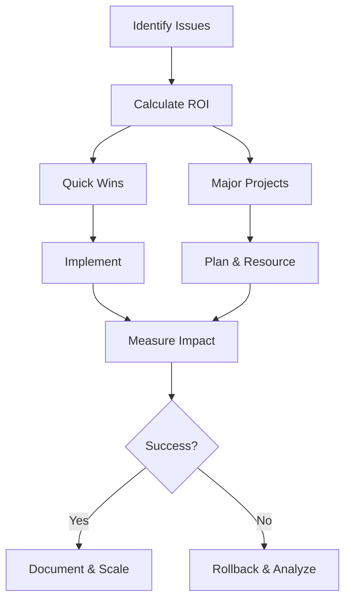

# Three Gulfs - Improve Phase

## Overview

The Improve phase transforms insights from Analysis and Measurement into concrete system enhancements. This phase emphasizes systematic, measured improvements over random changes.

## Core Principle

> "Improve one thing at a time, measure the impact, then move to the next."

Resist the temptation to change everything at once - it makes it impossible to know what actually helped.

## Improvement Priority Framework



## ROI-Driven Prioritization

### The Improvement Equation

```python
def calculate_improvement_roi(issue):
    """Calculate return on investment for fixing an issue"""
    
    # Impact = Frequency × Severity × Business Value
    impact = (
        issue.frequency_per_day *
        issue.severity_score *     # 1-5 scale
        issue.business_impact      # Dollar value or importance
    )
    
    # Effort = Development Time + Testing + Deployment
    effort = (
        issue.dev_hours +
        issue.test_hours +
        issue.deploy_hours
    )
    
    # ROI = Impact / Effort
    roi = impact / max(effort, 1)
    
    # Confidence adjustment
    roi *= issue.confidence_in_solution  # 0-1 scale
    
    return {
        "issue": issue.name,
        "roi_score": roi,
        "impact": impact,
        "effort": effort,
        "priority": classify_priority(roi)
    }

def classify_priority(roi):
    if roi > 100:
        return "immediate"
    elif roi > 10:
        return "high"
    elif roi > 1:
        return "medium"
    else:
        return "low"
```

### Quick Wins vs Major Projects

```python
improvements = {
    "quick_wins": [
        # High impact, low effort (< 1 day)
        {
            "issue": "Date parsing failures",
            "solution": "Add few-shot examples",
            "effort_hours": 2,
            "expected_improvement": "30% reduction in date errors"
        },
        {
            "issue": "JSON format drift",
            "solution": "Add schema validation",
            "effort_hours": 4,
            "expected_improvement": "95% format compliance"
        }
    ],
    
    "major_projects": [
        # High impact, high effort (> 1 week)
        {
            "issue": "Hallucination on technical topics",
            "solution": "Implement RAG system",
            "effort_hours": 80,
            "expected_improvement": "60% reduction in factual errors"
        },
        {
            "issue": "Complex multi-step failures",
            "solution": "Task decomposition architecture",
            "effort_hours": 120,
            "expected_improvement": "70% success on complex tasks"
        }
    ]
}
```

## Improvement Strategies by Gulf

### Gulf of Comprehension Improvements

```python
class ComprehensionImprovements:
    """Improvements for understanding your data"""
    
    def improve_logging(self):
        """Enhanced logging for better visibility"""
        
        improvements = [
            # Add missing fields
            {
                "change": "Add confidence scores to logs",
                "implementation": """
                log_entry['confidence'] = model_response.confidence
                log_entry['uncertainty_flags'] = identify_uncertainty(response)
                """
            },
            
            # Improve structure
            {
                "change": "Standardize log format",
                "implementation": """
                use_structured_logging(
                    format='json',
                    schema=STANDARD_SCHEMA,
                    validation=True
                )
                """
            },
            
            # Add context
            {
                "change": "Include full conversation context",
                "implementation": """
                log_entry['full_context'] = {
                    'conversation': conversation.to_dict(),
                    'user_profile': user.get_profile(),
                    'session_data': session.get_metadata()
                }
                """
            }
        ]
        
        return improvements
    
    def improve_data_viewer(self):
        """Better tools for data review"""
        
        viewer_upgrades = """
        // Before: Basic text display
        console.log(interaction);
        
        // After: Rich interactive viewer
        <InteractionViewer
            data={interaction}
            features={[
                'syntax_highlighting',
                'diff_view',
                'annotation_tools',
                'pattern_search',
                'export_options'
            ]}
            onAnnotate={saveAnnotation}
            onPattern={detectPattern}
        />
        """
        
        return viewer_upgrades
```

### Gulf of Specification Improvements

```python
class SpecificationImprovements:
    """Improvements for prompt engineering"""
    
    def iterative_prompt_refinement(self, current_prompt, error_analysis):
        """Systematic prompt improvement"""
        
        # Version 1: Baseline
        v1 = current_prompt
        
        # Version 2: Add examples for top errors
        v2 = self.add_few_shot_examples(v1, error_analysis.top_3_errors)
        
        # Version 3: Add explicit constraints
        v3 = self.add_constraints(v2, error_analysis.boundary_violations)
        
        # Version 4: Add output format specification
        v4 = self.add_format_spec(v3, error_analysis.format_issues)
        
        # Version 5: Add error handling
        v5 = self.add_error_handling(v4, error_analysis.edge_cases)
        
        return {
            "versions": [v1, v2, v3, v4, v5],
            "test_each": True,
            "rollback_if_worse": True
        }
    
    def add_few_shot_examples(self, prompt, top_errors):
        """Add examples for common errors"""
        
        examples = []
        for error in top_errors:
            example = f"""
            Example {len(examples) + 1}:
            Input: {error.sample_input}
            Correct Output: {error.expected_output}
            Explanation: {error.why_correct}
            """
            examples.append(example)
        
        improved_prompt = f"""
        {prompt}
        
        Here are examples of correct handling:
        {''.join(examples)}
        """
        
        return improved_prompt
    
    def add_constraints(self, prompt, violations):
        """Add explicit constraints"""
        
        constraints = []
        for violation in violations:
            if violation.type == "scope":
                constraints.append(f"NEVER answer about {violation.topic}")
            elif violation.type == "format":
                constraints.append(f"ALWAYS use {violation.required_format}")
            elif violation.type == "length":
                constraints.append(f"LIMIT responses to {violation.max_length}")
        
        improved_prompt = f"""
        {prompt}
        
        Critical Constraints:
        {chr(10).join(f'- {c}' for c in constraints)}
        
        If you cannot satisfy these constraints, respond with:
        "I cannot complete this request within the specified constraints."
        """
        
        return improved_prompt
```

### Gulf of Generalization Improvements

```python
class GeneralizationImprovements:
    """Architectural improvements for robustness"""
    
    def implement_rag(self, knowledge_gaps):
        """Add retrieval for knowledge gaps"""
        
        rag_implementation = {
            "vector_store": {
                "type": "pinecone",
                "dimension": 1536,
                "metric": "cosine",
                "index_name": "knowledge_base"
            },
            
            "chunking_strategy": {
                "method": "semantic",
                "max_chunk_size": 500,
                "overlap": 50,
                "metadata": ["source", "date", "confidence"]
            },
            
            "retrieval_pipeline": """
            def retrieve_context(query):
                # 1. Generate multiple query variants
                queries = [
                    query,
                    rephrase_technical(query),
                    extract_keywords(query)
                ]
                
                # 2. Retrieve from multiple sources
                results = []
                for q in queries:
                    results.extend(vector_store.search(q, k=10))
                
                # 3. Rerank by relevance
                reranked = reranker.rerank(query, results, top_k=5)
                
                # 4. Format context
                context = format_context(reranked)
                
                return context
            """,
            
            "integration": """
            def generate_with_rag(user_query):
                # Retrieve context
                context = retrieve_context(user_query)
                
                # Check if context is sufficient
                if not context or confidence(context) < 0.7:
                    return fallback_response()
                
                # Generate with context
                prompt = f'''
                Use the following context to answer the question.
                If the answer is not in the context, say so.
                
                Context: {context}
                Question: {user_query}
                '''
                
                return llm.generate(prompt)
            """
        }
        
        return rag_implementation
    
    def implement_task_decomposition(self, complex_failures):
        """Break complex tasks into steps"""
        
        decomposition_strategy = """
        class TaskDecomposer:
            def decompose(self, complex_task):
                # 1. Identify task type
                task_type = self.classify_task(complex_task)
                
                # 2. Apply appropriate decomposition
                if task_type == "multi_step_reasoning":
                    return self.chain_of_thought_decomposition(complex_task)
                elif task_type == "data_processing":
                    return self.pipeline_decomposition(complex_task)
                elif task_type == "creative_generation":
                    return self.iterative_refinement(complex_task)
                else:
                    return self.generic_decomposition(complex_task)
            
            def chain_of_thought_decomposition(self, task):
                steps = []
                
                # Break into reasoning steps
                steps.append({
                    "step": "understand_requirements",
                    "prompt": "What is being asked? List requirements."
                })
                steps.append({
                    "step": "gather_information",
                    "prompt": "What information do we need?"
                })
                steps.append({
                    "step": "analyze",
                    "prompt": "Analyze the information step by step."
                })
                steps.append({
                    "step": "synthesize",
                    "prompt": "Combine insights into solution."
                })
                
                return steps
        """
        
        return decomposition_strategy
```

## Implementation Patterns

### Pattern 1: A/B Testing Improvements

```python
class ABTestingFramework:
    """Test improvements systematically"""
    
    def run_improvement_test(self, baseline, improved, test_size=1000):
        """Compare baseline vs improved version"""
        
        # Get test samples
        test_samples = self.get_test_samples(test_size)
        
        # Run both versions
        baseline_results = []
        improved_results = []
        
        for sample in test_samples:
            # Baseline
            baseline_output = baseline.process(sample)
            baseline_score = self.evaluate(sample, baseline_output)
            baseline_results.append(baseline_score)
            
            # Improved
            improved_output = improved.process(sample)
            improved_score = self.evaluate(sample, improved_output)
            improved_results.append(improved_score)
        
        # Statistical analysis
        from scipy import stats
        t_stat, p_value = stats.ttest_rel(improved_results, baseline_results)
        
        improvement = (np.mean(improved_results) - np.mean(baseline_results)) / np.mean(baseline_results)
        
        return {
            "baseline_mean": np.mean(baseline_results),
            "improved_mean": np.mean(improved_results),
            "improvement_percentage": improvement * 100,
            "p_value": p_value,
            "significant": p_value < 0.05,
            "recommendation": "deploy" if p_value < 0.05 and improvement > 0 else "keep baseline"
        }
```

### Pattern 2: Gradual Rollout

```python
class GradualRollout:
    """Safely deploy improvements"""
    
    def __init__(self):
        self.rollout_stages = [
            {"percentage": 1, "duration_hours": 24, "success_threshold": 0.95},
            {"percentage": 5, "duration_hours": 48, "success_threshold": 0.93},
            {"percentage": 25, "duration_hours": 72, "success_threshold": 0.90},
            {"percentage": 50, "duration_hours": 96, "success_threshold": 0.90},
            {"percentage": 100, "duration_hours": None, "success_threshold": 0.90}
        ]
    
    def deploy_improvement(self, improvement):
        """Gradual rollout with monitoring"""
        
        for stage in self.rollout_stages:
            # Deploy to percentage of traffic
            self.route_traffic(improvement, stage["percentage"])
            
            # Monitor for duration
            metrics = self.monitor_for_duration(stage["duration_hours"])
            
            # Check success criteria
            if metrics["success_rate"] < stage["success_threshold"]:
                # Rollback
                self.rollback(improvement)
                return {
                    "status": "rolled_back",
                    "stage": stage["percentage"],
                    "reason": f"Success rate {metrics['success_rate']} below threshold"
                }
            
            # Check for regression
            if metrics["error_rate"] > self.baseline_error_rate * 1.2:
                self.rollback(improvement)
                return {
                    "status": "rolled_back",
                    "stage": stage["percentage"],
                    "reason": "Error rate increased by >20%"
                }
        
        return {
            "status": "fully_deployed",
            "final_metrics": metrics
        }
```

### Pattern 3: Improvement Tracking

```python
class ImprovementTracker:
    """Track impact of improvements"""
    
    def __init__(self):
        self.improvements = []
        self.baseline_metrics = None
    
    def record_improvement(self, improvement):
        """Document an improvement"""
        
        record = {
            "id": generate_id(),
            "timestamp": datetime.now(),
            "description": improvement.description,
            "type": improvement.type,  # prompt, architecture, data
            "gulf": improvement.gulf,   # comprehension, specification, generalization
            
            "implementation": {
                "code_changes": improvement.get_diff(),
                "config_changes": improvement.get_config_changes(),
                "prompt_changes": improvement.get_prompt_changes()
            },
            
            "testing": {
                "test_method": improvement.test_method,
                "sample_size": improvement.sample_size,
                "baseline_score": improvement.baseline_score,
                "improved_score": improvement.improved_score,
                "p_value": improvement.p_value
            },
            
            "deployment": {
                "rollout_strategy": improvement.rollout_strategy,
                "rollout_duration": improvement.rollout_duration,
                "incidents": improvement.incidents
            },
            
            "impact": {
                "metrics_affected": improvement.affected_metrics,
                "improvement_percentage": improvement.improvement_percentage,
                "business_impact": improvement.business_impact
            }
        }
        
        self.improvements.append(record)
        return record
    
    def generate_report(self):
        """Generate improvement report"""
        
        report = {
            "period": {
                "start": min(i["timestamp"] for i in self.improvements),
                "end": max(i["timestamp"] for i in self.improvements)
            },
            
            "summary": {
                "total_improvements": len(self.improvements),
                "successful": len([i for i in self.improvements if i["impact"]["improvement_percentage"] > 0]),
                "failed": len([i for i in self.improvements if i["impact"]["improvement_percentage"] <= 0]),
                "by_gulf": Counter([i["gulf"] for i in self.improvements]),
                "by_type": Counter([i["type"] for i in self.improvements])
            },
            
            "top_improvements": sorted(
                self.improvements,
                key=lambda x: x["impact"]["improvement_percentage"],
                reverse=True
            )[:5],
            
            "cumulative_impact": self.calculate_cumulative_impact(),
            
            "lessons_learned": self.extract_patterns()
        }
        
        return report
```

## Improvement Workflows

### Daily Improvement Cycle

```python
def daily_improvement_cycle():
    """Daily improvement workflow"""
    
    # Morning: Review yesterday's metrics
    yesterday_metrics = get_metrics(date=yesterday())
    issues = identify_degradations(yesterday_metrics)
    
    if issues:
        # Quick fix for regressions
        for issue in issues:
            if issue.severity == "critical":
                rollback = find_recent_change(issue)
                if rollback:
                    execute_rollback(rollback)
    
    # Midday: Implement one quick win
    quick_wins = get_quick_wins_queue()
    if quick_wins:
        selected = quick_wins[0]  # Top priority
        
        # Implement
        implementation = implement_improvement(selected)
        
        # Test
        test_results = test_improvement(implementation)
        
        # Deploy if successful
        if test_results.success:
            deploy_with_monitoring(implementation)
    
    # End of day: Analyze impact
    impact = analyze_today_improvements()
    log_learnings(impact)
```

### Weekly Improvement Sprint

```python
def weekly_improvement_sprint():
    """Weekly focused improvement"""
    
    # Monday: Planning
    week_plan = {
        "focus_area": select_focus_area(),  # One gulf or error category
        "target_metrics": define_success_metrics(),
        "improvements": prioritize_improvements()[:5]  # Max 5 per week
    }
    
    # Tuesday-Thursday: Implementation
    for improvement in week_plan["improvements"]:
        # Implement
        implementation = implement_improvement(improvement)
        
        # Test thoroughly
        test_results = comprehensive_testing(implementation)
        
        # Document
        documentation = document_improvement(implementation, test_results)
        
        # Stage for deployment
        if test_results.success:
            stage_for_deployment(implementation)
    
    # Friday: Deployment and monitoring
    deployments = get_staged_deployments()
    for deployment in deployments:
        # Gradual rollout
        rollout_status = gradual_rollout(deployment)
        
        # Monitor closely
        monitor_deployment(deployment)
    
    # End of week: Review
    week_results = {
        "planned": len(week_plan["improvements"]),
        "implemented": len([i for i in week_plan["improvements"] if i.implemented]),
        "deployed": len([i for i in week_plan["improvements"] if i.deployed]),
        "impact": measure_week_impact(week_plan["target_metrics"])
    }
    
    return week_results
```

## Measuring Improvement Impact

### Success Metrics

```python
def measure_improvement_success(improvement, timeframe="1 week"):
    """Measure if improvement was successful"""
    
    metrics = {
        # Direct metrics
        "error_rate_change": calculate_error_rate_change(improvement, timeframe),
        "success_rate_change": calculate_success_rate_change(improvement, timeframe),
        
        # Indirect metrics
        "user_satisfaction_change": calculate_satisfaction_change(improvement, timeframe),
        "escalation_rate_change": calculate_escalation_change(improvement, timeframe),
        
        # Business metrics
        "task_completion_change": calculate_completion_change(improvement, timeframe),
        "time_to_resolution_change": calculate_resolution_time_change(improvement, timeframe),
        
        # Technical metrics
        "latency_change": calculate_latency_change(improvement, timeframe),
        "cost_change": calculate_cost_change(improvement, timeframe)
    }
    
    # Overall success score
    success_score = (
        metrics["error_rate_change"] * -0.3 +  # Lower is better
        metrics["success_rate_change"] * 0.3 +
        metrics["user_satisfaction_change"] * 0.2 +
        metrics["task_completion_change"] * 0.2
    )
    
    return {
        "metrics": metrics,
        "success_score": success_score,
        "recommendation": "keep" if success_score > 0 else "revert"
    }
```

## Common Improvement Pitfalls

### ❌ Changing Too Much at Once
Making multiple changes simultaneously

**Solution**: One improvement at a time

### ❌ Not Measuring Impact
Assuming improvements work without verification

**Solution**: Always measure before/after

### ❌ Premature Optimization
Optimizing before understanding the problem

**Solution**: Analyze first, then improve

### ❌ Ignoring Regressions
Not noticing when improvements break other things

**Solution**: Comprehensive test coverage

### ❌ Over-Engineering Solutions
Building complex solutions for simple problems

**Solution**: Start simple, add complexity if needed

## Success Indicators

The Improve phase is successful when:

1. **Steady Progress**: Consistent week-over-week improvements
2. **Reduced Regressions**: Fewer rollbacks needed
3. **Faster Iterations**: Time to implement decreases
4. **Clear Impact**: Can quantify improvement value
5. **Team Confidence**: Team trusts the process

## Best Practices

### 1. Document Everything
```python
improvement_documentation = {
    "what_changed": "Specific changes made",
    "why_changed": "Problem being solved",
    "expected_impact": "Hypothesis about improvement",
    "actual_impact": "Measured results",
    "lessons_learned": "What we learned",
    "next_steps": "Follow-up improvements"
}
```

### 2. Maintain Improvement Backlog
```python
improvement_backlog = PriorityQueue()
improvement_backlog.add(
    improvement,
    priority=improvement.roi_score
)
```

### 3. Regular Reviews
```python
review_schedule = {
    "daily": "Check for regressions",
    "weekly": "Review improvement progress",
    "monthly": "Analyze cumulative impact",
    "quarterly": "Strategic improvement planning"
}
```

## Next Steps

After establishing improvement rhythm:
1. Build [[Three Gulfs - Implementation Playbooks|Implementation Playbooks]]
2. Create [[Three Gulfs - Error Analysis Templates|Reusable Templates]]
3. Scale successful patterns

## Related Resources

- [[A/B Testing Best Practices]]
- [[Gradual Rollout Strategies]]
- [[Change Management]]
- [[Three Gulfs Framework - Overview]]

---

*"The best improvement is the one you can measure. The second best is the one you can reverse."*