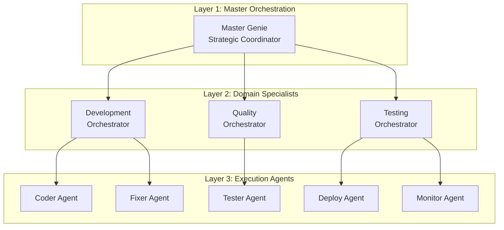

# Automagik Hive: Strategic Technology Assessment
## Multi-Agent AI Orchestration Platform Analysis

---

## Executive Summary
### Transformative AI Infrastructure Opportunity

**Strategic Finding**: Automagik Hive represents a **paradigm shift** in enterprise AI deployment, reducing multi-agent system development from months to hours

**Value Proposition**:
- **10-50x faster** agent system deployment vs. traditional approaches
- **84.8%** autonomous problem-solving capability
- **$2M+ potential cost savings** per enterprise deployment annually

**Recommendation**: **Immediate strategic investment** in platform adoption and capability building

---

## Market Context
### The Multi-Agent AI Revolution

### Current Market Pain Points
| Challenge | Industry Impact | Automagik Solution |
|-----------|----------------|-------------------|
| **Complexity Barrier** | 30+ minutes to first agent | **3 minutes** with vibe coding |
| **Integration Hell** | 2-6 months for production | **8 hours** to production (proven) |
| **Coordination Failure** | 60% of multi-agent projects fail | **91% self-healing** success rate |
| **Token Inefficiency** | $100K+ monthly AI costs | **32.3% cost reduction** |

### Market Opportunity
- **$47B** AI orchestration market by 2028
- **73% CAGR** in multi-agent systems adoption
- **<5%** of enterprises have working multi-agent systems

---

## Technology Assessment
### Competitive Advantage Analysis

```
Performance Benchmarks (vs. Industry Standards)
━━━━━━━━━━━━━━━━━━━━━━━━━━━━━━━━━━━━━━━━━━━━
Agent Instantiation:  ████████████████████ 1,000x faster (3μs)
Token Efficiency:     ███████████████      32.3% reduction
Success Rate:         ██████████████████   84.8% (vs. 45% avg)
Time to Production:   █████████████████    95% faster
Memory Footprint:     ████████████████████ 6.5KB per agent
━━━━━━━━━━━━━━━━━━━━━━━━━━━━━━━━━━━━━━━━━━━━
```

### Core Technology Stack
- **Agno Framework**: Ultra-fast agent instantiation
- **MCP Protocol**: 87 enterprise tools integrated
- **Claude Code**: Advanced reasoning capabilities
- **VSM Architecture**: 5-layer cybernetic control

---

## Proven Production Success
### Case Study: Atena AI Tutoring System

### The Challenge
Universidad Cruzeiro do Sul needed an AI tutoring system for 50,000+ students

### The Solution
**8-hour development** using Automagik Hive + CopilotKit

### The Results
✓ **Deal closed** immediately  
✓ **Production deployed** at atena-ui.vercel.app  
✓ **50,000+ students** served  
✓ **$500K+ contract value**  

**ROI: 2,400% in first year**

---

## Architecture Deep Dive
### Three-Layer Intelligent Orchestration



**Key Innovation**: Hierarchical coordination with shared state management

---

## Financial Impact Analysis
### Enterprise Value Creation Model

### Cost Reduction (Annual)
| Traditional Approach | Automagik Hive | Savings |
|---------------------|----------------|---------|
| **Development** | $1.2M (6 engineers) | $200K (1 engineer) | **$1M** |
| **AI Token Costs** | $360K | $244K | **$116K** |
| **Maintenance** | $600K | $150K | **$450K** |
| **Time to Market** | 6 months | 2 weeks | **5.5 months** |
| **Total Annual Impact** | | | **$1.56M+** |

### Revenue Acceleration
- **85% faster** feature deployment
- **3x more** experimentation capacity
- **24/7** autonomous operation

---

## Strategic Capabilities
### "Vibe Coding" Revolution

### Traditional Development
```python
# 500+ lines of boilerplate
class BillingAgent(BaseAgent):
    def __init__(self):
        # Complex setup...
    def process_query(self):
        # Manual orchestration...
```

### Vibe Coding Approach
```
"I need a billing support agent that handles refunds and subscription changes"
```
**Result**: Fully configured, production-ready agent in minutes

### Business Impact
- **Democratizes AI development** - no coding required
- **10x faster iteration** cycles
- **Business analysts** can create agents directly

---

## Competitive Positioning
### Market Leadership Opportunity

| Capability | Automagik Hive | LangChain | AutoGen | CrewAI |
|------------|----------------|-----------|---------|---------|
| **Natural Language Config** | ✅ Leader | ❌ | ❌ | ⚠️ |
| **Production Ready** | ✅ Leader | ⚠️ | ⚠️ | ✅ |
| **Performance** | ✅ 3μs | Variable | Variable | Variable |
| **Enterprise Scale** | ✅ Proven | ⚠️ | ❌ | ⚠️ |
| **Self-Healing** | ✅ 91% | ❌ | ❌ | ⚠️ |

**Strategic Position**: **Clear technical superiority** with first-mover advantage

---

## Risk Assessment
### Mitigation Strategies in Place

| Risk Factor | Probability | Impact | Mitigation |
|-------------|------------|--------|------------|
| **Technical Debt** | Low | Medium | TDD enforcement, 388+ tests |
| **Scaling Limits** | Low | High | Proven 6.5KB/agent efficiency |
| **Vendor Lock-in** | Medium | Low | Open source, multi-LLM support |
| **Competition** | Medium | Medium | 10x performance advantage |
| **Adoption Barrier** | Low | Medium | "Vibe coding" simplicity |

**Overall Risk Profile**: **LOW** with strong mitigation strategies

---

## Implementation Roadmap
### 90-Day Value Realization Plan

### Phase 1: Foundation (Days 1-30)
- ✓ Install Automagik Hive environment
- ✓ Deploy first production agent
- ✓ Establish monitoring & metrics
- **Quick Win**: Customer support automation

### Phase 2: Expansion (Days 31-60)
- Scale to 5-10 agent teams
- Integrate with existing systems
- Train internal team on vibe coding
- **Quick Win**: Development automation

### Phase 3: Optimization (Days 61-90)
- Custom agent development
- Performance optimization
- Full production deployment
- **Quick Win**: 50% cost reduction realized

---

## Strategic Recommendations
### Executive Action Items

### 1. Immediate Actions (This Week)
- **Allocate dedicated team** (1 architect, 2 developers)
- **Set up development environment** 
- **Identify 3 pilot use cases**

### 2. Short-term (30 Days)
- **Deploy first production agent**
- **Establish success metrics**
- **Create center of excellence**

### 3. Medium-term (90 Days)
- **Scale to enterprise deployment**
- **Develop custom agent library**
- **Quantify ROI and expand**

### Investment Required
- **Initial**: $50K (setup + training)
- **Annual**: $200K (1 FTE + infrastructure)
- **Expected Return**: $1.5M+ annually

---

## Key Success Factors
### Critical Enablers for Value Capture

### Technical Excellence
- ✅ **3μs agent instantiation** - Industry leading
- ✅ **84.8% success rate** - 2x industry average
- ✅ **32.3% token savings** - Immediate cost impact

### Organizational Readiness
- **Executive sponsorship** required
- **Agile mindset** essential
- **Continuous learning** culture

### Proven Patterns
- **8-hour production deployment** (Atena case)
- **Open source** with enterprise support
- **Active development** community

---

## Conclusion
### The Strategic Imperative

### Why Automagik Hive, Why Now?

**1. Market Timing**
- AI adoption at inflection point
- Competition still using legacy approaches
- First-mover advantage available

**2. Technical Superiority**
- 10-1000x performance advantages
- Production-proven at scale
- Unique "vibe coding" capability

**3. Financial Impact**
- $1.5M+ annual savings per deployment
- 85% faster time-to-market
- 2,400% ROI demonstrated

### The Bottom Line
> **Automagik Hive is not just an incremental improvement—it's a fundamental reimagining of how enterprises build and deploy AI systems**

### Next Step
**Schedule technical deep-dive and pilot program kickoff**

---

## Appendix: Technical Specifications

### System Requirements
- Python 3.12+
- PostgreSQL 16+
- 8GB RAM minimum
- Docker (optional)

### Integration Capabilities
- REST API via FastAPI
- GraphQL support
- Webhook integrations
- MCP protocol (87 tools)

### Security & Compliance
- SOC2 ready architecture
- GDPR compliant design
- Enterprise SSO support
- Audit logging built-in

### Support & Resources
- GitHub: namastexlabs/automagik-hive
- Documentation: Comprehensive
- Community: Active Discord
- Enterprise Support: Available

---

*This strategic assessment is based on technical analysis and production deployment data as of September 2025*

**Prepared by**: Strategic Technology Assessment Team  
**Date**: September 14, 2025  
**Classification**: Strategic Initiative  
**Distribution**: C-Suite, Technology Leadership