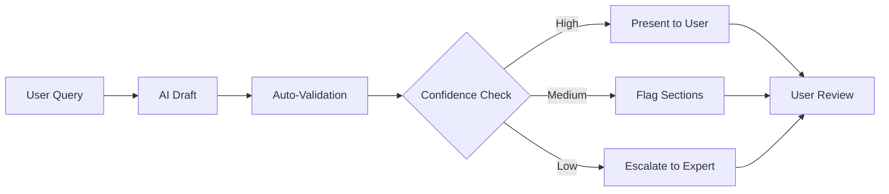

# Three Gulfs - Real World Case Studies

## Overview

These case studies demonstrate how real organizations successfully applied the Three Gulfs Framework to build reliable LLM applications. Each showcases different challenges and solutions across the gulfs.

## Case Study 1: NurtureBoss Apartment Rental AI

**Company**: NurtureBoss  
**Challenge**: Scheduling assistant failing silently in production  
**Primary Gulf**: Comprehension

### The Problem

The AI apartment scheduling assistant appeared to work perfectly in demos but had a hidden 66% failure rate in production. The team was unaware until systematic analysis revealed the issue.

### Discovery Through Data Analysis

```
Initial Assumption: "The bot handles scheduling well"
Reality Check: Manual review of 100 conversations

Results:
✗ 66 failed to extract dates correctly
✓ 34 successfully scheduled
```

### Root Causes Identified

1. **Date Format Variations**
   - "next Tuesday" → Failed
   - "tomorrow at 3" → Failed  
   - "March 15 at 2pm" → Succeeded

2. **Compound Requests**
   - "Can I see it Tuesday or Wednesday?" → Only captured first date
   - "I'm free 2-4pm" → Ignored time range

3. **Contextual Dates**
   - "Same time next week" → No reference point
   - "The day after tomorrow" → Calculation error

### Solutions Implemented

```python
# Before: Vague prompt
prompt = "Extract the meeting time from the message"

# After: Specific with examples
prompt = """
Extract ALL mentioned dates and times.

Examples:
"next Tuesday" → Calculate actual date from today
"tomorrow at 3" → {current_date + 1} at 15:00
"Tuesday or Wednesday" → Return BOTH options

Format: ISO-8601 timestamps
If ambiguous: Ask for clarification
"""
```

### Results

- Success rate: 33% → 95%
- User satisfaction: +47%
- Support tickets: -73%

### Key Lessons

1. **Systematic sampling reveals hidden failures**
2. **Demo success ≠ Production success**
3. **Specific examples prevent ambiguity**

---

## Case Study 2: Discord Clyde Chatbot

**Company**: Discord  
**Challenge**: Scaling safety to 200M+ users  
**Primary Gulf**: Generalization

### The Problem

Discord's Clyde chatbot needed to maintain safety and quality across millions of diverse conversations in different communities, languages, and contexts.

### Multi-Layer Architecture

```
Layer 1: Input Filtering
├── Toxic content detection
├── Personal information removal
└── Command injection prevention

Layer 2: Context-Aware Generation
├── Community guidelines integration
├── Age-appropriate responses
└── Cultural sensitivity

Layer 3: Output Validation
├── Safety classifier
├── Format verification
└── Hallucination detection

Layer 4: Fallback System
├── Uncertain → Defer to moderation
├── Harmful → Block and log
└── Error → Graceful message
```

### Safety Measurement System

```python
class SafetyEvaluator:
    def __init__(self):
        self.categories = [
            "violence", "self_harm", "sexual", 
            "harassment", "hate", "dangerous"
        ]
    
    def evaluate_message(self, message):
        scores = {}
        for category in self.categories:
            scores[category] = self.check_category(message, category)
        
        return {
            "safe": all(s < 0.1 for s in scores.values()),
            "categories": scores,
            "action": self.determine_action(scores)
        }
```

### Continuous Improvement Loop

1. **Daily Sampling**: Review 1,000 random interactions
2. **Weekly Analysis**: Identify new failure patterns
3. **Bi-weekly Updates**: Deploy safety improvements
4. **Monthly Audits**: Comprehensive safety review

### Results

- Safety violations: < 0.001%
- User trust score: 4.7/5
- Community adoption: 15M+ servers

### Key Lessons

1. **Architecture > Prompts for safety**
2. **Multiple layers prevent catastrophic failures**
3. **Continuous monitoring essential at scale**

---

## Case Study 3: Harvey Legal AI

**Company**: Harvey  
**Challenge**: Legal accuracy requirements  
**Primary Gulf**: Specification & Generalization

### The Problem

Legal work requires extreme precision. Even 95% accuracy means 1 in 20 legal documents contains errors – unacceptable for law firms.

### Custom Evaluation Framework

```python
class LegalEvaluator:
    def __init__(self):
        self.criteria = {
            "citation_accuracy": self.check_citations,
            "legal_reasoning": self.check_reasoning,
            "jurisdiction": self.check_jurisdiction,
            "precedent": self.check_precedent,
            "terminology": self.check_terminology
        }
    
    def evaluate_legal_output(self, output, context):
        results = {}
        
        # Check each criterion
        for criterion, checker in self.criteria.items():
            score, issues = checker(output, context)
            results[criterion] = {
                "score": score,
                "issues": issues
            }
        
        # Legal documents need 100% accuracy
        results["acceptable"] = all(
            r["score"] == 1.0 for r in results.values()
        )
        
        return results
```

### Retrieval-Augmented Generation System

```
Query: "Draft a motion to dismiss based on statute of limitations"

Pipeline:
1. Retrieve relevant statutes
2. Find similar successful motions
3. Extract jurisdiction-specific rules
4. Generate draft with citations
5. Validate every claim
6. Expert review step
```

### Human-in-the-Loop Workflow



### Results

- Accuracy on legal benchmarks: 94%
- Time savings for lawyers: 3-4 hours/day
- Error rate requiring correction: <2%

### Key Lessons

1. **Domain-specific evaluation essential**
2. **100% accuracy requires human verification**
3. **RAG critical for factual grounding**

---

## Case Study 4: Coursera AI Grading

**Company**: Coursera  
**Challenge**: Consistent grading across thousands of submissions  
**Primary Gulf**: Specification & Measurement

### The Problem

Human graders showed high variance in grading similar assignments. AI grading needed to be more consistent while maintaining pedagogical value.

### Rubric-Driven Specification

```python
grading_rubric = {
    "criteria": [
        {
            "name": "Correctness",
            "weight": 0.4,
            "levels": [
                {"points": 100, "description": "Solution completely correct"},
                {"points": 75, "description": "Minor errors, approach correct"},
                {"points": 50, "description": "Partially correct"},
                {"points": 25, "description": "Attempted but mostly incorrect"},
                {"points": 0, "description": "No attempt or completely wrong"}
            ]
        },
        {
            "name": "Code Quality",
            "weight": 0.3,
            "levels": [...]
        },
        {
            "name": "Documentation",
            "weight": 0.2,
            "levels": [...]
        },
        {
            "name": "Efficiency",
            "weight": 0.1,
            "levels": [...]
        }
    ]
}
```

### Calibration Process

1. **Expert Grading**: 100 submissions graded by experts
2. **AI Training**: Fine-tune on expert examples
3. **Validation**: AI grades compared to experts
4. **Calibration**: Adjust until agreement > 90%
5. **Monitoring**: Continuous comparison with spot checks

### Feedback Generation

```python
def generate_feedback(submission, grade_breakdown):
    """Generate pedagogically valuable feedback"""
    
    feedback = {
        "strengths": identify_strengths(submission),
        "improvements": suggest_improvements(submission),
        "specific_errors": highlight_errors(submission),
        "next_steps": recommend_learning_paths(submission)
    }
    
    # Personalize based on student history
    if student.struggling_with(topic):
        feedback["additional_resources"] = get_remedial_resources(topic)
    
    return format_encouraging_feedback(feedback)
```

### Results

- Grading consistency: 67% → 93%
- Student satisfaction: +23%
- Completion rates: +16.7%
- Grading time: -85%

### Key Lessons

1. **Explicit rubrics enable consistency**
2. **Calibration against experts crucial**
3. **Feedback quality matters more than grades**

---

## Case Study 5: Anaconda Code Assistant

**Company**: Anaconda  
**Challenge**: Complex code generation tasks  
**Primary Gulf**: All three gulfs

### The Problem

Initial prototype: 0% success rate on real tasks despite working on simple examples. Required complete framework overhaul.

### Systematic Improvement Process

#### Phase 1: Comprehension (Weeks 1-2)
```python
# Implemented comprehensive logging
log_interaction({
    "timestamp": now(),
    "user_query": query,
    "generated_code": code,
    "execution_result": result,
    "error_trace": trace,
    "user_feedback": feedback
})

# Discovery: 73% of failures due to missing context
```

#### Phase 2: Specification (Weeks 3-4)
```python
# Before: "Generate Python code"
# After:
specification = """
Generate Python code that:
1. Imports required libraries explicitly
2. Handles common error cases
3. Includes type hints
4. Follows PEP 8
5. Includes docstrings
6. Is executable as-is

If external dependencies needed:
- List them explicitly
- Provide installation command
- Use try/except for import
"""
```

#### Phase 3: Generalization (Weeks 5-6)
```python
# Implemented task decomposition
def handle_complex_request(request):
    steps = decompose_request(request)
    
    results = []
    for step in steps:
        if is_simple(step):
            result = generate_directly(step)
        else:
            # Use specialized models
            if needs_data_analysis(step):
                result = pandas_specialist(step)
            elif needs_visualization(step):
                result = plotting_specialist(step)
            else:
                result = general_python(step)
        
        results.append(result)
    
    return combine_results(results)
```

### Progressive Results

| Week | Success Rate | Improvement |
|------|-------------|-------------|
| 0 | 0% | Baseline |
| 2 | 31% | +31% (Comprehension) |
| 4 | 67% | +36% (Specification) |
| 6 | 89% | +22% (Generalization) |
| 8 | 94% | +5% (Refinement) |
| 12 | 100% | +6% (Edge cases) |

### Key Lessons

1. **Systematic approach beats random fixes**
2. **Each gulf requires different solutions**
3. **Measurement drives improvement**

---

## Common Patterns Across Case Studies

### 1. Discovery Pattern
All successful teams started with systematic data analysis:
- Manual review of 100-1000 examples
- Open coding to find patterns
- Surprise at actual vs perceived performance

### 2. Iteration Pattern
None achieved success in one shot:
- Multiple rounds of improvement
- Each round guided by metrics
- Diminishing returns after ~5 iterations

### 3. Architecture Pattern
Prompt engineering alone was insufficient:
- All needed architectural changes
- RAG, decomposition, or ensembles
- Fallback systems critical

### 4. Measurement Pattern
Success correlated with measurement sophistication:
- Custom evaluation metrics
- Domain-specific judges
- Continuous monitoring

### 5. Team Pattern
Cross-functional involvement crucial:
- Engineers + Domain experts
- PM involvement for prioritization
- Support teams for issue discovery

## Implementation Timeline Patterns

### Typical Timeline

| Phase | Duration | Focus | Outcome |
|-------|----------|-------|---------|
| Discovery | 1-2 weeks | Data analysis | Problem understanding |
| Specification | 2-3 weeks | Prompt engineering | 30-50% improvement |
| Architecture | 3-4 weeks | System design | 60-80% improvement |
| Refinement | 2-4 weeks | Edge cases | 85-95% improvement |
| Monitoring | Ongoing | Maintenance | Sustained quality |

### Resource Investment

- **Tooling**: 20-30% of effort
- **Evaluation**: 30-40% of effort  
- **Implementation**: 30-40% of effort
- **Documentation**: 5-10% of effort

## Success Factors

### Critical Success Factors

1. **Executive Buy-in**: For resource allocation
2. **Domain Expertise**: For quality evaluation
3. **Systematic Approach**: Following the framework
4. **Patience**: Accepting iterative improvement
5. **Measurement Culture**: Data-driven decisions

### Common Failure Modes

1. **Skipping Comprehension**: Building blind
2. **Over-Engineering**: Complex architecture too early
3. **Under-Measuring**: No quantitative goals
4. **Perfectionism**: Chasing 100% vs good enough
5. **Isolation**: Engineers working alone

## Recommendations

Based on these case studies:

1. **Start with 100 examples minimum**
2. **Expect 5-10 iterations**
3. **Budget 8-12 weeks for production quality**
4. **Involve domain experts from day 1**
5. **Build evaluation before features**
6. **Plan for fallbacks and escalation**
7. **Monitor continuously post-launch**

## Related Resources

- [[Three Gulfs Framework - Overview]]
- [[Three Gulfs - Implementation Playbooks]]
- [[Three Gulfs - Error Analysis Templates]]
- [[Three Gulfs - Measure Phase]]

---

*"Every successful LLM application has a story of systematic improvement. The teams that succeed are those that measure, analyze, and iterate relentlessly."*