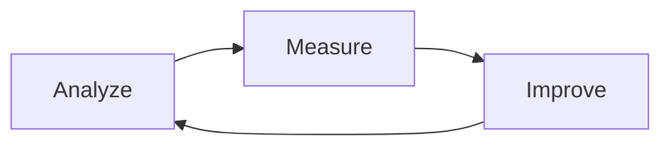

# Three Gulfs Framework - Overview

## Introduction

The Three Gulfs Framework is a systematic approach for diagnosing and solving the major challenges in building production LLM applications. Developed by **Hamel Husain** and **Shreya Shankar** for their AI Evals course, this framework has been adopted by over a thousand practitioners from hundreds of organizations.

## Core Philosophy

> "You cannot vibe-check your way to understanding what's going on" - Shreya Shankar

The framework rejects casual testing and demo-driven development in favor of systematic analysis, measurement, and improvement cycles.

## The Three Gulfs

### 🔍 [[Gulf of Comprehension - Data Understanding|Gulf of Comprehension]]
**Developer ↔ Data**
- The struggle to understand what your system is doing at scale
- Invisible failure modes hiding in production data
- Solution: Systematic data analysis and observability

### 📝 [[Gulf of Specification - Prompt Engineering|Gulf of Specification]]
**Developer ↔ LLM Pipeline**
- Translating human intent into precise model instructions
- The gap between one good output and consistent quality
- Solution: Formal, strict, testable prompts and instructions

### 🔧 [[Gulf of Generalization - Architectural Robustness|Gulf of Generalization]]
**Data ↔ LLM Pipeline**
- Perfect prompts failing on diverse real-world data
- Model limitations breaking through despite good specifications
- Solution: Architectural safeguards (RAG, decomposition, fallbacks)

## Why This Framework Matters

Each gulf identifies a different class of failures and requires different remedies:

| Gulf | Failure Type | Primary Solution |
|------|-------------|------------------|
| Comprehension | Can't see what's failing | Better observability & data analysis |
| Specification | Model doesn't understand intent | Clearer prompts, formal schemas |
| Generalization | Model can't handle edge cases | Architectural changes, not just prompts |

## The Core Lifecycle

### [[Three Gulfs - Analyze Phase|Analyze]]
- Manual data inspection
- Open coding to taxonomy
- Pattern identification

### [[Three Gulfs - Measure Phase|Measure]]
- LLM-as-Judge evaluations
- Code-based assertions
- Quantitative metrics

### [[Three Gulfs - Improve Phase|Improve]]
- Target highest ROI fixes
- One variable at a time
- Verify with metrics

## Key Principles

### Resource Allocation
- **60-80%** of effort should be on evaluation and iteration
- Not just building features
- "Measure twice, cut once" philosophy

### Team Involvement
- Not just ML engineers
- Domain experts, PMs, QA, support
- Shared understanding of capabilities and limits

### Continuous Discipline
> "If you are not willing to look at some data manually on a regular cadence, you are wasting your time with evals... Furthermore, you are wasting your time more generally." - Hamel Husain

## Implementation Timeline

- **Week 1-2**: Foundation (logging, data viewer, monitoring)
- **Week 3-4**: Analysis (taxonomy, failure modes)
- **Week 5-6**: Measurement (judges, baselines)
- **Week 7-8**: First improvements
- **Ongoing**: Continuous loops

## Success Metrics

### System Health
- Coverage of data reviewed
- Time to discovery of new issues
- Error distribution stability

### Quality Indicators
- Success rate by segment
- Regression rate from changes
- Fallback/deferral frequency

### Business Impact
- Task completion rates
- User satisfaction scores
- Incident reduction

## Case Studies

- [[Anaconda Code Assistant Case Study|Anaconda]]: 0% → 100% success through systematic improvement
- [[Discord Clyde Chatbot Case Study|Discord Clyde]]: 200M+ users with consistent safety
- [[Harvey Legal AI Case Study|Harvey]]: Custom benchmarks for legal domain
- [[Coursera AI Grading Case Study|Coursera]]: 16.7% completion increase

## Common Pitfalls

1. **The "Vibe Check" Trap** - Casual testing instead of systematic evaluation
2. **Generic Metrics** - BLEU scores instead of task-specific measures
3. **Premature Complexity** - Over-engineering before evidence
4. **Perfectionism** - Chasing 100% instead of robust 85% + fallbacks

## Tools & Resources

- [[Three Gulfs - Error Analysis Templates|Error Analysis Templates]]
- [[Three Gulfs - LLM Judge Templates|LLM-as-Judge Templates]]
- [[Three Gulfs - Synthetic Data Framework|Synthetic Data Generation]]
- [[Three Gulfs - Implementation Playbooks|Implementation Playbooks]]

## Related Frameworks

- [[SPARC Framework|SPARC]] - Specification, Pseudocode, Architecture, Refinement, Completion
- [[Maestro Repository - Complete Technical Documentation|Maestro]] - Multi-agent orchestration patterns
- [[Chain of Thought Prompting|Chain of Thought]] - Reasoning guidance techniques

## References

- Original AI Evals Course by Hamel Husain & Shreya Shankar
- [[NurtureBoss Case Study]] - 66% failure rate discovery
- [[BigLawBench]] - Domain-specific evaluation suite

---

*"By rigorously bridging all three gulfs, your LLM system not only gets better with time – it stays better."*