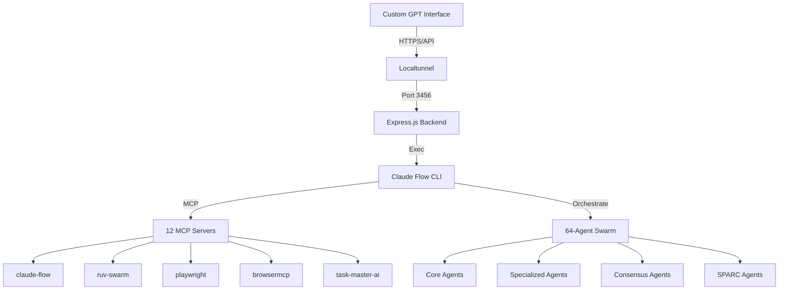

# Claude Flow Custom GPT Integration - Multi-Agent System Orchestration

## Overview
This document describes the complete setup and integration of a Custom GPT with Claude Flow's Multi-Agent System (MAS), enabling orchestration of a 64-agent AI swarm through OpenAI's GPT interface. The integration creates a bridge between ChatGPT and a locally-running Claude Flow backend, allowing remote control of sophisticated AI agent workflows.

## Architecture Overview

### System Components


### Integration Flow
1. **Custom GPT** sends API requests with operations
2. **Localtunnel** exposes local backend to internet
3. **Express.js Backend** authenticates and processes requests
4. **Claude Flow CLI** executes actual swarm commands
5. **MCP Servers** provide specialized capabilities
6. **Agent Swarm** performs distributed task execution

## Implementation Details

### Backend Server (`server-real.js`)
The backend server provides real integration with Claude Flow commands instead of mock data:

```javascript
// Core execution function that bridges GPT to Claude Flow
async function executeClaudeFlow(command, args = [], options = {}) {
  const PROJECT_ROOT = '/Users/speed/tests/claude';
  const CLAUDE_FLOW_CMD = 'npx claude-flow';
  
  const fullCommand = `cd ${PROJECT_ROOT} && ${CLAUDE_FLOW_CMD} ${command} ${args.map(arg => 
    arg.includes(' ') ? `"${arg}"` : arg
  ).join(' ')}`;
  
  return new Promise((resolve, reject) => {
    exec(fullCommand, options, (error, stdout, stderr) => {
      if (error) {
        console.error(`Command failed: ${error.message}`);
        resolve({ success: false, error: error.message });
      } else {
        try {
          const result = JSON.parse(stdout);
          resolve({ success: true, ...result });
        } catch (e) {
          resolve({ success: true, output: stdout, stderr });
        }
      }
    });
  });
}
```

### API Endpoints

#### Task Management
- **GET /tasks** - List all tasks with status and assigned agents
- **POST /tasks** - Create and orchestrate new tasks
- **PATCH /tasks/:id** - Update task status

#### Swarm Control
- **GET /swarm/status** - Check swarm health and topology
- **POST /swarm/spawn** - Create specialized agents
- **GET /agents** - List all active agents
- **GET /agents/:id** - Get specific agent details

#### Consensus Operations
- **GET /consensus/status** - Check consensus protocol
- **POST /consensus/propose** - Create consensus proposals

#### SPARC Methodology
- **POST /sparc/run** - Execute SPARC development phases

### Authentication
The system uses API key authentication:
- **Header**: `X-MAS-Key`
- **Value**: `dev-key-562ba99d-54d6-4a`

## Custom GPT Configuration

### 1. Basic Setup
```yaml
Name: Claude-Flow MAS Orchestrator
Description: Orchestrates a 64-agent AI swarm powered by Claude-Flow v2.0.0
```

### 2. Instructions (Condensed for GPT)
```
You are the Claude-Flow Multi-Agent System Orchestrator, managing a 64-agent AI swarm.

Agent Types: planner, coder, reviewer, tester, researcher, architect, analyst, optimizer, documenter, coordinator

Topologies: mesh, hierarchical, star, ring

When users request tasks:
1. Analyze requirements
2. Select agents and topology
3. Initialize swarm if needed
4. Execute and monitor
5. Report results

Use SPARC methodology for development:
1. Specification
2. Pseudocode
3. Architecture
4. Refinement
5. Completion
```

### 3. OpenAPI Schema Configuration
The complete OpenAPI 3.1 schema defines all endpoints, request/response formats, and authentication:

```yaml
openapi: 3.1.0
info:
  title: Claude-Flow Multi-Agent System API
  version: 2.0.0
servers:
  - url: https://[YOUR-TUNNEL-URL].loca.lt
paths:
  /tasks:
    # ... task operations
  /swarm/status:
    # ... swarm operations
  /agents:
    # ... agent operations
  /sparc/run:
    # ... SPARC operations
components:
  securitySchemes:
    ApiKeyAuth:
      type: apiKey
      in: header
      name: X-MAS-Key
```

## Local Development Setup

### Prerequisites
1. Node.js and npm installed
2. Claude Flow system at `/Users/speed/tests/claude`
3. MCP servers configured in `mcp/servers.json`
4. Port 3456 available

### Starting the Backend

#### Terminal 1: Start Backend Server
```bash
cd /Users/speed/tests/claude/backend
node server-real.js
```

Expected output:
```
🚀 Claude-Flow MAS Backend running on http://localhost:3456
✅ Health check endpoint: http://localhost:3456/health
🔑 API Key required: X-MAS-Key header
📝 API Documentation: http://localhost:3456/api-docs
```

#### Terminal 2: Create Public Tunnel
```bash
npx localtunnel --port 3456
```

Expected output:
```
your url is: https://[random-words].loca.lt
```

### Troubleshooting Common Issues

#### 503 Tunnel Unavailable
- **Cause**: Localtunnel connection dropped
- **Fix**: Restart localtunnel and update GPT with new URL

#### 403 Forbidden
- **Cause**: Missing or incorrect API key
- **Fix**: Ensure GPT sends `X-MAS-Key: dev-key-562ba99d-54d6-4a`

#### Port Already in Use
```bash
# Find and kill process using port 3456
lsof -i :3456
kill -9 [PID]
```

## Usage Examples

### Initialize Swarm
```
User: "Initialize a mesh topology swarm with 5 agents for development"
GPT: *Creates swarm with specified topology and agents*
```

### Create Development Task
```
User: "Create a task to build user authentication with JWT"
GPT: *Creates task, assigns coder and tester agents*
```

### Run SPARC Methodology
```
User: "Run SPARC specification for e-commerce checkout"
GPT: *Executes SPARC phase with appropriate agents*
```

### Check System Status
```
User: "Show current swarm status and metrics"
GPT: *Retrieves and displays swarm health, topology, active tasks*
```

## Advanced Features

### Agent Types and Capabilities

#### Core Agents
- **Planner**: Strategic planning and task decomposition
- **Coder**: Implementation and development
- **Reviewer**: Code review and quality assurance
- **Tester**: Test creation and execution
- **Researcher**: Information gathering and analysis

#### Specialized Agents
- **Architect**: System design and architecture
- **Analyst**: Data analysis and insights
- **Optimizer**: Performance optimization
- **Documenter**: Documentation generation
- **Coordinator**: Multi-agent coordination

### Swarm Topologies

#### Mesh (Fully Connected)
- Every agent can communicate with every other agent
- Best for collaborative problem-solving
- High communication overhead

#### Hierarchical (Tree Structure)
- Agents organized in levels with clear reporting structure
- Best for complex workflows with dependencies
- Efficient delegation and aggregation

#### Star (Centralized)
- Central coordinator manages all agents
- Best for simple coordination tasks
- Single point of control

#### Ring (Sequential)
- Agents connected in circular chain
- Best for pipeline processing
- Sequential task execution

### Consensus Protocols

#### Raft
- Leader-based consensus
- Fast decision making
- Handles network partitions

#### Byzantine
- Fault-tolerant consensus
- Handles malicious agents
- High security requirements

#### CRDT
- Conflict-free replicated data types
- Eventually consistent
- No coordination required

#### Gossip
- Epidemic protocol
- Scalable information dissemination
- Probabilistic guarantees

#### Quorum
- Majority voting
- Simple and effective
- Democratic decision making

## Integration with Tmux for 24/7 Operation

### Persistent Backend Session
```bash
# Create detached tmux session for backend
tmux new-session -d -s claude-backend "
cd /Users/speed/tests/claude/backend && 
node server-real.js
"

# Create detached session for tunnel
tmux new-session -d -s claude-tunnel "
npx localtunnel --port 3456 --subdomain claude-mas
"

# Monitor both sessions
tmux new-session -s claude-monitor \; \
  send-keys "tmux attach -t claude-backend" C-m \; \
  split-window -h \; \
  send-keys "tmux attach -t claude-tunnel" C-m \;
```

### Auto-Restart on Failure
```bash
#!/bin/bash
# claude-mas-guardian.sh
while true; do
  # Check if backend is running
  if ! curl -s http://localhost:3456/health > /dev/null; then
    echo "Backend down, restarting..."
    cd /Users/speed/tests/claude/backend
    node server-real.js &
  fi
  
  # Check tunnel and restart if needed
  if ! curl -s https://claude-mas.loca.lt/health > /dev/null; then
    echo "Tunnel down, restarting..."
    npx localtunnel --port 3456 --subdomain claude-mas &
  fi
  
  sleep 30
done
```

## Performance Metrics and Monitoring

### Key Metrics Tracked
- **Task Completion Rate**: Percentage of successfully completed tasks
- **Agent Utilization**: Active vs idle agent ratio
- **Response Time**: Average API response latency
- **Swarm Health**: Overall system stability score
- **Consensus Efficiency**: Time to reach agreement

### Monitoring Endpoints
- `/performance/report` - Comprehensive performance metrics
- `/swarm/status` - Real-time swarm health
- `/agents` - Individual agent status
- `/health` - Basic health check

## Security Considerations

### API Security
- API key authentication required for all endpoints
- HTTPS encryption via localtunnel
- Rate limiting on backend (future enhancement)

### Local Security
- Backend binds to localhost only
- Tunnel provides secure external access
- API key stored securely

### Data Privacy
- All processing happens locally
- No data sent to external services
- Complete control over agent operations

## Future Enhancements

### Planned Features
1. **WebSocket Support**: Real-time updates to GPT
2. **Multi-User Support**: Separate swarms per user
3. **Persistent Storage**: SQLite for task history
4. **Advanced Monitoring**: Grafana dashboard integration
5. **Auto-Scaling**: Dynamic agent spawning based on load

### Integration Opportunities
1. **GitHub Integration**: Direct repository management
2. **Slack Notifications**: Task status updates
3. **Jira Synchronization**: Task tracking integration
4. **CI/CD Pipeline**: Automated deployment workflows
5. **Kubernetes Deployment**: Cloud-native scaling

## Conclusion
This Custom GPT integration transforms Claude Flow's powerful multi-agent system into an accessible, ChatGPT-controlled orchestration platform. By bridging the gap between OpenAI's interface and local Claude Flow execution, we enable sophisticated AI swarm management through natural conversation.

## Related Documentation
- [[Claude Code 24-7 Automation with Tmux and Claude Flow]]
- [[Claude Flow Tmux Integration - Complete Swarm Automation]]
- [[Claude Flow - Hive-Mind AI Orchestration Architecture]]
- [[Claude Code as Maestro - Orchestrating Claude Flow Swarms via Tmux]]

## Tags
#claude-flow #custom-gpt #multi-agent-system #api-integration #swarm-orchestration #tmux #automation #backend #express #localtunnel

---
*Last Updated: 2025-09-01*
*Version: 1.0.0*
*Status: Production Ready*