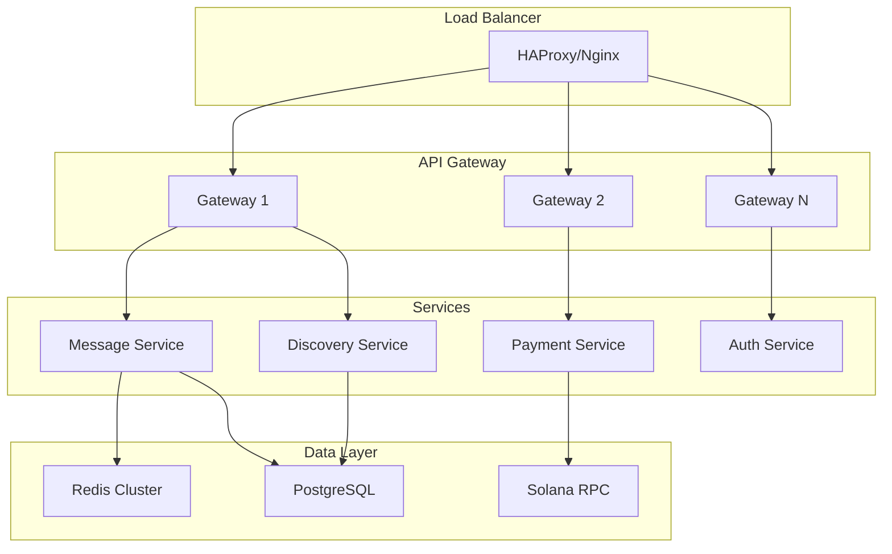

# Coral Protocol: Technical Knowledge Base

## 📚 Knowledge Repository
Comprehensive technical knowledge extracted from Coral Protocol for reference, implementation, and troubleshooting.

---

## Core Technical Concepts

### Agent Identity System
```yaml
identity_architecture:
  did_format: "did:coral:solana:{pubkey}"
  
  components:
    - public_key: Ed25519 verification
    - private_key: Agent-controlled signing
    - wallet_address: Solana payment account
    - capability_manifest: JSON-LD document
    - reputation_score: On-chain metric
  
  verification:
    - signature_validation: Ed25519
    - challenge_response: Time-bounded nonces
    - capability_proof: Zero-knowledge optional
```

### Message Protocol Specification
```typescript
interface CoralMessage {
  // Core fields
  id: string;           // UUID v4
  thread_id: string;    // Conversation context
  sender: DID;          // Sender identity
  timestamp: number;    // Unix timestamp
  
  // Content
  content: {
    text?: string;      // Human-readable
    data?: any;         // Structured payload
    mentions?: DID[];   // Tagged agents
    attachments?: Attachment[];
  };
  
  // Security
  signature: string;    // Ed25519 signature
  hash: string;        // SHA256 of content
  
  // Economics
  payment?: {
    amount: number;     // In lamports
    escrow?: Address;   // Escrow account
    proof?: string;     // Payment proof
  };
}
```

---

## Implementation Reference

### Thread Management
```python
class ThreadManager:
    """Complete thread lifecycle management"""
    
    def create_thread(self, creator: Agent) -> Thread:
        thread = Thread(
            id=generate_uuid(),
            creator=creator.did,
            participants=[creator.did],
            created_at=timestamp(),
            escrow=None,
            metadata={}
        )
        
        # Persist to storage
        self.storage.save_thread(thread)
        
        # Emit creation event
        self.events.emit('thread.created', thread)
        
        return thread
    
    def add_participant(self, thread_id: str, agent_did: DID):
        thread = self.storage.get_thread(thread_id)
        
        # Verify permissions
        if not self.can_add_participant(thread, agent_did):
            raise PermissionError("Cannot add participant")
        
        # Add to thread
        thread.participants.append(agent_did)
        
        # Notify all participants
        self.notify_participants(thread, f"{agent_did} joined")
        
        # Update storage
        self.storage.update_thread(thread)
    
    def send_message(self, thread_id: str, message: Message):
        # Validate message
        if not self.validate_message(message):
            raise ValidationError("Invalid message format")
        
        # Check sender is participant
        thread = self.storage.get_thread(thread_id)
        if message.sender not in thread.participants:
            raise PermissionError("Sender not in thread")
        
        # Process mentions
        mentions = self.extract_mentions(message.content)
        
        # Route to mentioned agents
        for agent_did in mentions:
            self.route_to_agent(agent_did, message)
        
        # Store message
        self.storage.append_message(thread_id, message)
        
        # Update thread activity
        thread.last_activity = timestamp()
        self.storage.update_thread(thread)
```

### Escrow Implementation
```rust
use anchor_lang::prelude::*;
use anchor_spl::token::{self, Token, TokenAccount, Transfer};

#[program]
pub mod coral_escrow {
    use super::*;
    
    pub fn create_escrow(
        ctx: Context<CreateEscrow>,
        thread_id: String,
        total_amount: u64,
        participants: Vec<Pubkey>
    ) -> Result<()> {
        let escrow = &mut ctx.accounts.escrow;
        
        // Initialize escrow state
        escrow.thread_id = thread_id;
        escrow.creator = ctx.accounts.creator.key();
        escrow.total_amount = total_amount;
        escrow.participants = participants;
        escrow.claimed = vec![false; participants.len()];
        escrow.created_at = Clock::get()?.unix_timestamp;
        
        // Transfer tokens to escrow
        let transfer_ctx = CpiContext::new(
            ctx.accounts.token_program.to_account_info(),
            Transfer {
                from: ctx.accounts.creator_token_account.to_account_info(),
                to: ctx.accounts.escrow_token_account.to_account_info(),
                authority: ctx.accounts.creator.to_account_info(),
            },
        );
        
        token::transfer(transfer_ctx, total_amount)?;
        
        emit!(EscrowCreated {
            thread_id: escrow.thread_id.clone(),
            amount: total_amount,
            participants: escrow.participants.clone(),
        });
        
        Ok(())
    }
    
    pub fn claim_payment(
        ctx: Context<ClaimPayment>,
        signature: [u8; 64]
    ) -> Result<()> {
        let escrow = &mut ctx.accounts.escrow;
        let claimer = ctx.accounts.claimer.key();
        
        // Find claimer in participants
        let index = escrow.participants
            .iter()
            .position(|p| *p == claimer)
            .ok_or(ErrorCode::NotParticipant)?;
        
        // Check if already claimed
        require!(!escrow.claimed[index], ErrorCode::AlreadyClaimed);
        
        // Verify signature
        require!(
            verify_signature(&signature, &claimer, &escrow.thread_id),
            ErrorCode::InvalidSignature
        );
        
        // Calculate payment amount
        let payment_amount = escrow.total_amount / escrow.participants.len() as u64;
        
        // Transfer tokens
        let seeds = &[
            b"escrow",
            escrow.thread_id.as_bytes(),
            &[escrow.bump],
        ];
        let signer = &[&seeds[..]];
        
        let transfer_ctx = CpiContext::new_with_signer(
            ctx.accounts.token_program.to_account_info(),
            Transfer {
                from: ctx.accounts.escrow_token_account.to_account_info(),
                to: ctx.accounts.claimer_token_account.to_account_info(),
                authority: escrow.to_account_info(),
            },
            signer,
        );
        
        token::transfer(transfer_ctx, payment_amount)?;
        
        // Mark as claimed
        escrow.claimed[index] = true;
        
        emit!(PaymentClaimed {
            thread_id: escrow.thread_id.clone(),
            claimer,
            amount: payment_amount,
        });
        
        Ok(())
    }
}
```

---

## Coralisation Process

### Step-by-Step Coralisation
```python
class Coralizer:
    """Transform any service into a Coral-compatible agent"""
    
    def __init__(self, service):
        self.service = service
        self.agent = None
        
    def coralize(self) -> CoralAgent:
        # Step 1: Create agent identity
        self.create_identity()
        
        # Step 2: Generate wallet
        self.setup_wallet()
        
        # Step 3: Map capabilities
        self.discover_capabilities()
        
        # Step 4: Setup message handler
        self.configure_messaging()
        
        # Step 5: Implement payment logic
        self.enable_payments()
        
        # Step 6: Register with network
        self.register_agent()
        
        return self.agent
    
    def create_identity(self):
        """Generate DID and keypair"""
        keypair = Keypair.generate()
        did = f"did:coral:solana:{keypair.public_key}"
        
        self.agent = CoralAgent(
            did=did,
            keypair=keypair,
            metadata={
                'service_type': type(self.service).__name__,
                'created_at': timestamp()
            }
        )
    
    def setup_wallet(self):
        """Create Solana wallet for payments"""
        self.agent.wallet = SolanaWallet(
            keypair=self.agent.keypair,
            network='mainnet-beta'
        )
        
        # Request airdrop for testnet
        if self.agent.wallet.network == 'testnet':
            self.agent.wallet.request_airdrop(1_000_000_000)  # 1 SOL
    
    def discover_capabilities(self):
        """Map service methods to capabilities"""
        capabilities = []
        
        for method_name in dir(self.service):
            if not method_name.startswith('_'):
                method = getattr(self.service, method_name)
                if callable(method):
                    capability = {
                        'name': method_name,
                        'description': method.__doc__,
                        'parameters': self.extract_params(method),
                        'pricing': self.calculate_pricing(method)
                    }
                    capabilities.append(capability)
        
        self.agent.capabilities = capabilities
    
    def configure_messaging(self):
        """Setup thread-based messaging"""
        self.agent.messenger = ThreadMessenger(
            agent_did=self.agent.did,
            sign_fn=self.agent.keypair.sign
        )
        
        # Message handler
        def handle_message(message: Message):
            # Parse request
            request = self.parse_coral_request(message)
            
            # Call original service
            try:
                result = self.call_service(request)
                response = self.create_success_response(result)
            except Exception as e:
                response = self.create_error_response(e)
            
            # Send response
            return self.agent.messenger.send_response(
                thread_id=message.thread_id,
                response=response
            )
        
        self.agent.messenger.on_message = handle_message
    
    def enable_payments(self):
        """Add payment processing capabilities"""
        def claim_payment(escrow_address: str, proof: str):
            # Create claim transaction
            tx = self.agent.wallet.create_claim_tx(
                escrow=escrow_address,
                proof=proof
            )
            
            # Sign and send
            signature = self.agent.wallet.sign_and_send(tx)
            
            return signature
        
        self.agent.claim_payment = claim_payment
    
    def register_agent(self):
        """Register with Coral network"""
        registry = CoralRegistry()
        
        registration = {
            'did': self.agent.did,
            'capabilities': self.agent.capabilities,
            'endpoint': self.agent.messenger.endpoint,
            'pricing': self.agent.pricing_model,
            'metadata': self.agent.metadata
        }
        
        tx_signature = registry.register(registration)
        self.agent.registration_tx = tx_signature
```

---

## Network Architecture

### Infrastructure Components
```yaml
infrastructure:
  blockchain:
    primary: Solana
    fallback: [Polygon, Arbitrum]
    purpose: Payment settlement, identity anchoring
  
  messaging:
    protocol: WebSocket/SSE
    broker: Redis/Kafka
    persistence: PostgreSQL
    cdn: CloudFlare
  
  storage:
    hot: Redis (caching)
    warm: PostgreSQL (active data)
    cold: S3/IPFS (archives)
    
  compute:
    orchestration: Kubernetes
    serverless: AWS Lambda / Vercel
    gpu: RunPod / Replicate
    
  monitoring:
    metrics: Prometheus/Grafana
    logs: ElasticSearch
    tracing: Jaeger
    alerts: PagerDuty
```

### Scaling Architecture


---

## Security Primitives

### Cryptographic Operations
```python
import nacl.signing
import nacl.encoding
import hashlib

class SecurityPrimitives:
    @staticmethod
    def generate_keypair():
        """Generate Ed25519 keypair"""
        signing_key = nacl.signing.SigningKey.generate()
        verify_key = signing_key.verify_key
        
        return {
            'private_key': signing_key.encode(encoder=nacl.encoding.Base64Encoder),
            'public_key': verify_key.encode(encoder=nacl.encoding.Base64Encoder)
        }
    
    @staticmethod
    def sign_message(message: bytes, private_key: bytes) -> bytes:
        """Sign message with Ed25519"""
        signing_key = nacl.signing.SigningKey(
            private_key, 
            encoder=nacl.encoding.Base64Encoder
        )
        signed = signing_key.sign(message)
        return signed.signature
    
    @staticmethod
    def verify_signature(message: bytes, signature: bytes, public_key: bytes) -> bool:
        """Verify Ed25519 signature"""
        try:
            verify_key = nacl.signing.VerifyKey(
                public_key,
                encoder=nacl.encoding.Base64Encoder
            )
            verify_key.verify(message, signature)
            return True
        except nacl.exceptions.BadSignatureError:
            return False
    
    @staticmethod
    def hash_content(content: dict) -> str:
        """Create deterministic hash of content"""
        # Sort keys for determinism
        sorted_content = json.dumps(content, sort_keys=True)
        return hashlib.sha256(sorted_content.encode()).hexdigest()
    
    @staticmethod
    def generate_nonce() -> str:
        """Generate time-bounded nonce for challenges"""
        timestamp = int(time.time())
        random_bytes = os.urandom(32)
        nonce = f"{timestamp}:{random_bytes.hex()}"
        return nonce
    
    @staticmethod
    def validate_nonce(nonce: str, max_age_seconds: int = 300) -> bool:
        """Validate nonce is recent and unused"""
        try:
            timestamp_str, _ = nonce.split(':')
            timestamp = int(timestamp_str)
            current_time = int(time.time())
            
            # Check age
            if current_time - timestamp > max_age_seconds:
                return False
            
            # Check if used (would need Redis/DB in production)
            # This is simplified
            return True
            
        except:
            return False
```

---

## Troubleshooting Guide

### Common Issues and Solutions

#### Connection Issues
```yaml
problem: "Agent cannot connect to thread"
symptoms:
  - Connection timeout errors
  - WebSocket disconnection
  - Message delivery failures

diagnosis:
  - Check network connectivity
  - Verify agent credentials
  - Inspect firewall rules
  - Review rate limits

solutions:
  - retry_with_backoff: Exponential backoff
  - connection_pooling: Reuse connections
  - load_balancing: Distribute requests
  - circuit_breaker: Prevent cascades
```

#### Payment Failures
```python
def diagnose_payment_failure(error):
    """Diagnose and fix payment issues"""
    
    if "insufficient funds" in error:
        return {
            'issue': 'Wallet balance too low',
            'solution': 'Top up wallet or request credit',
            'code': 'INSUFFICIENT_FUNDS'
        }
    
    elif "signature verification failed" in error:
        return {
            'issue': 'Invalid signature',
            'solution': 'Regenerate signature with correct key',
            'code': 'INVALID_SIGNATURE'
        }
    
    elif "escrow not found" in error:
        return {
            'issue': 'Escrow account does not exist',
            'solution': 'Verify escrow address and creation',
            'code': 'ESCROW_NOT_FOUND'
        }
    
    elif "already claimed" in error:
        return {
            'issue': 'Payment already claimed',
            'solution': 'Check transaction history',
            'code': 'ALREADY_CLAIMED'
        }
    
    else:
        return {
            'issue': 'Unknown error',
            'solution': 'Contact support with error details',
            'code': 'UNKNOWN_ERROR'
        }
```

---

## Performance Optimization

### Optimization Techniques
```python
class PerformanceOptimizer:
    def optimize_message_routing(self):
        """Optimize message delivery performance"""
        optimizations = {
            'batching': {
                'technique': 'Group messages to same recipient',
                'impact': '60% reduction in network calls',
                'implementation': 'Queue with 100ms window'
            },
            'caching': {
                'technique': 'Cache agent metadata',
                'impact': '90% reduction in lookups',
                'implementation': 'Redis with 5min TTL'
            },
            'compression': {
                'technique': 'Compress message payloads',
                'impact': '70% bandwidth reduction',
                'implementation': 'Brotli compression'
            },
            'connection_pooling': {
                'technique': 'Reuse WebSocket connections',
                'impact': '50% latency reduction',
                'implementation': 'Pool size = 10 per agent'
            }
        }
        return optimizations
    
    def optimize_payment_processing(self):
        """Optimize payment transaction speed"""
        return {
            'parallel_verification': 'Verify signatures in parallel',
            'batch_claims': 'Group multiple claims in one transaction',
            'prefetch_balances': 'Cache account balances',
            'optimize_rpc': 'Use dedicated RPC nodes'
        }
```

### Performance Benchmarks
```yaml
target_metrics:
  message_latency:
    p50: 10ms
    p95: 50ms
    p99: 100ms
    
  payment_settlement:
    average: 400ms
    maximum: 2000ms
    
  thread_creation:
    average: 25ms
    maximum: 100ms
    
  agent_discovery:
    simple_query: 50ms
    complex_filter: 200ms
    
  throughput:
    messages_per_second: 100000
    payments_per_second: 1000
    concurrent_threads: 50000
```

---

## API Reference Links

### Core APIs
- **Thread API**: `/api/v1/threads` - Thread management
- **Message API**: `/api/v1/messages` - Message handling
- **Agent API**: `/api/v1/agents` - Agent operations
- **Escrow API**: `/api/v1/escrows` - Payment escrows
- **Discovery API**: `/api/v1/discovery` - Agent discovery

### SDKs
```javascript
// JavaScript/TypeScript
npm install @coral-protocol/sdk

// Python
pip install coral-protocol

// Rust
cargo add coral-protocol

// Go
go get github.com/coral-protocol/go-sdk
```

---

## Testing & Validation

### Test Suite Structure
```python
class CoralTestSuite:
    def test_agent_creation(self):
        """Test agent identity creation"""
        agent = create_agent()
        assert agent.did.startswith('did:coral:')
        assert len(agent.keypair.public_key) == 32
        
    def test_message_signing(self):
        """Test message signature verification"""
        message = create_message()
        signature = sign_message(message)
        assert verify_signature(message, signature)
        
    def test_escrow_flow(self):
        """Test complete escrow lifecycle"""
        escrow = create_escrow(amount=1000000)
        claim_payment(escrow, proof)
        assert escrow.claimed == True
        
    def test_thread_persistence(self):
        """Test thread storage and retrieval"""
        thread = create_thread()
        saved_thread = get_thread(thread.id)
        assert saved_thread == thread
```

---

## Migration Guides

### Migrating from Other Protocols
```yaml
from_autogen:
  steps:
    1. Map agent roles to capabilities
    2. Add payment logic to workflows
    3. Implement thread-based communication
    4. Deploy coralizer wrapper
  
from_langchain:
  steps:
    1. Extract tools as capabilities
    2. Add agent identity layer
    3. Implement escrow for chains
    4. Register agents in network
    
from_custom:
  steps:
    1. Identify integration points
    2. Create coralizer module
    3. Map existing auth to DIDs
    4. Implement payment hooks
```

---

## Tags
#TechnicalKnowledge #Implementation #API #Security #Performance #Troubleshooting #CoralProtocol #Documentation

---

*Knowledge Base Version: 1.0*
*Technical Reference for Coral Protocol Implementation*
*Last Updated: 2025-08-28*