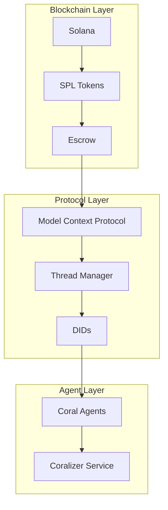
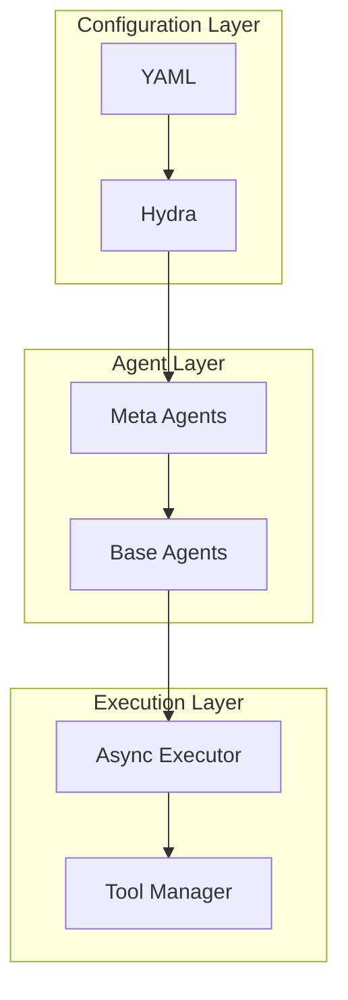
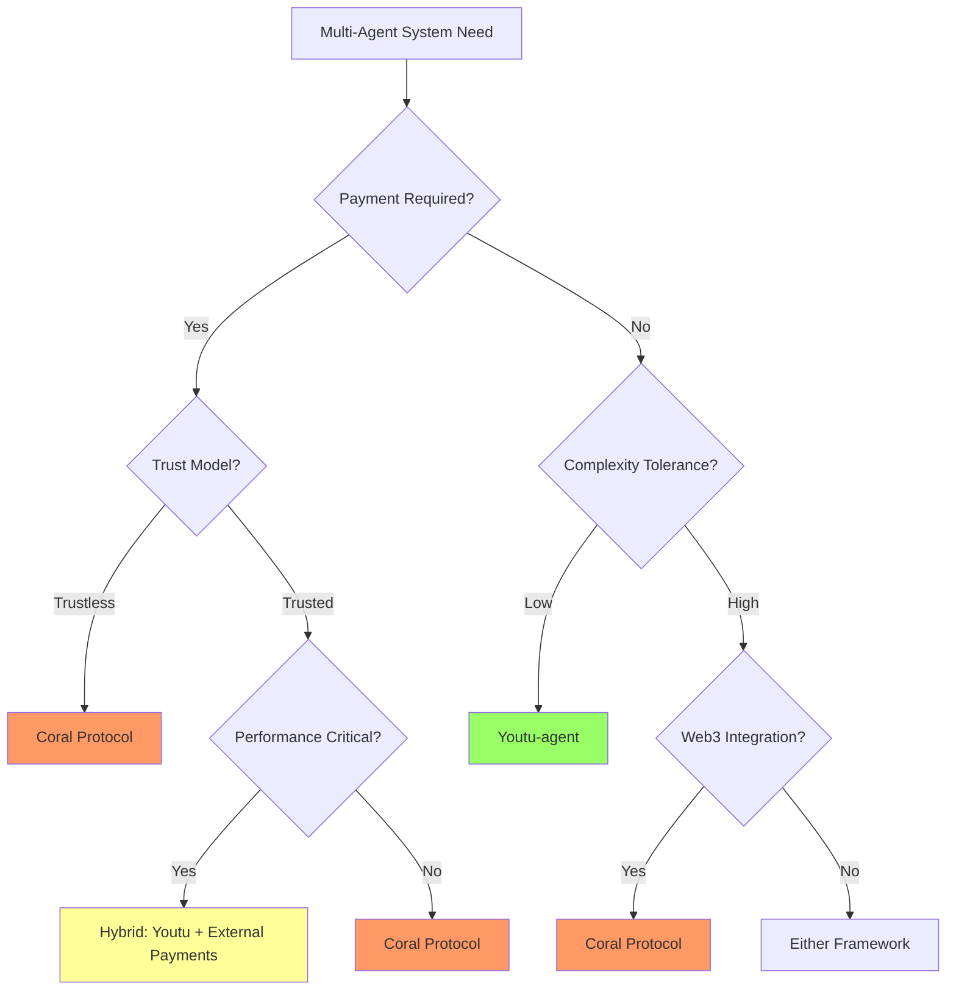

# Multi-Agent Framework Comparison: Coral Protocol vs Youtu-agent

## 📊 Comparative Analysis
Comprehensive comparison of two leading multi-agent frameworks: Coral Protocol (blockchain-based) and Youtu-agent (YAML-configuration).

---

## Executive Summary

| Aspect | Coral Protocol | Youtu-agent |
|--------|---------------|-------------|
| **Core Philosophy** | Decentralized agent economy | Configuration-first simplicity |
| **Architecture** | Blockchain + MCP | YAML + Hydra |
| **Primary Use Case** | Economic agent interactions | Rapid agent deployment |
| **Payment Model** | SPL tokens & escrow | External/optional |
| **Target Audience** | Web3 developers & enterprises | General developers |
| **Maturity** | Early (2025) | Production (71.47% accuracy) |

---

## Architecture Comparison

### Coral Protocol Architecture


### Youtu-agent Architecture


---

## Feature Comparison Matrix

| Feature | Coral Protocol | Youtu-agent | Winner |
|---------|---------------|-------------|--------|
| **Setup Complexity** | High (blockchain) | Low (YAML) | Youtu-agent ✅ |
| **Economic Incentives** | Native (SPL tokens) | None built-in | Coral ✅ |
| **Decentralization** | Full | Optional | Coral ✅ |
| **Developer Experience** | Complex | Simple | Youtu-agent ✅ |
| **Performance** | Good | Excellent (71.47%) | Youtu-agent ✅ |
| **Scalability** | Blockchain-limited | Unlimited | Youtu-agent ✅ |
| **Trust Model** | Trustless | Trust-required | Coral ✅ |
| **Interoperability** | MCP standard | Tool-based | Coral ✅ |

---

## Implementation Complexity

### Coral Protocol: Hello World Agent
```python
# Coral Protocol - More complex setup
from coral_protocol import CoralAgent, SolanaWallet, MCP

class HelloAgent(CoralAgent):
    def __init__(self):
        self.wallet = SolanaWallet(private_key)
        self.mcp = MCP(config)
        self.thread = ThreadManager()
        self.did = self.register_did()
        self.escrow = EscrowContract()
        
    async def handle_message(self, message):
        # Verify payment
        payment = await self.escrow.verify(message.payment_proof)
        if not payment:
            return {"error": "Payment required"}
        
        # Process with MCP context
        context = await self.thread.get_context(message.thread_id)
        response = await self.process(message, context)
        
        # Update thread and respond
        await self.thread.update(message.thread_id, response)
        return response
```

### Youtu-agent: Hello World Agent
```yaml
# Youtu-agent - Simple YAML
agent:
  name: hello-agent
  instructions: "Respond to greetings"
  
tools:
  - respond

# That's it! Agent is ready
```

---

## Use Case Alignment

### Best for Coral Protocol
```python
coral_use_cases = {
    'financial_services': {
        'reason': 'Built-in payment rails',
        'examples': ['Trading bots', 'Payment agents', 'DeFi automation']
    },
    'marketplace_platforms': {
        'reason': 'Economic incentive alignment',
        'examples': ['Service marketplaces', 'Agent hiring', 'Task markets']
    },
    'trustless_coordination': {
        'reason': 'Blockchain verification',
        'examples': ['Multi-party workflows', 'Supply chain', 'Governance']
    },
    'web3_native': {
        'reason': 'Solana integration',
        'examples': ['NFT agents', 'DAO tools', 'DeFi protocols']
    }
}
```

### Best for Youtu-agent
```python
youtu_use_cases = {
    'rapid_prototyping': {
        'reason': 'YAML simplicity',
        'examples': ['POCs', 'Hackathons', 'Experiments']
    },
    'enterprise_automation': {
        'reason': 'Easy deployment',
        'examples': ['Customer service', 'Data processing', 'Report generation']
    },
    'developer_tools': {
        'reason': 'Meta-agent capabilities',
        'examples': ['Code assistants', 'Testing agents', 'Documentation']
    },
    'internal_systems': {
        'reason': 'No blockchain overhead',
        'examples': ['IT automation', 'HR bots', 'Analytics']
    }
}
```

---

## Integration Patterns

### Hybrid Architecture: Best of Both Worlds
```python
class HybridAgentSystem:
    """Combine Coral's economics with Youtu's simplicity"""
    
    def __init__(self):
        # Youtu-agent for configuration
        self.config = load_yaml("agent.yaml")
        self.youtu_agent = Agent(self.config)
        
        # Coral for payments
        self.coral_payment = CoralPaymentLayer()
        self.escrow = EscrowContract()
        
    async def execute_paid_task(self, task, payment_proof):
        # Verify payment via Coral
        if await self.coral_payment.verify(payment_proof):
            # Execute task via Youtu
            result = await self.youtu_agent.process(task)
            # Record on blockchain
            await self.coral_payment.record_completion(result)
            return result
```

### Complementary Deployment
```yaml
deployment_strategy:
  frontend:
    framework: youtu_agent
    reason: "Quick iteration and configuration"
    
  backend:
    framework: coral_protocol
    reason: "Payment processing and verification"
    
  integration:
    method: "API bridge"
    benefits:
      - Simple agent development
      - Secure payment handling
      - Best of both worlds
```

---

## Performance Comparison

### Benchmark Results
```python
benchmarks = {
    'WebWalkerQA': {
        'youtu_agent': 0.7147,  # 71.47% with DeepSeek
        'coral_protocol': None,  # Not benchmarked
        'note': 'Youtu optimized for accuracy'
    },
    'latency': {
        'youtu_agent': '100ms',  # Direct execution
        'coral_protocol': '500ms+',  # Blockchain overhead
        'note': 'Coral includes payment verification'
    },
    'throughput': {
        'youtu_agent': '1000 req/s',  # Async execution
        'coral_protocol': '50 req/s',  # Blockchain limited
        'note': 'Different optimization goals'
    },
    'cost_per_transaction': {
        'youtu_agent': '$0.01',  # Model costs only
        'coral_protocol': '$0.05',  # + blockchain fees
        'note': 'Coral includes payment infrastructure'
    }
}
```

---

## Migration Strategies

### From Youtu-agent to Coral
```python
class YoutuToCoralMigration:
    """Add economic layer to existing Youtu agents"""
    
    def migrate(self, youtu_config):
        # Keep YAML configuration
        coral_agent = CoralAgent()
        coral_agent.load_config(youtu_config)
        
        # Add payment layer
        coral_agent.enable_payments()
        
        # Add thread management
        coral_agent.enable_persistence()
        
        # Deploy to Solana
        return coral_agent.deploy()
```

### From Coral to Youtu-agent
```yaml
# Extract agent logic from Coral
migration:
  extract:
    - agent_behavior
    - tool_definitions
    - instructions
    
  simplify:
    - remove_payment_logic
    - remove_blockchain_calls
    - convert_to_yaml
    
  deploy:
    - standalone_deployment
    - api_wrapper_for_payments
```

---

## Strategic Recommendations

### When to Use Coral Protocol
```yaml
use_coral_when:
  - requirement: "Trustless agent interactions"
    priority: critical
    
  - requirement: "Built-in payment system"
    priority: critical
    
  - requirement: "Decentralized governance"
    priority: high
    
  - requirement: "Web3 integration"
    priority: high
    
  - requirement: "Persistent context across sessions"
    priority: medium
```

### When to Use Youtu-agent
```yaml
use_youtu_when:
  - requirement: "Rapid development"
    priority: critical
    
  - requirement: "Simple configuration"
    priority: critical
    
  - requirement: "High performance"
    priority: high
    
  - requirement: "Meta-agent capabilities"
    priority: high
    
  - requirement: "Enterprise deployment"
    priority: medium
```

### When to Use Both
```yaml
hybrid_approach:
  - scenario: "Enterprise with payment needs"
    solution: "Youtu frontend, Coral payments"
    
  - scenario: "Web3 platform with complex agents"
    solution: "Coral infrastructure, Youtu logic"
    
  - scenario: "Marketplace with diverse agents"
    solution: "Dual support for maximum reach"
```

---

## Future Convergence

### Potential Integration Points
```python
future_integration = {
    'shared_standards': {
        'description': 'Common agent description format',
        'timeline': '2026',
        'benefit': 'Cross-platform agents'
    },
    'payment_plugins': {
        'description': 'Coral payments for Youtu agents',
        'timeline': '2025 Q4',
        'benefit': 'Economic incentives for all'
    },
    'meta_agent_economy': {
        'description': 'Youtu agents creating Coral agents',
        'timeline': '2026',
        'benefit': 'Autonomous agent economies'
    },
    'unified_marketplace': {
        'description': 'Single marketplace for both',
        'timeline': '2027',
        'benefit': 'Maximum liquidity and choice'
    }
}
```

---

## Implementation Decision Tree



---

## Conclusion

### Key Insights
1. **Complementary, not Competitive**: These frameworks solve different problems
2. **Coral for Economics**: When you need trustless payments and persistence
3. **Youtu for Simplicity**: When you need rapid development and high performance
4. **Hybrid Potential**: Combining both creates powerful solutions

### Recommended Approach
```python
def choose_framework(requirements):
    if requirements['payments'] and requirements['trustless']:
        return 'coral_protocol'
    elif requirements['simplicity'] and requirements['performance']:
        return 'youtu_agent'
    elif requirements['payments'] and requirements['simplicity']:
        return 'hybrid_solution'
    else:
        # Evaluate based on primary concern
        return evaluate_primary_requirement(requirements)
```

### Future Outlook
- **2025**: Parallel evolution, early integrations
- **2026**: Standard convergence, plugin ecosystems
- **2027**: Unified marketplaces, seamless interop
- **2028**: Mature multi-agent economy

---

## Tags
#Comparison #MultiAgent #CoralProtocol #Youtu-agent #Architecture #Strategy #Integration

---

*Comparison Version: 1.0*
*Frameworks: Coral Protocol & Youtu-agent*
*Analysis Date: 2025-08-28*