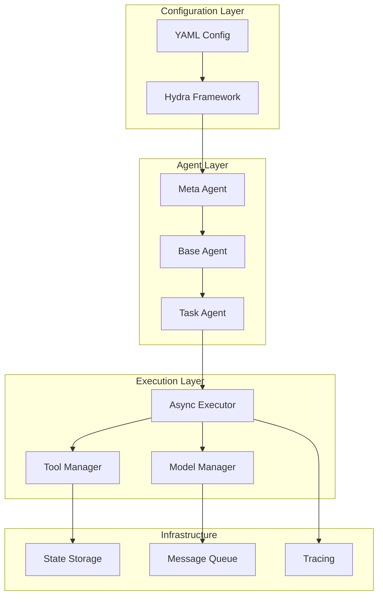

# Youtu-agent: Technical Reference

## 📚 Knowledge Repository
Comprehensive technical reference for implementing and operating Tencent's Youtu-agent framework.

---

## Architecture Overview

### System Components


---

## Installation & Setup

### Quick Start
```bash
# Using UV (recommended)
git clone https://github.com/Tencent/Youtu-agent.git
cd Youtu-agent
uv sync
source .venv/bin/activate

# Using pip
pip install youtu-agent

# Using conda
conda install -c tencent youtu-agent
```

### Environment Configuration
```bash
# Required environment variables
export DEEPSEEK_API_KEY="your_api_key"
export OPENAI_API_KEY="your_openai_key"  # Optional
export ANTHROPIC_API_KEY="your_claude_key"  # Optional

# Optional configuration
export YOUTU_CACHE_DIR="~/.youtu/cache"
export YOUTU_LOG_LEVEL="INFO"
export YOUTU_TRACE_ENABLED="true"
```

---

## Configuration Reference

### Complete Configuration Schema
```yaml
# Full configuration structure
config_version: "1.0.0"

# Model configuration
model:
  provider: deepseek  # deepseek, openai, anthropic, local
  name: deepseek-v3
  parameters:
    temperature: 0.7
    max_tokens: 4096
    top_p: 0.95
    frequency_penalty: 0.0
    presence_penalty: 0.0
  
  # Fallback models
  fallback:
    - provider: deepseek
      name: deepseek-v2
    - provider: openai
      name: gpt-4

# Agent definition
agent:
  name: string  # Required: Agent identifier
  instructions: string  # Required: Agent behavior
  
  # Optional fields
  description: string
  version: string
  author: string
  
  # Capabilities
  capabilities:
    - capability_name: string
      enabled: boolean
      config: object
  
  # Workflow definition
  workflow:
    - step: string
      tool: string
      input: any
      output: string
      parallel: boolean
      timeout: number
      retry: number

# Tools configuration
tools:
  # Built-in tools
  search:
    provider: google  # google, bing, duckduckgo
    max_results: 10
    timeout: 30
  
  csv_analyzer:
    max_rows: 100000
    memory_limit: "2GB"
    operations:
      - statistical_analysis
      - correlation_matrix
      - outlier_detection
  
  file_manager:
    allowed_paths:
      - "/tmp"
      - "~/workspace"
    max_file_size: "100MB"
  
  # Custom tools
  custom:
    - name: my_tool
      type: rest_api
      endpoint: "https://api.example.com"
      method: POST
      headers:
        Authorization: "Bearer ${API_TOKEN}"

# Execution configuration
execution:
  async: true  # Enable async execution
  max_concurrent_tools: 5
  timeout: 300  # Global timeout in seconds
  retry_policy:
    max_attempts: 3
    backoff_multiplier: 2
    max_backoff: 60

# Observability
observability:
  tracing:
    enabled: true
    provider: opentelemetry
    endpoint: "http://localhost:4318"
    sample_rate: 0.1
  
  logging:
    level: INFO  # DEBUG, INFO, WARNING, ERROR
    format: json
    output:
      - console
      - file: "./logs/agent.log"
  
  metrics:
    enabled: true
    prometheus_port: 9090

# Security
security:
  sandbox:
    enabled: true
    memory_limit: "4GB"
    cpu_limit: 2
    network_isolation: false
  
  data_protection:
    encrypt_at_rest: true
    pii_detection: true
    redact_sensitive: true
```

---

## Core Implementation

### Creating a Basic Agent
```python
from youtu_agent import Agent, load_config

# Load configuration
config = load_config("config.yaml")

# Create agent
agent = Agent(config)

# Simple interaction
response = await agent.chat("What is the weather today?")
print(response)
```

### Implementing a Meta-Agent
```python
from youtu_agent import MetaAgent

class CustomMetaAgent(MetaAgent):
    """Agent that creates other agents"""
    
    async def create_agent_from_dialogue(self):
        # Step 1: Understand requirements
        requirements = await self.capture_requirements()
        
        # Step 2: Select appropriate tools
        tools = self.select_tools(requirements)
        
        # Step 3: Generate configuration
        config = self.generate_config(requirements, tools)
        
        # Step 4: Create and test agent
        agent = Agent(config)
        test_result = await self.test_agent(agent)
        
        # Step 5: Refine if needed
        if test_result.score < 0.8:
            config = await self.refine_config(config, test_result)
            agent = Agent(config)
        
        return agent
    
    async def capture_requirements(self):
        """Interactive requirement gathering"""
        questions = [
            "What task should the agent perform?",
            "What tools does it need access to?",
            "What are the performance requirements?",
            "Any specific constraints?"
        ]
        
        requirements = {}
        for question in questions:
            answer = await self.ask_user(question)
            requirements[question] = answer
        
        return requirements
```

---

## Tool Development

### Creating Custom Tools
```python
from youtu_agent.tools import BaseTool, tool_registry

class CustomSearchTool(BaseTool):
    """Custom search implementation"""
    
    def __init__(self, config):
        super().__init__(config)
        self.api_key = config.get('api_key')
        self.endpoint = config.get('endpoint')
    
    async def execute(self, query: str, **kwargs):
        """Execute search query"""
        # Perform search
        results = await self.search_api(query)
        
        # Process results
        processed = self.process_results(results)
        
        # Return standardized format
        return {
            'success': True,
            'data': processed,
            'metadata': {
                'query': query,
                'count': len(processed),
                'timestamp': datetime.now()
            }
        }
    
    async def search_api(self, query):
        async with aiohttp.ClientSession() as session:
            async with session.get(
                self.endpoint,
                params={'q': query, 'key': self.api_key}
            ) as response:
                return await response.json()

# Register tool
tool_registry.register('custom_search', CustomSearchTool)
```

### Tool Configuration Patterns
```yaml
# Tool configuration patterns
tools:
  # Pattern 1: Simple tool
  simple:
    name: calculator
    operations: [add, subtract, multiply, divide]
  
  # Pattern 2: API tool
  api:
    name: weather
    endpoint: "${WEATHER_API_URL}"
    auth:
      type: api_key
      key: "${WEATHER_API_KEY}"
  
  # Pattern 3: Composite tool
  composite:
    name: researcher
    components:
      - search
      - summarize
      - format
    pipeline: sequential  # or parallel
  
  # Pattern 4: Stateful tool
  stateful:
    name: conversation
    state:
      history: []
      context: {}
    persistence: redis  # or memory, file
```

---

## Performance Optimization

### Async Execution Patterns
```python
class PerformancePatterns:
    @staticmethod
    async def parallel_tools(tools, inputs):
        """Execute tools in parallel"""
        tasks = []
        for tool, input_data in zip(tools, inputs):
            task = asyncio.create_task(tool.execute(input_data))
            tasks.append(task)
        
        results = await asyncio.gather(*tasks)
        return results
    
    @staticmethod
    async def pipeline_with_cache(tools, input_data):
        """Pipeline with caching"""
        result = input_data
        cache = {}
        
        for tool in tools:
            # Check cache
            cache_key = f"{tool.name}:{hash(str(result))}"
            if cache_key in cache:
                result = cache[cache_key]
                continue
            
            # Execute tool
            result = await tool.execute(result)
            
            # Cache result
            cache[cache_key] = result
        
        return result
    
    @staticmethod
    async def batch_processing(tool, items, batch_size=10):
        """Process items in batches"""
        results = []
        
        for i in range(0, len(items), batch_size):
            batch = items[i:i+batch_size]
            batch_results = await asyncio.gather(*[
                tool.execute(item) for item in batch
            ])
            results.extend(batch_results)
        
        return results
```

### Optimization Configurations
```yaml
# Performance optimization settings
optimization:
  caching:
    enabled: true
    backend: redis  # redis, memory, disk
    ttl: 3600  # Cache TTL in seconds
    max_size: "1GB"
  
  batching:
    enabled: true
    batch_size: 10
    max_wait: 100  # ms
  
  connection_pooling:
    enabled: true
    pool_size: 10
    max_overflow: 20
    timeout: 30
  
  compression:
    enabled: true
    algorithm: gzip  # gzip, brotli, zstd
    level: 6
```

---

## Monitoring & Observability

### Metrics Collection
```python
from prometheus_client import Counter, Histogram, Gauge

# Define metrics
agent_requests = Counter('agent_requests_total', 'Total agent requests')
agent_latency = Histogram('agent_latency_seconds', 'Agent response latency')
active_agents = Gauge('active_agents', 'Number of active agents')

# Instrument code
class InstrumentedAgent(Agent):
    async def process(self, message):
        agent_requests.inc()
        active_agents.inc()
        
        with agent_latency.time():
            result = await super().process(message)
        
        active_agents.dec()
        return result
```

### Tracing Configuration
```yaml
# OpenTelemetry configuration
tracing:
  provider: opentelemetry
  
  exporters:
    - type: jaeger
      endpoint: http://localhost:14268/api/traces
    
    - type: zipkin
      endpoint: http://localhost:9411/api/v2/spans
    
    - type: otlp
      endpoint: http://localhost:4318
  
  sampling:
    strategy: probabilistic
    rate: 0.1  # 10% sampling
    
    # Always sample these operations
    always_sample:
      - errors
      - slow_requests
      - critical_paths
```

---

## Testing & Validation

### Unit Testing Agents
```python
import pytest
from youtu_agent.testing import AgentTestCase

class TestMyAgent(AgentTestCase):
    @pytest.fixture
    def agent_config(self):
        return {
            'agent': {
                'name': 'test_agent',
                'instructions': 'Test instructions'
            },
            'tools': ['search', 'summarize']
        }
    
    async def test_basic_response(self, agent):
        response = await agent.chat("Hello")
        assert response is not None
        assert len(response) > 0
    
    async def test_tool_usage(self, agent):
        response = await agent.chat("Search for Python tutorials")
        assert 'search' in agent.get_used_tools()
    
    async def test_error_handling(self, agent):
        with pytest.raises(ValueError):
            await agent.chat("")
```

### Benchmark Testing
```python
from youtu_agent.benchmarks import Benchmark

class CustomBenchmark(Benchmark):
    def __init__(self):
        super().__init__("CustomBenchmark")
        self.load_dataset("path/to/dataset.json")
    
    async def evaluate(self, agent):
        correct = 0
        total = len(self.dataset)
        
        for sample in self.dataset:
            response = await agent.process(sample['input'])
            if self.check_answer(response, sample['expected']):
                correct += 1
        
        accuracy = correct / total
        return {
            'accuracy': accuracy,
            'passed': accuracy > 0.7
        }

# Run benchmark
benchmark = CustomBenchmark()
results = await benchmark.evaluate(agent)
print(f"Accuracy: {results['accuracy']:.2%}")
```

---

## Deployment

### Docker Deployment
```dockerfile
# Dockerfile for Youtu-agent
FROM python:3.10-slim

WORKDIR /app

# Install dependencies
COPY requirements.txt .
RUN pip install --no-cache-dir -r requirements.txt

# Copy application
COPY . .

# Configuration
ENV PYTHONPATH=/app
ENV YOUTU_CONFIG=/app/config.yaml

# Health check
HEALTHCHECK --interval=30s --timeout=3s \
  CMD python -c "import youtu_agent; print('healthy')"

# Run agent
CMD ["python", "-m", "youtu_agent.server"]
```

### Kubernetes Deployment
```yaml
apiVersion: apps/v1
kind: Deployment
metadata:
  name: youtu-agent
spec:
  replicas: 3
  selector:
    matchLabels:
      app: youtu-agent
  template:
    metadata:
      labels:
        app: youtu-agent
    spec:
      containers:
      - name: agent
        image: youtu-agent:latest
        ports:
        - containerPort: 8080
        env:
        - name: DEEPSEEK_API_KEY
          valueFrom:
            secretKeyRef:
              name: api-keys
              key: deepseek
        resources:
          requests:
            memory: "1Gi"
            cpu: "500m"
          limits:
            memory: "2Gi"
            cpu: "1000m"
```

---

## Troubleshooting

### Common Issues

#### Configuration Errors
```python
# Problem: Invalid YAML
try:
    config = load_config("config.yaml")
except YAMLError as e:
    print(f"Configuration error: {e}")
    # Solution: Validate YAML syntax
    validate_yaml("config.yaml")

# Problem: Missing required fields
try:
    agent = Agent(config)
except ConfigurationError as e:
    print(f"Missing field: {e}")
    # Solution: Check schema requirements
    print_schema_requirements()
```

#### Performance Issues
```python
# Problem: Slow response times
def diagnose_performance():
    issues = []
    
    # Check async execution
    if not config.get('execution', {}).get('async', False):
        issues.append("Enable async execution")
    
    # Check caching
    if not config.get('optimization', {}).get('caching', {}).get('enabled'):
        issues.append("Enable caching")
    
    # Check model size
    if 'large' in config.get('model', {}).get('name', ''):
        issues.append("Consider smaller model for speed")
    
    return issues
```

#### Tool Integration Issues
```yaml
# Problem: Tool not found
debugging:
  tool_not_found:
    check:
      - Tool registered in tool_registry
      - Tool module imported
      - Configuration correct
    
    solution: |
      from youtu_agent.tools import tool_registry
      print(tool_registry.list_tools())
  
  # Problem: Tool timeout
  tool_timeout:
    check:
      - Network connectivity
      - API credentials
      - Timeout settings
    
    solution:
      increase_timeout: 60
      add_retry: true
      use_fallback: true
```

---

## API Reference

### Core Classes
```python
# Agent class
class Agent:
    def __init__(self, config: dict)
    async def chat(self, message: str) -> str
    async def process(self, task: Task) -> Result
    def get_config(self) -> dict
    def update_config(self, config: dict)
    
# MetaAgent class
class MetaAgent(Agent):
    async def create_agent(self, requirements: dict) -> Agent
    async def improve_agent(self, agent: Agent, feedback: dict) -> Agent
    
# Tool base class
class BaseTool:
    def __init__(self, config: dict)
    async def execute(self, input: Any) -> dict
    def validate_input(self, input: Any) -> bool
    def get_schema(self) -> dict
```

### Configuration Functions
```python
# Configuration utilities
def load_config(path: str) -> dict
def validate_config(config: dict) -> bool
def merge_configs(*configs: dict) -> dict
def save_config(config: dict, path: str)

# Registry functions
def register_tool(name: str, tool_class: Type[BaseTool])
def register_model(name: str, model_config: dict)
def list_available_tools() -> List[str]
def list_available_models() -> List[str]
```

---

## Best Practices

### Configuration Management
1. Use environment variables for secrets
2. Version control configurations
3. Validate before deployment
4. Use configuration inheritance
5. Document custom configurations

### Performance
1. Enable async execution by default
2. Implement caching strategically
3. Use appropriate model sizes
4. Batch operations when possible
5. Monitor and profile regularly

### Security
1. Never hardcode credentials
2. Validate all inputs
3. Use sandboxing for untrusted code
4. Implement rate limiting
5. Regular security audits

---

## Tags
#TechnicalReference #Implementation #Youtu-agent #API #Configuration #Deployment #Monitoring #Troubleshooting

---

*Technical Reference Version: 1.0*
*Framework: Youtu-agent*
*Last Updated: 2025-08-28*