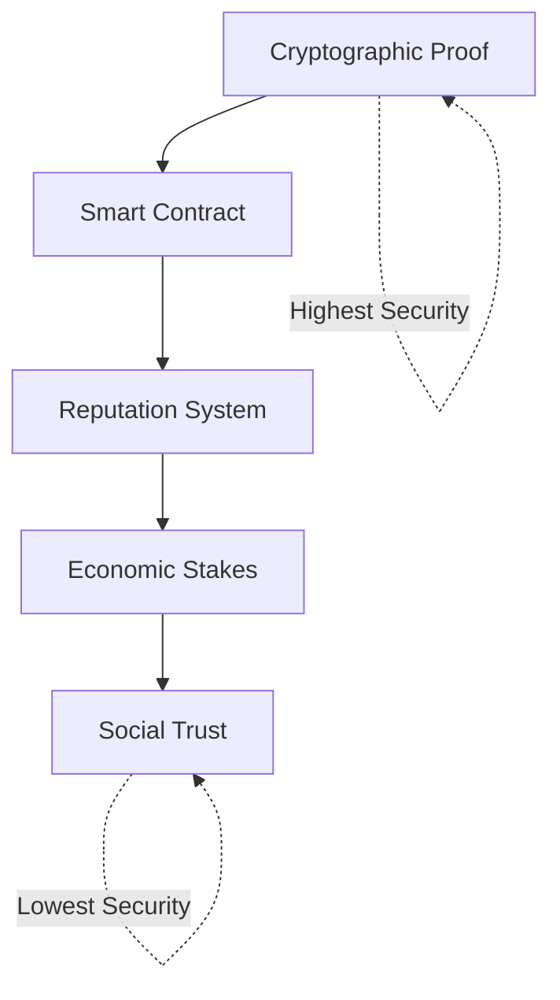
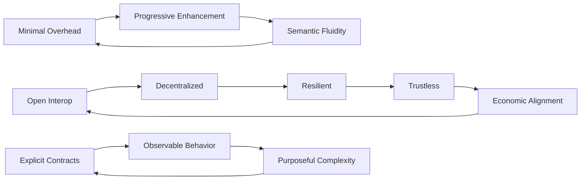

# Coral Protocol: Core Design Principles

## 🎯 Foundational Philosophy
The principles that guide every design decision in the Coral Protocol ecosystem and should inform any multi-agent system architecture.

---

## Primary Principles

### 1. 🔓 Principle of Open Interoperability
> **"No agent should be locked into a single platform, framework, or vendor"**

#### Implementation Mandates
- All protocols must be open source
- Standard interfaces required (MCP)
- No proprietary dependencies
- Vendor-neutral design
- Framework-agnostic communication

#### Design Decisions
```yaml
acceptable:
  - open_standards: JSON-RPC, HTTP, WebSocket
  - open_identity: W3C DIDs
  - open_payments: Blockchain-based
  - open_source: MIT/Apache licensed

unacceptable:
  - vendor_apis: Proprietary endpoints
  - closed_protocols: Non-documented formats
  - platform_locks: Single-cloud dependency
  - license_restrictions: GPL, proprietary
```

#### Measurement
- Portability Score: Can agent move between platforms?
- Integration Time: Hours to connect new service
- Dependency Count: Number of proprietary dependencies

---

### 2. 💰 Principle of Economic Alignment
> **"Every interaction should have clear economic incentives that align all participants"**

#### Core Tenets
1. **Work = Payment**: No unpaid labor
2. **Quality = Reward**: Better work, better pay
3. **Risk = Compensation**: Higher risk, higher reward
4. **Skin in the Game**: Staking for commitment

#### Implementation Patterns
```python
class EconomicAlignment:
    def validate_interaction(self, interaction):
        assert interaction.has_payment(), "No free work"
        assert interaction.payment >= interaction.cost, "Must cover costs"
        assert interaction.incentives_aligned(), "Misaligned incentives"
        assert interaction.has_recourse(), "No recourse mechanism"
        return True
    
    def calculate_payment(self, task):
        base = task.complexity * market_rate
        quality_bonus = task.quality_requirement * 0.2 * base
        urgency_premium = task.urgency * 0.3 * base
        risk_compensation = task.risk_level * 0.1 * base
        
        return base + quality_bonus + urgency_premium + risk_compensation
```

---

### 3. 🔐 Principle of Trustless Security
> **"Never require trust where cryptography can suffice"**

#### Security Hierarchy


#### Implementation Rules
- **Signatures over Promises**: Every commitment must be signed
- **Escrow over IOUs**: Payments locked before work
- **Verification over Trust**: Cryptographic proofs required
- **Immutable over Mutable**: Blockchain for critical data

#### Code Example
```rust
// Never this:
fn trust_based_payment(agent: Agent, amount: u64) {
    if agent.seems_trustworthy() {  // ❌ Subjective
        pay(agent, amount);
    }
}

// Always this:
fn cryptographic_payment(agent: Agent, amount: u64, proof: Proof) {
    if verify_proof(proof, agent.public_key) {  // ✅ Objective
        release_escrow(agent, amount);
    }
}
```

---

### 4. 🕸️ Principle of Decentralized Resilience
> **"No single point of failure should exist in the system"**

#### Architectural Requirements
1. **Geographic Distribution**: Agents across regions
2. **Provider Diversity**: Multiple cloud/hosting providers
3. **Protocol Redundancy**: Multiple communication paths
4. **Economic Distribution**: No single payment processor

#### Resilience Metrics
```yaml
redundancy_requirements:
  orchestrators: minimum 3 per region
  payment_chains: at least 2 (Solana + backup)
  message_routes: 3+ independent paths
  data_storage: 5+ replicas across providers
  
failure_tolerance:
  single_node: zero impact
  single_region: <10% degradation
  single_provider: <25% degradation
  payment_network: graceful fallback
```

---

### 5. ⚡ Principle of Minimal Overhead
> **"Every byte and every millisecond must be justified"**

#### Efficiency Mandates
- Protocol overhead < 5% of payload
- Message routing < 50ms P99
- Payment settlement < 500ms
- Discovery queries < 100ms

#### Optimization Hierarchy
1. Remove unnecessary data
2. Compress remaining data
3. Cache frequently accessed data
4. Parallelize independent operations
5. Batch similar operations

#### Example Evolution
```python
# Version 1: Verbose (450 bytes)
message_v1 = {
    "protocol_version": "1.0.0",
    "message_type": "task_request",
    "sender": {
        "id": "agent_123",
        "name": "DataAnalyzer",
        "reputation": 95
    },
    "recipient": "agent_456",
    "timestamp": "2024-01-15T10:30:00Z",
    "task": {
        "type": "analysis",
        "data": "...",
        "timeout": 3600
    }
}

# Version 2: Optimized (120 bytes)
message_v2 = {
    "v": 2,
    "t": "tr",
    "s": "123",
    "r": "456",
    "ts": 1705316400,
    "d": {"t": "analysis", "d": "...", "to": 3600}
}

# Version 3: Context-implicit (45 bytes)
message_v3 = "tr:123:456:1705316400:analysis:...:3600"
```

---

### 6. 🔄 Principle of Progressive Enhancement
> **"Start simple, enhance gradually based on actual needs"**

#### Implementation Stages
1. **MVP**: Basic functionality only
2. **Enhancement**: Add based on usage patterns
3. **Optimization**: Improve based on bottlenecks
4. **Evolution**: Adapt based on ecosystem changes

#### Feature Addition Criteria
```python
def should_add_feature(feature):
    return (
        feature.requested_by_users > 100 and
        feature.implementation_cost < feature.expected_value and
        feature.maintains_backward_compatibility and
        feature.doesn't_increase_complexity > 10%
    )
```

---

### 7. 🌊 Principle of Semantic Fluidity
> **"Protocols should evolve naturally toward efficiency"**

#### Evolution Patterns
- Human-readable → Machine-optimized
- Explicit → Implicit (context-aware)
- Stateless → Stateful (where beneficial)
- Synchronous → Asynchronous

#### Version Compatibility
```typescript
interface ProtocolEvolution {
    // Support last 3 versions
    supportedVersions: [1, 2, 3];
    
    // Automatic version negotiation
    negotiate(client: Client): Version {
        const clientVersions = client.getSupportedVersions();
        const common = this.supportedVersions.filter(v => 
            clientVersions.includes(v)
        );
        return Math.max(...common);  // Use highest common version
    }
    
    // Graceful degradation
    fallback(message: Message): Message {
        if (message.version > this.maxVersion) {
            return this.downgrade(message);
        }
        return message;
    }
}
```

---

### 8. 🎯 Principle of Purposeful Complexity
> **"Complexity is only acceptable when it provides proportional value"**

#### Complexity Budget
```yaml
complexity_allocation:
  security: 30%      # Critical, high value
  payments: 25%      # Essential, high risk
  routing: 20%       # Core functionality
  discovery: 15%     # Important, moderate complexity
  ui/ux: 10%        # Keep simple for adoption
```

#### Complexity Assessment
```python
def assess_complexity(component):
    metrics = {
        'lines_of_code': component.loc,
        'cyclomatic_complexity': component.complexity,
        'dependencies': len(component.dependencies),
        'api_surface': len(component.public_methods)
    }
    
    value = component.business_value
    complexity = sum(metrics.values()) / len(metrics)
    
    if complexity / value > 2.0:
        raise ComplexityException("Too complex for value provided")
```

---

### 9. 🤝 Principle of Explicit Contracts
> **"Every agreement must be explicit, verifiable, and enforceable"**

#### Contract Requirements
1. **Clear Terms**: Unambiguous specifications
2. **Measurable Outcomes**: Objective success criteria
3. **Enforcement Mechanism**: Automated execution
4. **Dispute Resolution**: Clear escalation path

#### Smart Contract Template
```solidity
contract AgentAgreement {
    struct Contract {
        address agent;
        address client;
        bytes32 taskHash;
        uint256 payment;
        uint256 deadline;
        bytes32 successCriteria;
        bool completed;
    }
    
    function executeContract(Contract memory c) public {
        require(block.timestamp <= c.deadline, "Past deadline");
        require(verifyCompletion(c.successCriteria), "Not complete");
        require(!c.completed, "Already executed");
        
        transfer(c.agent, c.payment);
        c.completed = true;
    }
}
```

---

### 10. 🔍 Principle of Observable Behavior
> **"All agent actions must be observable, measurable, and auditable"**

#### Observability Stack
```yaml
layers:
  - metrics:
      what: Performance indicators
      tools: Prometheus, Grafana
      retention: 30 days
      
  - logs:
      what: Detailed execution logs
      tools: ElasticSearch, Kibana
      retention: 90 days
      
  - traces:
      what: Distributed transaction tracking
      tools: Jaeger, Zipkin
      retention: 7 days
      
  - events:
      what: Significant state changes
      tools: Kafka, EventStore
      retention: Forever (blockchain)
```

#### Implementation
```python
class ObservableAgent:
    def execute_task(self, task):
        trace_id = generate_trace_id()
        
        # Start trace
        with tracer.start_span("task_execution", trace_id):
            # Log initiation
            logger.info(f"Starting task {task.id}", extra={
                'trace_id': trace_id,
                'agent_id': self.id,
                'task_type': task.type
            })
            
            # Record metrics
            metrics.increment('tasks_started')
            
            # Execute with timing
            with metrics.timer('task_duration'):
                result = self._execute(task)
            
            # Log completion
            logger.info(f"Completed task {task.id}", extra={
                'trace_id': trace_id,
                'result': result.status,
                'duration': result.duration
            })
            
            # Emit event
            events.emit('task_completed', {
                'agent': self.id,
                'task': task.id,
                'result': result
            })
            
            return result
```

---

## Principle Interactions

### Synergies


### Conflicts & Resolutions
| Conflict | Resolution |
|----------|------------|
| Security vs Speed | Use risk-based security levels |
| Decentralization vs Efficiency | Hierarchical organization |
| Openness vs Value Capture | Open core + premium services |
| Simplicity vs Features | Progressive enhancement |
| Trust vs Verification | Graduated trust levels |

---

## Validation Checklist

### For New Features
- [ ] Maintains open interoperability?
- [ ] Has clear economic model?
- [ ] Requires minimal trust?
- [ ] No single point of failure?
- [ ] Justifies overhead added?
- [ ] Can be added progressively?
- [ ] Allows protocol evolution?
- [ ] Complexity justified by value?
- [ ] Contracts are explicit?
- [ ] Behavior is observable?

### For Architecture Decisions
- [ ] Follows all 10 principles?
- [ ] Resolves principle conflicts appropriately?
- [ ] Maintains system coherence?
- [ ] Enables future evolution?
- [ ] Reduces overall complexity?

---

## Anti-Principles (What NOT to Do)

### ❌ Closed Garden Thinking
"We'll lock users into our ecosystem"

### ❌ Trust-Based Security
"Agents won't misbehave"

### ❌ Centralized Control
"We'll manage everything from one place"

### ❌ Feature Creep
"Let's add everything users might want"

### ❌ Premature Optimization
"Let's optimize before we measure"

---

## Tags
#Principles #DesignPhilosophy #SystemArchitecture #CoralProtocol #EngineeringPrinciples #DistributedSystems

---

*Principles derived from: Coral Protocol design philosophy and implementation patterns*
*Version: 1.0 | Living document - updates with ecosystem evolution*