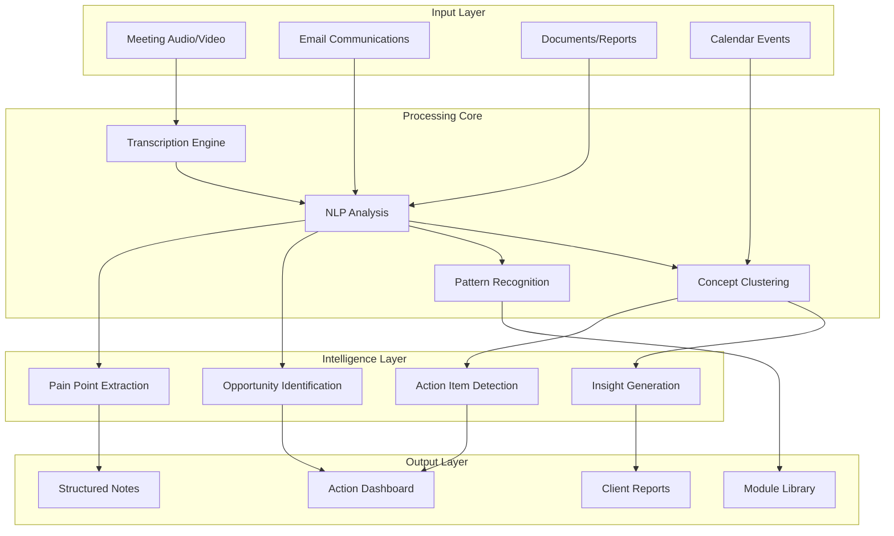

# Chris Productivity Suite - Technical Architecture

## 📋 Executive Summary
Technical architecture and implementation plan for Chris's AI-powered consultant productivity suite, designed to transform consulting workflow through automation and intelligent assistance.

---

## Current Workflow Analysis

### Pain Points Identified

```yaml
discovery_challenges:
  manual_processes:
    - Note-taking during client meetings
    - Pain point identification
    - Opportunity mapping
    - Pattern recognition across clients
  
  information_management:
    - Scattered notes across tools
    - Lost insights in meeting recordings
    - Manual follow-up tracking
    - Inconsistent documentation
  
  efficiency_bottlenecks:
    - Repetitive report generation
    - Manual action item extraction
    - Time-consuming synthesis
    - Context switching overhead
```

### Current Tool Stack Assessment

```python
current_tools = {
    'note_taking': ['Manual notes', 'Basic transcription'],
    'organization': ['Scattered files', 'Email threads'],
    'analysis': ['Manual review', 'Spreadsheets'],
    'client_management': ['Calendar', 'Email'],
    'knowledge_base': ['Unstructured documents']
}

# Gaps identified:
gaps = [
    'No automated pain point capture',
    'No pattern recognition system',
    'No concept clustering implementation',
    'Manual workflow with high friction',
    'No reusable module library'
]
```

---

## Proposed Architecture

### Core System Design



### Technical Stack

```yaml
infrastructure:
  hosting:
    primary: Vercel/Railway
    fallback: AWS Lambda
  
  database:
    vector: Pinecone
    structured: Supabase
    cache: Redis
  
  processing:
    transcription: Whisper API
    llm: Claude 3.5 Sonnet
    embeddings: text-embedding-3-large

frontend:
  framework: Next.js 14
  ui: Shadcn UI
  state: Zustand
  
backend:
  api: FastAPI
  workers: Celery
  queue: RabbitMQ

integrations:
  calendar: Google/Outlook
  email: IMAP/SMTP
  storage: S3/R2
  auth: Clerk
```

---

## Implementation Plan

### Week 1: Foundation (Immediate)

```python
week_1_deliverables = {
    'day_1_2': {
        'meeting_transcription': {
            'setup': 'Whisper API integration',
            'features': [
                'Real-time transcription',
                'Speaker diarization',
                'Timestamp alignment'
            ],
            'output': 'Structured transcript JSON'
        }
    },
    
    'day_3_4': {
        'note_organization': {
            'structure': 'Hierarchical tagging system',
            'features': [
                'Auto-categorization',
                'Smart search',
                'Version control'
            ],
            'output': 'Organized knowledge base'
        }
    },
    
    'day_5_7': {
        'action_tracker': {
            'extraction': 'NLP-based detection',
            'features': [
                'Priority assignment',
                'Due date inference',
                'Owner identification'
            ],
            'output': 'Action item dashboard'
        }
    }
}
```

### Week 2-4: Enhancement

```yaml
enhancement_phase:
  week_2:
    pattern_recognition:
      - Cross-client pain point analysis
      - Opportunity clustering
      - Solution mapping
    
    concept_clustering:
      - Palantir pattern implementation
      - Knowledge graph construction
      - Semantic similarity matching
  
  week_3:
    module_library:
      - Reusable component catalog
      - Solution templates
      - Best practice repository
    
    report_generation:
      - Automated insights compilation
      - Custom report templates
      - Export formats (PDF, MD, DOCX)
  
  week_4:
    integration_testing:
      - End-to-end workflow validation
      - Performance optimization
      - User feedback incorporation
```

---

## Module Architecture

### 1. Discovery Automation Module

```python
class DiscoveryAutomation:
    """Automated pain point and opportunity discovery"""
    
    def __init__(self):
        self.llm = Claude35Sonnet()
        self.embeddings = TextEmbedding3Large()
        self.vector_store = PineconeIndex()
    
    async def process_meeting(self, transcript):
        # Extract pain points
        pain_points = await self.extract_pain_points(transcript)
        
        # Identify opportunities
        opportunities = await self.identify_opportunities(pain_points)
        
        # Cluster concepts
        clusters = await self.cluster_concepts(transcript)
        
        # Generate insights
        insights = await self.generate_insights(
            pain_points, 
            opportunities, 
            clusters
        )
        
        return {
            'pain_points': pain_points,
            'opportunities': opportunities,
            'concept_clusters': clusters,
            'insights': insights
        }
```

### 2. Workflow Efficiency Module

```python
class WorkflowAutomation:
    """Streamline consultant workflows"""
    
    async def process_workflow(self, input_data):
        pipeline = [
            self.transcribe_meeting,
            self.extract_actions,
            self.generate_followups,
            self.create_reports,
            self.update_knowledge_base
        ]
        
        result = input_data
        for step in pipeline:
            result = await step(result)
        
        return result
    
    async def extract_actions(self, transcript):
        prompt = """
        Extract actionable items from this transcript:
        1. Identify WHO needs to do WHAT by WHEN
        2. Classify priority (High/Medium/Low)
        3. Link to relevant context
        """
        
        return await self.llm.extract(prompt, transcript)
```

### 3. Knowledge Management Module

```python
class KnowledgeManagement:
    """Palantir-style concept clustering"""
    
    def __init__(self):
        self.graph = Neo4j()
        self.concepts = {}
        self.modules = {}
    
    async def add_concept(self, concept):
        # Embed concept
        embedding = await self.embed(concept)
        
        # Find similar concepts
        similar = await self.find_similar(embedding)
        
        # Create or update cluster
        cluster = await self.update_cluster(concept, similar)
        
        # Link to modules
        await self.link_to_modules(cluster)
        
        return cluster
    
    async def generate_module(self, cluster):
        """Convert concept cluster to reusable module"""
        return {
            'name': cluster.name,
            'description': cluster.description,
            'components': cluster.extract_components(),
            'patterns': cluster.identify_patterns(),
            'applications': cluster.suggest_applications()
        }
```

---

## API Design

### RESTful Endpoints

```yaml
api_endpoints:
  /transcribe:
    method: POST
    input: audio_file
    output: structured_transcript
  
  /analyze:
    method: POST
    input: transcript
    output:
      pain_points: []
      opportunities: []
      actions: []
  
  /cluster:
    method: POST
    input: concepts[]
    output: concept_clusters
  
  /generate-report:
    method: POST
    input: analysis_data
    output: formatted_report
  
  /search:
    method: GET
    params: query, filters
    output: relevant_items[]
```

### WebSocket Events

```javascript
// Real-time updates
socket.on('transcription:chunk', (chunk) => {
  updateTranscript(chunk);
});

socket.on('action:detected', (action) => {
  addToActionList(action);
});

socket.on('insight:generated', (insight) => {
  displayInsight(insight);
});
```

---

## User Interface Design

### Dashboard Layout

```typescript
interface DashboardLayout {
  header: {
    search: SearchBar;
    notifications: NotificationCenter;
    profile: UserMenu;
  };
  
  sidebar: {
    navigation: MenuItem[];
    recentItems: RecentItem[];
    quickActions: QuickAction[];
  };
  
  main: {
    activeView: 'meetings' | 'actions' | 'insights' | 'modules';
    content: ViewContent;
  };
  
  panels: {
    right: DetailPanel;
    bottom: StatusBar;
  };
}
```

### Key Views

1. **Meeting View**
   - Live transcription display
   - Pain point highlighting
   - Action item extraction
   - Follow-up generation

2. **Action Dashboard**
   - Kanban board layout
   - Priority sorting
   - Due date tracking
   - Owner assignment

3. **Insights Hub**
   - Pattern visualizations
   - Opportunity mapping
   - Trend analysis
   - Cross-client insights

4. **Module Library**
   - Searchable catalog
   - Usage analytics
   - Version control
   - Export/import tools

---

## Integration Points

### Email Integration

```python
class EmailIntegration:
    async def process_emails(self):
        # Connect to email
        emails = await self.fetch_unread()
        
        for email in emails:
            # Extract context
            context = await self.extract_context(email)
            
            # Identify actions
            actions = await self.identify_actions(context)
            
            # Update knowledge base
            await self.update_kb(context)
            
            # Generate response if needed
            if self.needs_response(email):
                response = await self.generate_response(context)
                await self.queue_response(response)
```

### Calendar Integration

```python
class CalendarIntegration:
    async def prepare_meeting(self, event):
        # Gather context
        attendees = await self.get_attendee_history(event)
        previous_meetings = await self.get_related_meetings(event)
        
        # Generate briefing
        briefing = await self.generate_briefing(
            attendees, 
            previous_meetings
        )
        
        # Prepare questions
        questions = await self.suggest_questions(briefing)
        
        return {
            'briefing': briefing,
            'suggested_questions': questions,
            'relevant_documents': await self.find_relevant_docs(event)
        }
```

---

## Performance Specifications

### Response Times

```yaml
performance_targets:
  transcription:
    real_time: < 500ms latency
    batch: < 2s per minute of audio
  
  analysis:
    pain_point_extraction: < 3s
    opportunity_identification: < 5s
    report_generation: < 10s
  
  search:
    keyword: < 100ms
    semantic: < 500ms
    complex_query: < 2s
```

### Scalability

```python
scalability_specs = {
    'concurrent_users': 100,
    'meetings_per_day': 1000,
    'storage': '1TB',
    'vector_dimensions': 3072,
    'max_context_length': 200000
}
```

---

## Security & Privacy

### Data Protection

```yaml
security_measures:
  encryption:
    at_rest: AES-256
    in_transit: TLS 1.3
  
  authentication:
    method: OAuth2 + MFA
    providers: [Google, Microsoft]
  
  authorization:
    model: RBAC
    levels: [admin, user, viewer]
  
  compliance:
    standards: [SOC2, GDPR]
    audit_logging: enabled
```

---

## Deployment Strategy

### Phase 1: Local Development
- Docker containerization
- Local testing environment
- Mock data generation

### Phase 2: Staging
- Vercel preview deployments
- Integration testing
- Performance benchmarking

### Phase 3: Production
- Progressive rollout
- Monitoring setup
- Backup strategies

---

## Success Metrics

```python
success_metrics = {
    'efficiency': {
        'time_saved': '80% reduction in note processing',
        'automation_rate': '90% of routine tasks automated'
    },
    
    'quality': {
        'insight_accuracy': '95% relevant insights',
        'action_capture': '100% action items identified'
    },
    
    'adoption': {
        'daily_active_use': '100% (Chris)',
        'feature_utilization': '>80% of features used'
    }
}
```

---

## Next Steps

### Immediate Actions (Today)
1. [ ] Set up development environment
2. [ ] Initialize Next.js project
3. [ ] Configure Whisper API
4. [ ] Create basic transcription prototype

### Tomorrow
1. [ ] Implement action item extraction
2. [ ] Set up vector database
3. [ ] Create dashboard skeleton
4. [ ] Test with sample data

### This Week
1. [ ] Complete Week 1 deliverables
2. [ ] Schedule demo with Chris
3. [ ] Gather feedback
4. [ ] Iterate on design

---

## Technical Contact

**Jay Guthrie**  
*Technical Architecture & Implementation*  
- Discord: [Jay's Discord]
- GitHub: [Jay's GitHub]

---

*Architecture Version: 1.0*  
*Created: August 29, 2025*  
*Status: Implementation Starting*