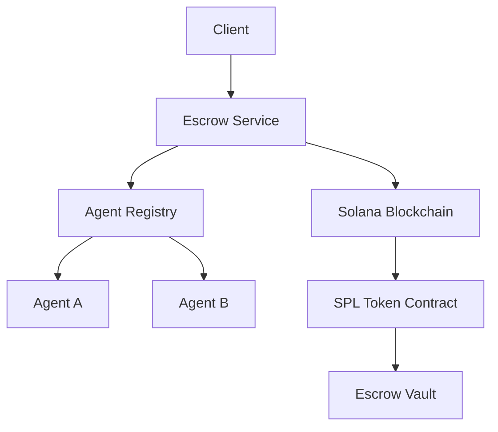

# Coral Protocol: Implementation Projects

## 🚀 Project Portfolio
Concrete projects to implement Coral Protocol concepts, ranging from proof-of-concepts to production systems.

---

## Tier 1: Foundation Projects (Start Here)

### Project 1: Basic Agent Communication Hub
**Objective**: Implement core thread-based messaging between agents

#### Technical Specifications
```yaml
project: agent-communication-hub
duration: 2-3 weeks
complexity: medium
technologies:
  - Python/TypeScript
  - WebSocket/SSE
  - Redis for message queue
  - PostgreSQL for persistence
```

#### Implementation Roadmap
```python
# Phase 1: Message Router (Week 1)
class MessageRouter:
    def __init__(self):
        self.threads = {}
        self.agents = {}
        
    def create_thread(self, creator_id: str) -> Thread:
        thread = Thread(creator_id)
        self.threads[thread.id] = thread
        return thread
    
    def route_message(self, message: Message):
        thread = self.threads.get(message.thread_id)
        mentions = self.extract_mentions(message.content)
        for agent_id in mentions:
            self.deliver_to_agent(agent_id, message)

# Phase 2: Agent Interface (Week 2)
class CoralAgent:
    def __init__(self, agent_id: str, capabilities: List[str]):
        self.id = agent_id
        self.capabilities = capabilities
        self.message_handler = None
        
    async def join_thread(self, thread_id: str):
        # Connect to thread
        pass
    
    async def send_message(self, content: str, mentions: List[str]):
        # Send to thread
        pass

# Phase 3: Persistence & Recovery (Week 3)
class ThreadPersistence:
    def save_message(self, message: Message):
        # Save to PostgreSQL
        pass
    
    def recover_thread(self, thread_id: str) -> Thread:
        # Restore from database
        pass
```

#### Success Metrics
- [ ] 10,000+ messages/second throughput
- [ ] < 50ms message delivery latency
- [ ] 99.9% message delivery guarantee
- [ ] Thread recovery after restart

---

### Project 2: Simple Escrow Payment System
**Objective**: Build trustless payment mechanism for agents

#### Architecture


#### Core Components
```rust
// Smart Contract (Solana/Anchor)
#[program]
pub mod simple_escrow {
    use anchor_lang::prelude::*;
    
    pub fn create_escrow(
        ctx: Context<CreateEscrow>,
        amount: u64,
        agents: Vec<Pubkey>
    ) -> Result<()> {
        let escrow = &mut ctx.accounts.escrow;
        escrow.authority = ctx.accounts.authority.key();
        escrow.amount = amount;
        escrow.agents = agents;
        escrow.created_at = Clock::get()?.unix_timestamp;
        
        // Transfer tokens to escrow
        token::transfer(
            ctx.accounts.transfer_context(),
            amount
        )?;
        
        Ok(())
    }
    
    pub fn claim_payment(
        ctx: Context<ClaimPayment>,
        signature: [u8; 64]
    ) -> Result<()> {
        // Verify signature
        require!(
            verify_signature(&signature, &ctx.accounts.agent.key()),
            ErrorCode::InvalidSignature
        );
        
        // Transfer payment
        token::transfer(
            ctx.accounts.payment_context(),
            ctx.accounts.escrow.payment_amount
        )?;
        
        Ok(())
    }
}
```

#### Milestones
- Week 1: Smart contract development
- Week 2: Backend service implementation
- Week 3: Agent integration
- Week 4: Testing & deployment

---

### Project 3: Agent Discovery Service
**Objective**: Create capability-based agent discovery system

#### Database Schema
```sql
-- Agent Registry
CREATE TABLE agents (
    id UUID PRIMARY KEY,
    did TEXT UNIQUE NOT NULL,
    name TEXT NOT NULL,
    reputation DECIMAL(5,2) DEFAULT 50.0,
    status VARCHAR(20) DEFAULT 'active',
    created_at TIMESTAMP DEFAULT NOW()
);

-- Capabilities
CREATE TABLE capabilities (
    id UUID PRIMARY KEY,
    agent_id UUID REFERENCES agents(id),
    capability TEXT NOT NULL,
    proficiency DECIMAL(3,2),
    verified BOOLEAN DEFAULT FALSE,
    examples JSONB,
    INDEX idx_capability (capability)
);

-- Performance Metrics
CREATE TABLE metrics (
    agent_id UUID REFERENCES agents(id),
    task_count INTEGER DEFAULT 0,
    success_rate DECIMAL(3,2),
    avg_response_time INTEGER,
    last_active TIMESTAMP
);
```

#### Discovery API
```typescript
class DiscoveryService {
    async findAgents(query: DiscoveryQuery): Promise<Agent[]> {
        const sql = `
            SELECT a.*, c.capability, c.proficiency, m.success_rate
            FROM agents a
            JOIN capabilities c ON a.id = c.agent_id
            JOIN metrics m ON a.id = m.agent_id
            WHERE c.capability = $1
            AND a.status = 'active'
            AND m.success_rate > $2
            ORDER BY a.reputation DESC, m.success_rate DESC
            LIMIT $3
        `;
        
        return this.db.query(sql, [
            query.capability,
            query.minSuccessRate || 0.7,
            query.limit || 10
        ]);
    }
    
    async registerAgent(agent: AgentRegistration): Promise<string> {
        // Validate DID
        await this.validateDID(agent.did);
        
        // Store agent
        const id = await this.db.insert('agents', agent);
        
        // Index capabilities
        for (const cap of agent.capabilities) {
            await this.indexCapability(id, cap);
        }
        
        return id;
    }
}
```

---

## Tier 2: Integration Projects

### Project 4: MCP Coralizer Implementation
**Objective**: Wrap MCP servers as Coral agents

#### Coralizer Architecture
```python
class MCPCoralizer:
    """Transforms MCP servers into Coral agents"""
    
    def __init__(self, mcp_endpoint: str):
        self.mcp_client = MCPClient(mcp_endpoint)
        self.coral_agent = None
        
    async def coralize(self) -> CoralAgent:
        # Discover MCP capabilities
        tools = await self.mcp_client.list_tools()
        
        # Create Coral agent
        self.coral_agent = CoralAgent(
            id=f"mcp_{self.mcp_endpoint}",
            capabilities=self.map_tools_to_capabilities(tools)
        )
        
        # Setup message handler
        self.coral_agent.on_message = self.handle_coral_message
        
        # Generate wallet
        self.coral_agent.wallet = self.generate_wallet()
        
        return self.coral_agent
    
    async def handle_coral_message(self, message: Message):
        # Parse Coral message
        request = self.parse_request(message)
        
        # Call MCP tool
        result = await self.mcp_client.call_tool(
            request.tool,
            request.parameters
        )
        
        # Return Coral response
        return self.format_response(result)
```

#### Integration Examples
```yaml
supported_mcp_servers:
  - filesystem:
      tools: [read_file, write_file, list_directory]
      coral_capabilities: [file_management, data_storage]
      
  - github:
      tools: [create_issue, create_pr, list_repos]
      coral_capabilities: [version_control, issue_tracking]
      
  - slack:
      tools: [send_message, read_channel, list_users]
      coral_capabilities: [communication, notification]
      
  - database:
      tools: [query, insert, update, delete]
      coral_capabilities: [data_persistence, querying]
```

---

### Project 5: Multi-Agent Orchestration Platform
**Objective**: Build system for complex multi-agent workflows

#### Workflow Definition Language
```yaml
workflow: customer_support_automation
version: 1.0

stages:
  - name: ticket_classification
    agent: classifier_agent
    input: customer_ticket
    output: ticket_category
    
  - name: sentiment_analysis
    agent: sentiment_agent
    input: customer_ticket
    output: emotion_score
    parallel: true
    
  - name: knowledge_search
    agent: search_agent
    input: 
      - ticket_category
      - customer_ticket
    output: relevant_articles
    
  - name: response_generation
    agent: writer_agent
    input:
      - relevant_articles
      - emotion_score
      - customer_ticket
    output: draft_response
    
  - name: quality_review
    agent: reviewer_agent
    input: draft_response
    output: final_response
    
payment:
  total: 10 SOL
  distribution:
    classifier_agent: 10%
    sentiment_agent: 10%
    search_agent: 20%
    writer_agent: 40%
    reviewer_agent: 20%
```

#### Orchestrator Implementation
```python
class WorkflowOrchestrator:
    async def execute_workflow(self, workflow_def: dict, input_data: dict):
        # Create thread and escrow
        thread = await self.coral.create_thread()
        escrow = await self.create_escrow(workflow_def['payment'])
        
        results = {}
        for stage in workflow_def['stages']:
            # Find capable agent
            agent = await self.discovery.find_agent(
                capability=stage['agent']
            )
            
            # Add to thread
            await thread.add_participant(agent)
            
            # Prepare input
            stage_input = self.resolve_input(stage['input'], results)
            
            # Execute stage
            if stage.get('parallel'):
                task = asyncio.create_task(
                    self.execute_stage(thread, agent, stage_input)
                )
                results[stage['name']] = task
            else:
                result = await self.execute_stage(thread, agent, stage_input)
                results[stage['name']] = result
        
        # Wait for parallel tasks
        for name, task in results.items():
            if isinstance(task, asyncio.Task):
                results[name] = await task
        
        # Distribute payments
        await self.distribute_payments(escrow, workflow_def['payment'])
        
        return results
```

---

### Project 6: Agent Reputation System
**Objective**: Build decentralized reputation tracking

#### Reputation Algorithm
```python
class ReputationEngine:
    def calculate_reputation(self, agent_id: str) -> float:
        # Base factors
        task_performance = self.get_task_performance(agent_id)  # 0-100
        peer_ratings = self.get_peer_ratings(agent_id)         # 0-100
        client_feedback = self.get_client_feedback(agent_id)    # 0-100
        
        # Time decay
        recency_weight = self.calculate_recency_weight(agent_id)
        
        # Specialization bonus
        specialization = self.calculate_specialization(agent_id)
        
        # Weighted calculation
        base_score = (
            task_performance * 0.4 +
            peer_ratings * 0.3 +
            client_feedback * 0.3
        )
        
        # Apply modifiers
        final_score = base_score * recency_weight * (1 + specialization * 0.1)
        
        # Anti-gaming measures
        if self.detect_gaming(agent_id):
            final_score *= 0.5  # Penalty for gaming attempts
        
        return min(final_score, 100)  # Cap at 100
    
    def update_after_task(self, agent_id: str, task_result: TaskResult):
        # Update performance metrics
        self.update_performance(agent_id, task_result)
        
        # Propagate to collaborators
        for collaborator in task_result.collaborators:
            impact = self.calculate_impact(agent_id, collaborator)
            self.propagate_reputation(collaborator, impact)
        
        # Store on blockchain for immutability
        self.blockchain.store_reputation_update(agent_id, task_result)
```

---

## Tier 3: Advanced Projects

### Project 7: Cross-Chain Agent Bridge
**Objective**: Enable agents to operate across multiple blockchains

#### Bridge Architecture
```typescript
interface CrossChainBridge {
    // Supported chains
    chains: {
        solana: SolanaConnector,
        ethereum: EthereumConnector,
        polygon: PolygonConnector,
        arbitrum: ArbitrumConnector
    };
    
    // Unified interface
    async transferValue(
        from_chain: Chain,
        to_chain: Chain,
        amount: number,
        token: Token
    ): Promise<TransferReceipt>;
    
    // Agent migration
    async migrateAgent(
        agent: Agent,
        from_chain: Chain,
        to_chain: Chain
    ): Promise<MigrationResult>;
}
```

---

### Project 8: AI Model Marketplace
**Objective**: Create marketplace for specialized AI models

#### Marketplace Features
```yaml
features:
  - model_listing:
      - name, description, capabilities
      - pricing per inference
      - performance metrics
      - example outputs
      
  - quality_assurance:
      - automated testing
      - peer review
      - performance benchmarks
      - security scanning
      
  - payment_integration:
      - pay-per-use
      - subscription models
      - bulk discounts
      - revenue sharing
      
  - discovery:
      - capability search
      - performance filtering
      - cost optimization
      - recommendation engine
```

---

### Project 9: Autonomous Agent Breeding
**Objective**: Genetic algorithm for agent optimization

#### Breeding Algorithm
```python
class AgentBreeder:
    def breed_agents(self, parent_a: Agent, parent_b: Agent) -> Agent:
        # Combine capabilities
        child_capabilities = self.crossover_capabilities(
            parent_a.capabilities,
            parent_b.capabilities
        )
        
        # Inherit parameters
        child_params = self.blend_parameters(
            parent_a.parameters,
            parent_b.parameters
        )
        
        # Apply mutations
        if random.random() < self.mutation_rate:
            child_params = self.mutate(child_params)
        
        # Create child agent
        child = Agent(
            capabilities=child_capabilities,
            parameters=child_params,
            generation=max(parent_a.generation, parent_b.generation) + 1
        )
        
        # Inherit reputation (diminished)
        child.reputation = (
            parent_a.reputation * 0.15 +
            parent_b.reputation * 0.15
        )
        
        return child
```

---

### Project 10: Zero-Knowledge Agent Proofs
**Objective**: Prove agent capabilities without revealing implementation

#### ZK Proof System
```rust
impl ZKCapabilityProof {
    fn prove_capability(&self, capability: &str) -> Proof {
        // Create circuit for capability
        let circuit = CapabilityCircuit::new(capability);
        
        // Generate proof without revealing code
        let proof = circuit.prove(self.implementation);
        
        proof
    }
    
    fn verify_capability(proof: &Proof, capability: &str) -> bool {
        // Verify proof without seeing implementation
        let circuit = CapabilityCircuit::new(capability);
        circuit.verify(proof)
    }
}
```

---

## Project Difficulty Matrix

| Project | Difficulty | Time | Team Size | Skills Required |
|---------|-----------|------|-----------|-----------------|
| Communication Hub | ⭐⭐⭐ | 3 weeks | 2-3 | Backend, WebSocket |
| Escrow System | ⭐⭐⭐⭐ | 4 weeks | 2-3 | Blockchain, Rust |
| Discovery Service | ⭐⭐⭐ | 2 weeks | 1-2 | Database, API |
| MCP Coralizer | ⭐⭐⭐ | 3 weeks | 2 | Integration, Python |
| Orchestration Platform | ⭐⭐⭐⭐ | 6 weeks | 3-4 | Distributed Systems |
| Reputation System | ⭐⭐⭐⭐ | 4 weeks | 2-3 | Algorithms, Blockchain |
| Cross-Chain Bridge | ⭐⭐⭐⭐⭐ | 8 weeks | 4-5 | Multi-chain, Security |
| AI Marketplace | ⭐⭐⭐⭐ | 6 weeks | 3-4 | Full-stack, ML |
| Agent Breeding | ⭐⭐⭐⭐⭐ | 6 weeks | 2-3 | Genetic Algorithms |
| ZK Proofs | ⭐⭐⭐⭐⭐ | 8 weeks | 3-4 | Cryptography, ZK |

---

## Getting Started Guide

### Prerequisites
```bash
# Development environment
- Node.js 18+
- Python 3.10+
- Rust 1.70+
- Docker & Docker Compose
- Solana CLI tools
- PostgreSQL 15+
- Redis 7+

# Recommended IDEs
- VS Code with Rust/Python/TS extensions
- IntelliJ IDEA for Java/Kotlin projects
```

### Repository Structure
```
coral-implementations/
├── tier1/
│   ├── communication-hub/
│   ├── escrow-system/
│   └── discovery-service/
├── tier2/
│   ├── mcp-coralizer/
│   ├── orchestration-platform/
│   └── reputation-system/
├── tier3/
│   ├── cross-chain-bridge/
│   ├── ai-marketplace/
│   ├── agent-breeding/
│   └── zk-proofs/
├── shared/
│   ├── protocols/
│   ├── contracts/
│   └── utilities/
└── docs/
    ├── getting-started.md
    ├── api-reference.md
    └── deployment.md
```

---

## Tags
#Projects #Implementation #CoralProtocol #MultiAgentSystems #Blockchain #Development #OpenSource

---

*Project Portfolio Version: 1.0*
*Based on: Coral Protocol Implementation Requirements*
*Status: Ready for Implementation*