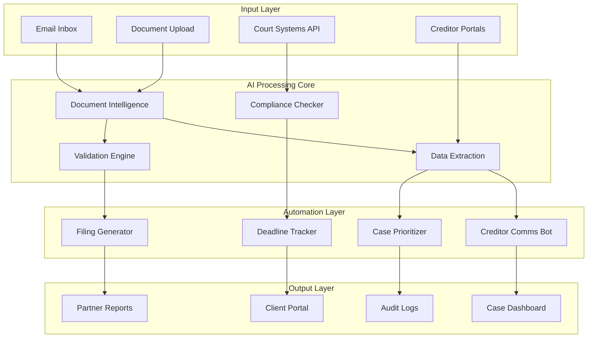

# Insolvency Company POC - Discovery and Solution Design

## 📊 Executive Summary
Proof of Concept design for automating insolvency case management through AI-powered document processing, creditor communication, and compliance tracking.

---

## Pain Points Analysis (from Chris's Discovery)

### Current State Problems

```yaml
manual_processes:
  document_processing:
    pain_level: CRITICAL
    current_time: "4-6 hours per case"
    error_rate: "15-20%"
    description: |
      - Manual review of creditor claims
      - Hand-typing data into systems
      - PDF extraction nightmares
      - Cross-referencing multiple sources
  
  creditor_communication:
    pain_level: HIGH
    current_time: "2-3 hours daily"
    frustrations:
      - Repetitive emails
      - Status update requests
      - Missing documentation follow-ups
      - Timeline coordination
  
  compliance_tracking:
    pain_level: HIGH
    risks:
      - Missed deadlines ($10K+ penalties)
      - Incomplete filings
      - Audit trail gaps
      - Regulatory changes
  
  case_prioritization:
    pain_level: MEDIUM
    issues:
      - No systematic approach
      - Resource allocation inefficiency
      - Deadline collisions
      - Workload imbalance
```

### Stakeholder Impact

```python
stakeholder_impacts = {
    'case_managers': {
        'time_wasted': '60% on manual tasks',
        'stress_level': 'Very High',
        'overtime': '10-15 hours/week'
    },
    'partners': {
        'visibility': 'Limited real-time insights',
        'decisions': 'Delayed by data lag',
        'client_satisfaction': 'Affected by delays'
    },
    'clients': {
        'wait_times': 'Extended unnecessarily',
        'communication': 'Inconsistent updates',
        'outcomes': 'Suboptimal due to delays'
    }
}
```

---

## Proposed Solution Architecture

### System Overview



### Technical Stack

```yaml
infrastructure:
  deployment: Docker on client premises
  database: PostgreSQL (encrypted)
  file_storage: S3-compatible (MinIO)
  
ai_services:
  ocr: Azure Document Intelligence
  llm: Claude 3.5 Sonnet (via API)
  extraction: Custom fine-tuned model
  
automation:
  workflow: n8n (self-hosted)
  scheduler: Bull Queue
  notifications: SendGrid
  
frontend:
  framework: Next.js
  ui: Tailwind + Shadcn
  charts: Recharts
  
security:
  encryption: AES-256
  auth: Auth0 + MFA
  audit: Immutable logs
  compliance: SOC2 Type II ready
```

---

## Module Specifications

### 1. Document Intelligence Module

```python
class DocumentIntelligenceModule:
    """AI-powered document processing for insolvency cases"""
    
    def __init__(self):
        self.ocr = AzureDocumentIntelligence()
        self.llm = Claude35Sonnet()
        self.validator = DataValidator()
    
    async def process_creditor_claim(self, document):
        # Step 1: OCR and structure extraction
        raw_data = await self.ocr.analyze_document(document)
        
        # Step 2: Intelligent field extraction
        extracted = await self.extract_fields(raw_data)
        
        # Step 3: Validation and enrichment
        validated = await self.validate_data(extracted)
        
        # Step 4: Auto-classification
        classified = await self.classify_claim(validated)
        
        return {
            'claim_id': generated_id(),
            'creditor': validated['creditor_name'],
            'amount': validated['claim_amount'],
            'priority': classified['priority'],
            'supporting_docs': validated['attachments'],
            'validation_score': validated['confidence'],
            'next_steps': self.determine_next_steps(classified)
        }
    
    async def extract_fields(self, raw_data):
        prompt = """
        Extract from this creditor claim document:
        - Creditor name and contact
        - Claim amount and currency
        - Claim date and due dates
        - Security/collateral details
        - Priority classification
        - Supporting documentation references
        
        Document: {raw_data}
        
        Return as structured JSON with confidence scores.
        """
        
        return await self.llm.extract(prompt, raw_data)
```

### 2. Creditor Communication Automation

```python
class CreditorCommunicationBot:
    """Automated creditor correspondence handler"""
    
    def __init__(self):
        self.templates = self.load_templates()
        self.llm = Claude35Sonnet()
        self.email_service = SendGrid()
    
    async def handle_creditor_inquiry(self, email):
        # Classify inquiry type
        inquiry_type = await self.classify_inquiry(email)
        
        # Generate appropriate response
        response = await self.generate_response(
            inquiry_type, 
            email.case_id,
            email.creditor_id
        )
        
        # Add personal touch
        personalized = await self.personalize_response(
            response,
            email.creditor_name
        )
        
        # Queue for sending
        await self.queue_response(personalized)
        
        # Log interaction
        await self.log_interaction(email, response)
    
    async def generate_response(self, inquiry_type, case_id, creditor_id):
        case_data = await self.get_case_status(case_id)
        creditor_data = await self.get_creditor_info(creditor_id)
        
        prompt = f"""
        Generate professional response for {inquiry_type} inquiry.
        
        Case Status: {case_data}
        Creditor Details: {creditor_data}
        
        Tone: Professional, empathetic, informative
        Include: Next steps, timeline, contact info
        """
        
        return await self.llm.generate(prompt)
    
    def auto_responses(self):
        return {
            'status_update': self.send_status_update,
            'missing_docs': self.request_documents,
            'deadline_reminder': self.send_reminder,
            'claim_received': self.acknowledge_claim,
            'distribution_notice': self.send_distribution
        }
```

### 3. Compliance Tracking System

```python
class ComplianceTracker:
    """Regulatory compliance and deadline management"""
    
    def __init__(self):
        self.regulations = self.load_regulations()
        self.calendar = CalendarIntegration()
        self.alerts = AlertSystem()
    
    async def track_case_compliance(self, case_id):
        case = await self.get_case(case_id)
        
        # Check all compliance requirements
        requirements = self.get_requirements(case.type, case.jurisdiction)
        
        compliance_status = []
        for req in requirements:
            status = await self.check_requirement(case, req)
            compliance_status.append(status)
            
            if status['at_risk']:
                await self.trigger_alert(case, req, status)
        
        return {
            'case_id': case_id,
            'compliance_score': self.calculate_score(compliance_status),
            'deadlines': self.extract_deadlines(compliance_status),
            'risks': self.identify_risks(compliance_status),
            'recommendations': self.generate_recommendations(compliance_status)
        }
    
    async def automated_filing(self, case_id, filing_type):
        # Gather required data
        data = await self.gather_filing_data(case_id, filing_type)
        
        # Generate filing document
        document = await self.generate_filing(filing_type, data)
        
        # Validate before submission
        validation = await self.validate_filing(document)
        
        if validation['valid']:
            # Submit to court system
            result = await self.submit_filing(document)
            
            # Update case status
            await self.update_case_status(case_id, filing_type, result)
            
            return result
        else:
            # Flag for manual review
            await self.flag_for_review(case_id, validation['issues'])
```

### 4. Case Prioritization Engine

```python
class CasePrioritizer:
    """Intelligent case prioritization and resource allocation"""
    
    def __init__(self):
        self.ml_model = self.load_prioritization_model()
        self.resource_manager = ResourceManager()
    
    async def prioritize_cases(self):
        active_cases = await self.get_active_cases()
        
        priorities = []
        for case in active_cases:
            score = await self.calculate_priority_score(case)
            priorities.append({
                'case_id': case.id,
                'score': score,
                'factors': self.explain_score(score)
            })
        
        # Sort by priority
        priorities.sort(key=lambda x: x['score'], reverse=True)
        
        # Allocate resources
        allocations = await self.allocate_resources(priorities)
        
        return {
            'prioritized_cases': priorities,
            'resource_allocations': allocations,
            'workload_distribution': self.calculate_distribution(allocations)
        }
    
    def priority_factors(self):
        return {
            'deadline_proximity': 0.3,
            'case_value': 0.2,
            'complexity': 0.15,
            'client_priority': 0.15,
            'regulatory_risk': 0.1,
            'resource_availability': 0.1
        }
```

---

## Implementation Timeline (2 Weeks)

### Week 1: Core Development

```yaml
day_1_2:
  document_processing:
    - Set up Azure Document Intelligence
    - Create extraction templates
    - Build validation logic
    - Test with sample documents
  
day_3_4:
  creditor_automation:
    - Design email templates
    - Implement classification
    - Build response generator
    - Set up email integration
  
day_5:
  compliance_system:
    - Map regulatory requirements
    - Create deadline tracker
    - Build alert system
    - Design compliance dashboard
```

### Week 2: Integration & Testing

```yaml
day_6_7:
  system_integration:
    - Connect all modules
    - Build unified dashboard
    - Implement authentication
    - Set up audit logging
  
day_8_9:
  user_testing:
    - Deploy to staging
    - Train case managers
    - Collect feedback
    - Iterate on UX
  
day_10:
  production_prep:
    - Performance optimization
    - Security audit
    - Documentation
    - Deployment planning
```

---

## Success Metrics

### Quantitative Metrics

```python
success_metrics = {
    'efficiency': {
        'document_processing_time': '75% reduction',
        'creditor_response_time': '90% reduction',
        'filing_accuracy': '99%+',
        'deadline_compliance': '100%'
    },
    
    'productivity': {
        'cases_per_manager': '40% increase',
        'overtime_reduction': '80%',
        'parallel_case_handling': '3x improvement'
    },
    
    'quality': {
        'error_rate': '< 1%',
        'client_satisfaction': '> 4.5/5',
        'audit_pass_rate': '100%'
    },
    
    'financial': {
        'cost_per_case': '60% reduction',
        'penalty_avoidance': '$50K+/year',
        'revenue_per_manager': '35% increase'
    }
}
```

### Qualitative Benefits

```yaml
staff_benefits:
  - Reduced stress and burnout
  - Focus on high-value activities
  - Better work-life balance
  - Professional development opportunities

client_benefits:
  - Faster case resolution
  - Better communication
  - Increased transparency
  - Higher recovery rates

firm_benefits:
  - Competitive advantage
  - Scalability without hiring
  - Better risk management
  - Enhanced reputation
```

---

## Pricing Model

### POC Investment

```yaml
poc_pricing:
  development: $25,000
  timeline: 2 weeks
  includes:
    - All four modules
    - Dashboard interface
    - Training materials
    - 30-day support
  
  success_criteria:
    - Process 50 test cases
    - Achieve 70% time savings
    - Zero compliance violations
    - Positive user feedback
```

### Production Pricing

```yaml
production_options:
  option_1_subscription:
    model: SaaS
    price: $5,000/month
    includes:
      - Unlimited cases
      - All updates
      - 24/7 support
      - Custom integrations
  
  option_2_perpetual:
    model: One-time license
    price: $75,000
    includes:
      - Source code
      - 1 year updates
      - Installation support
      - Training program
  
  option_3_hybrid:
    model: License + Success fee
    base: $2,500/month
    success_fee: $50/case processed
    cap: $7,500/month
```

---

## Risk Mitigation

### Technical Risks

```yaml
risks:
  data_security:
    mitigation:
      - End-to-end encryption
      - On-premise deployment option
      - Audit logging
      - Access controls
  
  integration_challenges:
    mitigation:
      - API-first design
      - Gradual rollout
      - Fallback mechanisms
      - Manual override options
  
  ai_accuracy:
    mitigation:
      - Human-in-the-loop validation
      - Confidence scoring
      - Continuous learning
      - Regular model updates
```

---

## Demo Script

### Live Demo Flow (30 minutes)

```markdown
1. **Problem Statement** (5 min)
   - Show current manual process
   - Highlight pain points
   - Calculate time/cost impact

2. **Document Processing** (7 min)
   - Upload creditor claim
   - Watch AI extraction
   - Show validation results
   - Demonstrate accuracy

3. **Automation in Action** (7 min)
   - Trigger creditor email
   - Show auto-response
   - Display communication log
   - Highlight time savings

4. **Compliance Dashboard** (5 min)
   - View deadline calendar
   - Show risk alerts
   - Demonstrate filing generation
   - Display audit trail

5. **ROI Calculation** (3 min)
   - Input current metrics
   - Show projected savings
   - Calculate payback period
   - Highlight soft benefits

6. **Q&A** (3 min)
   - Address concerns
   - Discuss customization
   - Plan next steps
```

---

## Next Steps

### For Chris (Immediate)
1. [ ] Schedule demo with insolvency firm
2. [ ] Gather sample documents for testing
3. [ ] Identify pilot case managers
4. [ ] Define success criteria

### For Jay (This Week)
1. [ ] Complete POC development environment
2. [ ] Build document processing module
3. [ ] Create demo dataset
4. [ ] Prepare presentation materials

### Joint Actions
1. [ ] Finalize pricing proposal
2. [ ] Create implementation timeline
3. [ ] Develop training plan
4. [ ] Draft contract terms

---

## Contact Information

**Solution Team**
- Chris Small - Business Development & Discovery
- Jay Guthrie - Technical Architecture & Delivery

**Demo Access**
- URL: https://insolvency-poc.demo.com
- Username: demo@insolvency.com
- Password: [Will provide during demo]

---

*POC Version: 1.0*  
*Prepared for: [Insolvency Firm Name]*  
*Date: August 29, 2025*  
*Status: Ready for Demo*