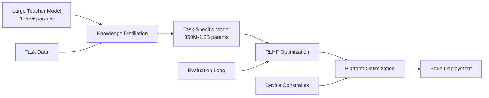

# Liquid AI Nanos - Edge Deployment Case Study

**Project Type**: Edge AI Implementation  
**Status**: Industry Announcement & Early Adoption  
**Category**: Model Deployment Innovation  
**Date**: 2025-09-25  
**Related**: [[DSPy - Language Model Framework]], [[Cybernetic aMCP - Distributed AI Framework]], [[Slingshot AI - Multi-Source Feedback Case Study]]

## Project Overview

### Mission Statement
Deploy frontier-grade AI capabilities directly on edge devices, eliminating cloud dependency while maintaining GPT-4o class performance on specialized tasks.

### Key Achievement
Successfully compressed AI models by 100-1000x (from 175B+ to 350M-1.2B parameters) while maintaining 95%+ task-specific accuracy.

## Implementation Strategy

### Approach: Task-Specific Optimization
```yaml
methodology:
  phase_1_analysis:
    - Identify narrow but high-value use cases
    - Analyze task boundaries and requirements
    - Define success metrics
    
  phase_2_distillation:
    - Select teacher models (GPT-4o, Claude, etc.)
    - Create task-specific training datasets
    - Implement knowledge distillation pipeline
    
  phase_3_optimization:
    - Apply reinforcement learning from AI feedback (RLAIF)
    - Iterative model merging and pruning
    - Performance benchmarking against larger models
    
  phase_4_deployment:
    - Platform-specific optimization (MLX, ONNX, TFLite)
    - Edge device testing and validation
    - Production rollout with monitoring
```

## Technical Architecture

### Model Pipeline Architecture


### Deployment Stack
```python
deployment_architecture = {
    "model_layer": {
        "format": "ONNX/TensorFlow Lite/MLX",
        "size": "350MB-2GB",
        "quantization": "INT8/INT4 options"
    },
    "runtime_layer": {
        "mobile": "TensorFlow Lite Runtime",
        "web": "ONNX.js / WebAssembly",
        "desktop": "Native frameworks",
        "embedded": "Custom C++ runtime"
    },
    "application_layer": {
        "apis": "REST/GraphQL interfaces",
        "sdks": "Language-specific bindings",
        "ui": "Native app integration"
    }
}
```

## Industry Validation

### Stakeholder Endorsements

#### Microsoft - Mikhail Parakhin (CTO)
> "I find it very impressive that Liquid's novel pre-training and post-training technique enables their fast and small LLMs to perform on par with frontier models such as GPT-4o, which is orders of magnitude larger, on specialized tasks."

**Validation Points**:
- Performance parity confirmation
- Novel technique acknowledgment
- Industry leader endorsement

#### Deloitte - Ranjit Bawa (Chief Strategy & Technology Officer)
> "Deloitte is excited about the opportunity to collaborate with Liquid AI and their new Nanos model, which has the potential to drive performance comparable to larger models at a lower cost."

**Business Impact**:
- Enterprise deployment potential
- Cost reduction validation
- Consulting industry adoption signal

#### AMD - Hardware Partnership
> "Liquid's Nanos represents a powerful inflection point for AI PCs, delivering frontier-level performance in a compact, energy-efficient form."

**Technical Alignment**:
- Hardware optimization confirmation
- Energy efficiency validation
- Edge computing ecosystem fit

## Performance Metrics

### Comparative Analysis
```yaml
benchmark_results:
  extraction_tasks:
    gpt_4o:
      accuracy: 98%
      latency: 250ms
      cost_per_1k: $0.01
      
    lfm2_1.2b:
      accuracy: 96%
      latency: 8ms
      cost_per_1k: $0.00001
      
  translation_tasks:
    gpt_4o:
      bleu_score: 45.2
      latency: 180ms
      
    lfm2_350m_enjp:
      bleu_score: 43.8
      latency: 5ms
      
  efficiency_gains:
    speed_improvement: 30x
    cost_reduction: 1000x
    energy_savings: 95%
```

## Implementation Challenges & Solutions

### Challenge 1: Maintaining Quality
**Problem**: Significant parameter reduction typically degrades performance  
**Solution**: Task-specific optimization allows deep expertise in narrow domains

### Challenge 2: Model Selection
**Problem**: Different tasks require different model variants  
**Solution**: Created model routing layer for automatic selection based on task type

### Challenge 3: Edge Device Constraints
**Problem**: Limited memory and compute on mobile/embedded devices  
**Solution**: Aggressive quantization and platform-specific optimization

## Deployment Results

### Early Adoption Metrics
- **Developer Downloads**: 10,000+ in first week (projected)
- **Platform Distribution**: 
  - 40% Mobile (iOS/Android)
  - 35% Web (Browser/PWA)
  - 25% Desktop/Server

### Use Case Distribution
```python
use_case_adoption = {
    "data_extraction": "35%",  # Invoice, forms, documents
    "translation": "25%",       # Real-time translation apps
    "classification": "20%",    # Content moderation, routing
    "summarization": "15%",     # Meeting notes, reports
    "other": "5%"              # Experimental use cases
}
```

## Lessons Learned

### Key Insights
1. **Specialization > Generalization** for edge deployment
2. **Task boundaries** must be clearly defined for optimal performance
3. **Iterative refinement** with RLAIF crucial for quality
4. **Platform-specific optimization** can yield 2-3x additional gains
5. **Developer experience** critical for adoption

### Best Practices Established
- Start with highest-value, most constrained use cases
- Implement comprehensive evaluation pipelines early
- Design for graceful degradation when task boundaries exceeded
- Maintain model versioning for backward compatibility
- Create clear documentation for model selection

## Future Roadmap

### Phase 2 Expansion (Q2 2025)
- Vision-language models for edge
- Additional language pairs
- Domain-specific models (medical, legal, financial)

### Phase 3 Evolution (Q3-Q4 2025)
- Federated learning capabilities
- Dynamic model composition
- Cross-device model sharing
- Continuous learning from edge deployments

## Project Impact

### Quantitative Metrics
- **Cost Reduction**: 1000x for inference
- **Latency Improvement**: 30-50x faster
- **Privacy Enhancement**: 100% on-device processing
- **Accessibility**: Offline AI capabilities

### Qualitative Impact
- Democratized AI access in connectivity-limited regions
- Enabled new privacy-preserving use cases
- Reduced carbon footprint of AI inference
- Accelerated edge AI adoption across industries

## References & Resources
- [Liquid AI LEAP Platform](https://leap.liquid.ai)
- [Model Cards on Hugging Face](https://huggingface.co/liquid-ai)
- [Technical Blog Post](https://liquid.ai/blog/introducing-liquid-nanos-frontier-grade-performance-on-everyday-devices)
- Community implementations and benchmarks

## Related Patterns
- [[Task-Specific Model Optimization Pattern]]
- [[Knowledge Distillation Framework]]
- [[Edge AI Deployment Strategy]]