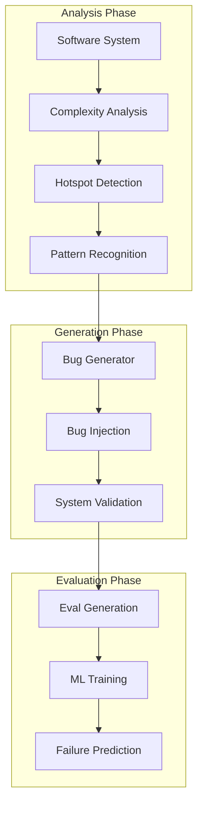

# Precognition: Synthetic Bug Generation Agent

## 🐛 Project Overview
A revolutionary synthetic data agent that intentionally introduces bugs into complex software systems to generate evaluation data (evals), enabling predictive testing and preemptive disaster prevention.

---

## Origin & Concept

### Initial Proposal
**Source**: @jxnlco (jason liu) on X/Twitter, August 28, 2025, 15:27 UTC
> "Creating a synthetic data agent that introduces bugs in complex software systems to generate more evals call it precognition"

### Core Innovation
```python
class PrecognitionAgent:
    """Synthetic bug generation for predictive testing"""
    
    def __init__(self):
        self.bug_generator = SyntheticBugEngine()
        self.complexity_analyzer = ComplexityAnalyzer()
        self.eval_generator = EvaluationDataGenerator()
        self.prediction_engine = DisasterPredictionModel()
        
    async def generate_predictive_bugs(self, system):
        """Generate bugs that predict future failures"""
        
        # Analyze system complexity
        complexity_map = await self.complexity_analyzer.map(system)
        
        # Generate bugs based on complexity hotspots
        bugs = []
        for hotspot in complexity_map.hotspots:
            bug = await self.bug_generator.create(
                location=hotspot,
                type=self.predict_bug_type(hotspot),
                severity=self.calculate_severity(hotspot)
            )
            bugs.append(bug)
            
        # Create evaluation data
        evals = await self.eval_generator.create_from_bugs(bugs)
        
        return {
            'bugs': bugs,
            'evals': evals,
            'predictions': self.predict_failures(bugs)
        }
```

---

## Technical Architecture

### Bug Generation Pipeline


### Bug Taxonomy
```yaml
bug_categories:
  memory:
    - leaks: "Gradual memory consumption"
    - corruption: "Buffer overflows, use-after-free"
    - fragmentation: "Inefficient allocation patterns"
    
  concurrency:
    - race_conditions: "Timing-dependent failures"
    - deadlocks: "Resource contention loops"
    - livelocks: "Infinite retry patterns"
    
  logic:
    - off_by_one: "Boundary condition errors"
    - null_pointer: "Unhandled null references"
    - infinite_loops: "Termination condition failures"
    
  performance:
    - n_plus_one: "Database query inefficiency"
    - algorithmic: "O(n²) where O(n) possible"
    - cache_misses: "Poor locality of reference"
    
  security:
    - injection: "SQL, XSS, command injection"
    - authentication: "Bypass vulnerabilities"
    - authorization: "Privilege escalation"
```

---

## Implementation Strategy

### Phase 1: Basic Bug Injection
```python
class BasicBugInjector:
    """Simple deterministic bug injection"""
    
    def inject_memory_leak(self, code):
        """Inject memory leak pattern"""
        # Find allocation points
        allocations = self.find_allocations(code)
        
        # Remove corresponding deallocations
        for alloc in allocations:
            if random.random() < 0.1:  # 10% injection rate
                self.remove_deallocation(alloc)
        
        return self.modified_code
    
    def inject_race_condition(self, code):
        """Inject race condition pattern"""
        # Find shared resources
        shared = self.find_shared_resources(code)
        
        # Remove synchronization
        for resource in shared:
            if self.is_good_candidate(resource):
                self.remove_locks(resource)
        
        return self.modified_code
```

### Phase 2: Intelligent Generation
```python
class IntelligentBugGenerator:
    """ML-driven bug generation"""
    
    def __init__(self):
        self.pattern_learner = BugPatternLearner()
        self.complexity_model = ComplexityPredictor()
        self.impact_analyzer = ImpactAnalyzer()
        
    async def generate_bug(self, context):
        """Generate contextually appropriate bug"""
        
        # Learn from historical bugs
        patterns = await self.pattern_learner.extract(context.history)
        
        # Predict high-impact locations
        targets = await self.complexity_model.predict_fragile_points(
            context.codebase
        )
        
        # Generate novel bug combinations
        bug = self.synthesize_bug(
            patterns=patterns,
            target=self.select_target(targets),
            constraints=context.constraints
        )
        
        # Analyze potential impact
        impact = await self.impact_analyzer.predict(bug)
        
        return {
            'bug': bug,
            'impact': impact,
            'detection_difficulty': self.estimate_detection_difficulty(bug)
        }
```

### Phase 3: Predictive Testing
```python
class PredictiveTestingEngine:
    """Use generated bugs for prediction"""
    
    def __init__(self):
        self.precognition = PrecognitionAgent()
        self.disaster_model = DisasterPredictionModel()
        
    async def predict_failures(self, system):
        """Predict future system failures"""
        
        # Generate synthetic bugs
        synthetic_bugs = await self.precognition.generate_bugs(
            system,
            count=1000,
            diversity='high'
        )
        
        # Simulate bug evolution
        evolution_paths = []
        for bug in synthetic_bugs:
            path = await self.simulate_evolution(bug, time_horizon='6_months')
            evolution_paths.append(path)
        
        # Identify critical failure modes
        disasters = self.disaster_model.identify_disasters(evolution_paths)
        
        # Generate preventive measures
        preventions = self.generate_preventions(disasters)
        
        return {
            'predicted_disasters': disasters,
            'prevention_strategies': preventions,
            'confidence': self.calculate_confidence(evolution_paths)
        }
```

---

## Integration with ActPRM

### Active Learning Enhancement
```python
class PrecognitionActPRM:
    """Combine Precognition with ActPRM for efficient learning"""
    
    def __init__(self):
        self.precognition = PrecognitionAgent()
        self.actprm = ActPRMFramework()
        
    async def train_with_active_learning(self, software_corpus):
        """Train bug generation with active learning"""
        
        # Generate initial bug pool
        bug_pool = await self.precognition.generate_bugs(
            software_corpus,
            count=100000  # Large unlabeled pool
        )
        
        # ActPRM selects most uncertain bugs
        uncertain_bugs = self.actprm.select_uncertain_samples(
            bug_pool,
            budget=0.2,  # 20% annotation budget
            metric='impact_uncertainty'
        )
        
        # Annotate selected bugs
        annotations = await self.annotate_bugs(uncertain_bugs)
        
        # Train reward model
        reward_model = await self.actprm.train_reward_model(
            annotations,
            objective='maximize_disaster_prediction'
        )
        
        # Refine bug generation
        self.precognition.refine_with_rewards(reward_model)
        
        return {
            'model': reward_model,
            'efficiency': len(annotations) / len(bug_pool),
            'quality': self.evaluate_bug_quality(reward_model)
        }
```

---

## Integration with LFAR

### Active Reading for Bug Pattern Discovery
```python
class PrecognitionLFAR:
    """Use LFAR to discover bug patterns efficiently"""
    
    def __init__(self):
        self.lfar = LFARSystem()
        self.precognition = PrecognitionAgent()
        
    async def learn_bug_patterns(self, codebase, bug_reports):
        """Extract bug patterns using active reading"""
        
        # LFAR identifies high-value code regions
        valuable_regions = await self.lfar.identify_regions(
            codebase,
            value_metric='historical_bug_density'
        )
        
        # Active reading of bug-prone regions
        bug_patterns = []
        for region in valuable_regions:
            if self.lfar.should_read(region):
                patterns = await self.extract_patterns(region, bug_reports)
                bug_patterns.extend(patterns)
        
        # Generate synthetic bugs from patterns
        synthetic_bugs = await self.precognition.generate_from_patterns(
            bug_patterns,
            mutation_rate=0.3,
            novelty_threshold=0.7
        )
        
        return synthetic_bugs
```

---

## Performance Metrics

### Expected Outcomes
```python
performance_targets = {
    'bug_diversity': {
        'unique_bug_types': 50,
        'coverage_of_failure_modes': 0.85,
        'novelty_score': 0.7
    },
    'prediction_accuracy': {
        'disaster_prediction': 0.75,
        'false_positive_rate': 0.15,
        'early_warning_time': '3_months'
    },
    'efficiency': {
        'bugs_per_hour': 1000,
        'eval_generation_rate': 10000,
        'computational_cost': '$0.10_per_bug'
    },
    'impact': {
        'prevented_outages': 10,
        'reduced_debugging_time': 0.5,
        'improved_test_coverage': 0.3
    }
}
```

---

## Use Cases

### 1. Continuous Integration Enhancement
```python
def enhance_ci_pipeline():
    """Add precognition to CI/CD"""
    
    pipeline = {
        'stage_1': 'Traditional tests',
        'stage_2': 'Precognition bug injection',
        'stage_3': 'Disaster prediction',
        'stage_4': 'Preventive fixes',
        'stage_5': 'Deployment decision'
    }
    
    return pipeline
```

### 2. Pre-Production Validation
```python
def validate_before_production():
    """Test with synthetic bugs before release"""
    
    validation = {
        'generate_bugs': 'Create 1000 synthetic bugs',
        'inject_bugs': 'Test in staging environment',
        'measure_resilience': 'Track system recovery',
        'predict_production': 'Estimate production failures',
        'go_no_go': 'Make deployment decision'
    }
    
    return validation
```

### 3. Security Vulnerability Discovery
```python
def discover_vulnerabilities():
    """Find security issues proactively"""
    
    security_testing = {
        'generate_exploits': 'Create synthetic attack patterns',
        'test_defenses': 'Evaluate security measures',
        'predict_breaches': 'Identify potential compromises',
        'patch_proactively': 'Fix before exploitation'
    }
    
    return security_testing
```

---

## Development Roadmap

### Week 1: MVP
- [ ] Basic bug injection engine
- [ ] Simple eval generator
- [ ] Initial testing on small codebase
- [ ] Performance baseline

### Week 2: Intelligence Layer
- [ ] Pattern learning from bug databases
- [ ] Complexity analysis integration
- [ ] Impact prediction model
- [ ] ActPRM integration

### Week 3: Scale Testing
- [ ] Large codebase testing
- [ ] LFAR integration for efficiency
- [ ] Performance optimization
- [ ] Cloud deployment

### Week 4: Validation
- [ ] Benchmark against chaos testing
- [ ] Real-world case studies
- [ ] Documentation and release
- [ ] Community feedback

---

## Competitive Analysis

### vs Chaos Engineering
| Aspect | Precognition | Chaos Engineering |
|--------|--------------|-------------------|
| **Approach** | Predictive | Reactive |
| **Bug Types** | Comprehensive | Random failures |
| **Learning** | ML-driven | Rule-based |
| **Efficiency** | High (targeted) | Medium (random) |
| **Prediction** | Yes | No |

### vs Traditional Testing
| Aspect | Precognition | Traditional |
|--------|--------------|-------------|
| **Coverage** | Dynamic | Static |
| **Edge Cases** | Discovers | Misses |
| **Maintenance** | Self-updating | Manual |
| **Cost** | Low (automated) | High (manual) |

---

## Challenges & Solutions

### Technical Challenges
```yaml
challenges:
  realism:
    problem: "Synthetic bugs may not reflect real bugs"
    solution: "Learn from production bug databases"
    
  detection:
    problem: "Generated bugs might be too obvious"
    solution: "Adversarial training for subtlety"
    
  safety:
    problem: "Risk of damaging systems"
    solution: "Sandboxed execution environments"
```

### Adoption Challenges
```yaml
barriers:
  trust:
    issue: "Developers skeptical of AI-generated bugs"
    approach: "Start with known bug patterns, prove value"
    
  integration:
    issue: "Difficult to add to existing workflows"
    approach: "CI/CD plugins, gradual adoption"
    
  cost:
    issue: "Computational resources needed"
    approach: "Cloud-based SaaS model"
```

---

## Future Vision

### 2025-2026: Foundation
- Establish core technology
- Prove value in production
- Build developer community

### 2027-2028: Expansion
- Industry-specific versions
- Integration with major platforms
- Predictive maintenance standard

### 2029-2030: Maturity
- Autonomous debugging
- Self-healing systems
- Zero-downtime deployments

---

## Conclusion

Precognition represents a paradigm shift in software testing:
- **Predictive** rather than reactive
- **Intelligent** rather than random
- **Efficient** through active learning
- **Scalable** via cloud deployment

When combined with ActPRM and LFAR, it could revolutionize how we ensure software reliability.

---

## Tags
#Precognition #BugGeneration #SyntheticData #Testing #AI #Predictive #ActPRM #LFAR

---

*Project Specification Version: 1.0*
*Concept: @jxnlco*
*Documentation Date: 2025-08-28*