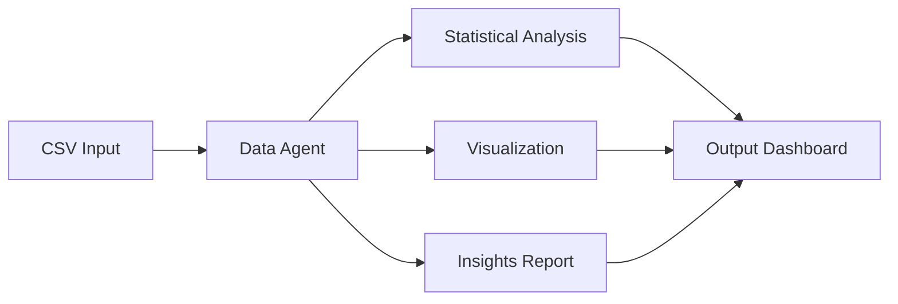
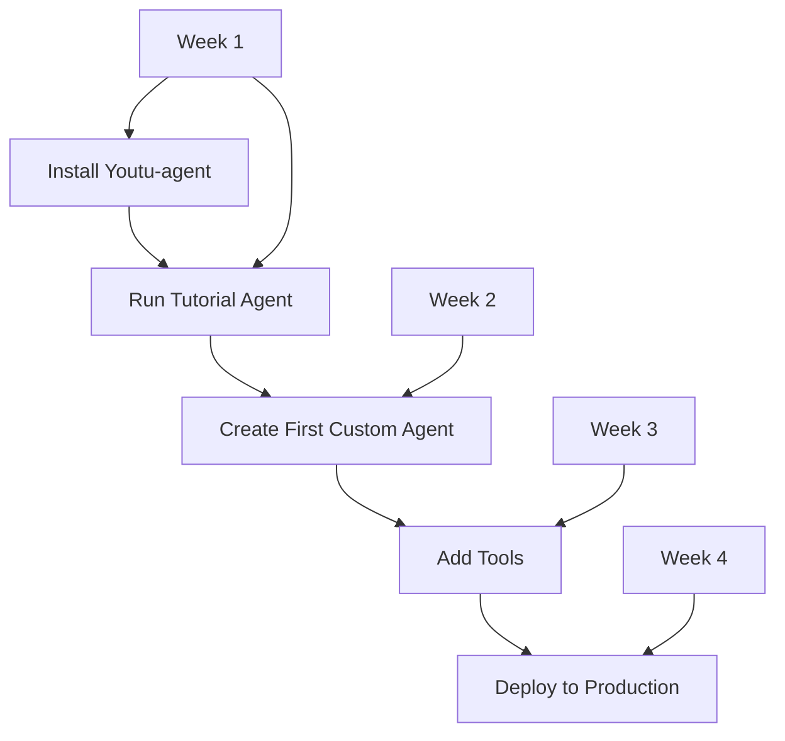

# Youtu-agent: Implementation Projects

## 🚀 Project Portfolio
Concrete implementation projects using Tencent's Youtu-agent framework for building intelligent agents.

---

## Tier 1: Starter Projects

### Project 1: Personal Research Assistant
**Objective**: Build an agent that automates research tasks

#### Configuration
```yaml
name: personal-researcher
defaults:
  - /model/deepseek-v3
  - /tools/search@toolkits.search
  - /tools/file_manager@toolkits.files

agent:
  instructions: |
    You are a personal research assistant that:
    1. Searches for information on given topics
    2. Organizes findings into structured notes
    3. Saves research to organized files
    
  workflow:
    - gather_sources
    - extract_key_points
    - organize_by_topic
    - generate_summary
```

#### Implementation
```python
# Simple research assistant
async def create_research_assistant():
    config = load_config("configs/research_assistant.yaml")
    agent = Agent(config)
    
    # Research workflow
    async def research_topic(topic):
        # Phase 1: Search
        sources = await agent.search_web(topic, max_results=20)
        
        # Phase 2: Analyze
        insights = await agent.extract_insights(sources)
        
        # Phase 3: Organize
        report = await agent.create_report(insights)
        
        # Phase 4: Save
        await agent.save_to_file(f"research/{topic}.md", report)
        
        return report
    
    return agent
```

**Timeline**: 1 week  
**Complexity**: Low  
**Use Cases**: Literature review, market research, competitive analysis

---

### Project 2: Data Analysis Pipeline
**Objective**: Automated CSV/Excel data analysis agent

#### Architecture


#### Configuration
```yaml
name: data-analyzer
tools:
  - csv_analyzer:
      max_rows: 100000
      operations:
        - descriptive_stats
        - correlation_analysis
        - outlier_detection
  
  - visualizer:
      charts:
        - histogram
        - scatter_plot
        - correlation_matrix

agent:
  instructions: |
    Analyze data files to find patterns and insights.
    Generate visualizations and statistical summaries.
```

**Features**:
- Automatic data profiling
- Statistical analysis
- Anomaly detection
- Report generation

---

### Project 3: Document Organizer
**Objective**: Intelligent file organization system

```python
class DocumentOrganizer:
    def __init__(self):
        self.config = {
            'name': 'doc-organizer',
            'tools': ['file_manager', 'text_analyzer'],
            'instructions': '''
                Organize documents by:
                1. Content type
                2. Date
                3. Topic
                4. Importance
            '''
        }
        self.agent = Agent(self.config)
    
    async def organize_directory(self, path):
        # Scan files
        files = await self.scan_directory(path)
        
        # Classify each file
        classifications = await asyncio.gather(*[
            self.classify_document(f) for f in files
        ])
        
        # Create organization structure
        structure = self.create_structure(classifications)
        
        # Move files
        await self.reorganize_files(structure)
        
        # Generate index
        await self.create_index(structure)
```

---

## Tier 2: Integration Projects

### Project 4: Meta-Agent Factory
**Objective**: Agent that creates other agents automatically

#### Core Implementation
```python
class MetaAgentFactory:
    """Factory for creating custom agents through dialogue"""
    
    def __init__(self):
        self.meta_config = {
            'name': 'meta-agent',
            'instructions': '''
                You help users create custom agents by:
                1. Understanding their requirements
                2. Selecting appropriate tools
                3. Generating optimal configuration
                4. Testing the created agent
            '''
        }
        self.meta_agent = Agent(self.meta_config)
    
    async def create_agent_interactive(self):
        # Dialogue phase
        requirements = await self.capture_requirements()
        
        # Design phase
        design = await self.design_agent(requirements)
        
        # Configuration generation
        config = await self.generate_config(design)
        
        # Validation
        validated_config = await self.validate_config(config)
        
        # Save and deploy
        agent_path = await self.save_agent(validated_config)
        
        return Agent(validated_config)
    
    async def capture_requirements(self):
        dialogue = [
            "What task should the agent perform?",
            "What tools does it need?",
            "What are the performance requirements?",
            "Any specific constraints?"
        ]
        
        requirements = {}
        for question in dialogue:
            answer = await self.meta_agent.ask_user(question)
            requirements[question] = answer
        
        return requirements
```

#### Auto-Generation Templates
```yaml
# Template library for common agent types
templates:
  researcher:
    tools: [search, summarizer]
    pattern: "research_{topic}"
  
  analyst:
    tools: [csv_analyzer, statistics]
    pattern: "analyze_{dataset}"
  
  automator:
    tools: [file_manager, scheduler]
    pattern: "automate_{task}"
```

---

### Project 5: Benchmark Evaluation System
**Objective**: Systematic agent performance evaluation

#### Benchmark Configuration
```python
class BenchmarkSystem:
    def __init__(self):
        self.benchmarks = {
            'WebWalkerQA': {
                'dataset': 'webwalker_qa_v1',
                'metrics': ['accuracy', 'latency'],
                'target': 0.7147  # 71.47%
            },
            'GAIA': {
                'dataset': 'gaia_text_only',
                'metrics': ['pass_rate'],
                'target': 0.728  # 72.8%
            }
        }
    
    async def evaluate_agent(self, agent, benchmark_name):
        benchmark = self.benchmarks[benchmark_name]
        dataset = await self.load_dataset(benchmark['dataset'])
        
        results = []
        for sample in dataset:
            start_time = time.time()
            
            # Run agent
            response = await agent.process(sample['input'])
            
            # Evaluate
            score = self.evaluate_response(
                response, 
                sample['expected'],
                benchmark['metrics']
            )
            
            results.append({
                'sample_id': sample['id'],
                'score': score,
                'latency': time.time() - start_time
            })
        
        # Calculate aggregate metrics
        return self.aggregate_results(results, benchmark)
```

---

### Project 6: Multi-Agent Research Team
**Objective**: Coordinate multiple specialized agents

#### Team Architecture
```yaml
team:
  coordinator:
    name: research-coordinator
    role: "Manages research workflow"
    tools: [task_scheduler, progress_tracker]
  
  members:
    - web_researcher:
        specialization: "Online research"
        tools: [web_search, scraper]
    
    - data_analyst:
        specialization: "Data analysis"
        tools: [csv_analyzer, statistics]
    
    - writer:
        specialization: "Report writing"
        tools: [text_generator, formatter]
```

#### Coordination Logic
```python
class ResearchTeam:
    async def conduct_research(self, topic):
        # Phase 1: Planning
        plan = await self.coordinator.create_plan(topic)
        
        # Phase 2: Parallel research
        research_tasks = [
            self.web_researcher.gather_sources(topic),
            self.data_analyst.find_datasets(topic)
        ]
        sources, datasets = await asyncio.gather(*research_tasks)
        
        # Phase 3: Analysis
        analysis = await self.data_analyst.analyze(datasets)
        
        # Phase 4: Writing
        report = await self.writer.create_report({
            'sources': sources,
            'analysis': analysis,
            'topic': topic
        })
        
        return report
```

---

## Tier 3: Advanced Projects

### Project 7: Self-Improving Agent System
**Objective**: Agents that learn and improve from feedback

```python
class SelfImprovingAgent:
    def __init__(self):
        self.performance_history = []
        self.config_versions = []
        
    async def process_with_learning(self, task):
        # Execute task
        result = await self.execute(task)
        
        # Get feedback
        feedback = await self.get_feedback(result)
        
        # Learn from feedback
        if feedback.score < 0.8:
            # Analyze failure
            analysis = await self.analyze_failure(task, result, feedback)
            
            # Update configuration
            new_config = await self.optimize_config(analysis)
            
            # Test new configuration
            if await self.validate_improvement(new_config):
                self.update_agent(new_config)
        
        # Store for future learning
        self.performance_history.append({
            'task': task,
            'result': result,
            'feedback': feedback,
            'config': self.current_config
        })
        
        return result
    
    async def optimize_config(self, analysis):
        # Generate new configuration based on analysis
        optimizations = {
            'instructions': self.refine_instructions(analysis),
            'tools': self.adjust_tools(analysis),
            'parameters': self.tune_parameters(analysis)
        }
        
        return self.merge_config(self.current_config, optimizations)
```

---

### Project 8: Real-time Stream Processing Agent
**Objective**: Process continuous data streams

```python
class StreamProcessingAgent:
    def __init__(self):
        self.config = {
            'name': 'stream-processor',
            'async': True,
            'buffer_size': 1000,
            'window_size': 60  # seconds
        }
    
    async def process_stream(self, stream_source):
        buffer = asyncio.Queue(maxsize=self.config['buffer_size'])
        
        # Producer coroutine
        async def produce():
            async for item in stream_source:
                await buffer.put(item)
        
        # Consumer coroutine
        async def consume():
            window = []
            while True:
                item = await buffer.get()
                window.append(item)
                
                # Process window
                if len(window) >= self.config['window_size']:
                    insights = await self.analyze_window(window)
                    await self.emit_insights(insights)
                    window = window[len(window)//2:]  # Sliding window
        
        # Run concurrently
        await asyncio.gather(produce(), consume())
```

---

### Project 9: Code Generation Assistant
**Objective**: Generate code based on requirements

```yaml
name: code-generator
model: deepseek-v3

tools:
  - code_analyzer:
      languages: [python, javascript, yaml]
  - test_generator:
      frameworks: [pytest, jest]
  - documentation_generator:
      format: markdown

agent:
  instructions: |
    Generate production-ready code with:
    1. Clean architecture
    2. Error handling
    3. Tests
    4. Documentation
```

Implementation:
```python
async def generate_code(requirements):
    agent = Agent(load_config('code_generator.yaml'))
    
    # Understand requirements
    spec = await agent.analyze_requirements(requirements)
    
    # Generate code
    code = await agent.generate_implementation(spec)
    
    # Generate tests
    tests = await agent.generate_tests(code)
    
    # Generate documentation
    docs = await agent.generate_docs(code)
    
    return {
        'code': code,
        'tests': tests,
        'documentation': docs
    }
```

---

### Project 10: Knowledge Graph Builder
**Objective**: Build knowledge graphs from unstructured data

```python
class KnowledgeGraphBuilder:
    def __init__(self):
        self.agent = Agent({
            'name': 'kg-builder',
            'tools': ['entity_extractor', 'relation_finder', 'graph_builder']
        })
        self.graph = nx.DiGraph()
    
    async def build_from_documents(self, documents):
        for doc in documents:
            # Extract entities
            entities = await self.agent.extract_entities(doc)
            
            # Find relationships
            relations = await self.agent.find_relations(entities, doc)
            
            # Add to graph
            for entity in entities:
                self.graph.add_node(entity['id'], **entity['attributes'])
            
            for relation in relations:
                self.graph.add_edge(
                    relation['source'],
                    relation['target'],
                    type=relation['type']
                )
        
        # Enrich graph
        await self.enrich_graph()
        
        return self.graph
```

---

## Implementation Roadmap

### Quick Start Path


### Development Timeline
| Project | Difficulty | Time | Skills Required |
|---------|-----------|------|----------------|
| Research Assistant | ⭐⭐ | 1 week | Python, YAML |
| Data Pipeline | ⭐⭐⭐ | 2 weeks | Data Analysis |
| Meta-Agent | ⭐⭐⭐⭐ | 3 weeks | Agent Design |
| Research Team | ⭐⭐⭐⭐ | 4 weeks | Async Programming |
| Self-Improving | ⭐⭐⭐⭐⭐ | 6 weeks | ML, Optimization |

---

## Getting Started

### Installation
```bash
# Clone repository
git clone https://github.com/Tencent/Youtu-agent.git
cd Youtu-agent

# Install with uv
uv sync
source .venv/bin/activate

# Run first agent
python scripts/cli_chat.py --config configs/examples/simple_agent.yaml
```

### First Agent
```yaml
# my_first_agent.yaml
defaults:
  - /model/deepseek-v3
  - /tools/search

agent:
  name: my-assistant
  instructions: "Help users with their questions"
```

---

## Tags
#Projects #Implementation #Youtu-agent #Tencent #AI #Agents #DeepSeek

---

*Project Portfolio Version: 1.0*
*Based on: Youtu-agent Framework*
*Created: 2025-08-28*