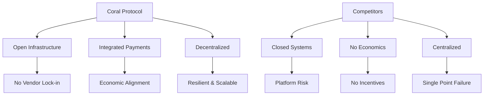
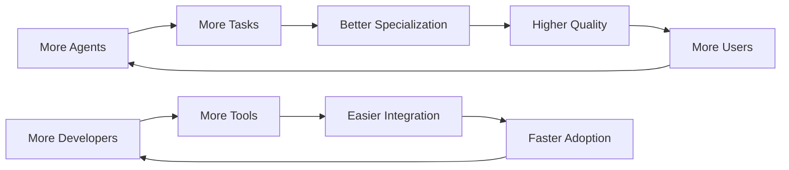

# Coral Protocol: Strategic Insights

## 🎯 Strategic Overview
High-level strategic insights from the Coral Protocol for business planning, market positioning, and competitive advantage in multi-agent systems.

---

## Market Strategy

### First-Mover Advantages
```yaml
timing_opportunity:
  market_maturity: Early stage (2025)
  adoption_curve: Pre-chasm
  competitive_density: Low
  regulatory_clarity: Emerging
  
strategic_windows:
  - infrastructure_play: Build before demand surge
  - standard_setting: Define protocols early
  - ecosystem_lock_in: Create network effects
  - talent_acquisition: Hire before competition
```

### Go-to-Market Strategy

#### Phase 1: Developer-First Approach
```python
class DeveloperStrategy:
    """Bottom-up adoption through developer community"""
    
    tactics = {
        'open_source': 'Build credibility and trust',
        'documentation': 'Lower barriers to entry',
        'tools': 'Provide superior developer experience',
        'community': 'Foster ecosystem growth',
        'hackathons': 'Discover use cases',
        'bounties': 'Incentivize contributions'
    }
    
    success_metrics = {
        'github_stars': 10000,  # Social proof
        'npm_downloads': 1000000,  # Adoption
        'discord_members': 50000,  # Community
        'contributors': 500  # Ecosystem health
    }
```

#### Phase 2: Enterprise Penetration
```yaml
enterprise_strategy:
  entry_point: IT departments and innovation labs
  
  value_proposition:
    primary: "90% reduction in AI integration costs"
    secondary: "Vendor-neutral agent interoperability"
    tertiary: "Future-proof AI infrastructure"
  
  proof_of_concept:
    duration: 30 days
    success_criteria:
      - 10x faster deployment
      - 50% cost reduction
      - Zero vendor lock-in
  
  expansion:
    land: Single department pilot
    expand: Cross-department rollout
    dominate: Company-wide standard
```

---

## Competitive Positioning

### Strategic Differentiation


### Competitive Response Matrix
| Competitor Move | Coral Response | Strategic Advantage |
|----------------|---------------|-------------------|
| Big Tech enters | Emphasize openness | No lock-in fear |
| Price war | Focus on value | Superior economics |
| Feature race | Platform approach | Ecosystem innovation |
| Patent warfare | Open standards | Community support |
| Acquisition attempts | Decentralized structure | Can't be bought |

---

## Business Model Innovation

### Revenue Streams
```python
class RevenueModel:
    streams = {
        'transaction_fees': {
            'model': 'Usage-based',
            'rate': '0.1% of transaction value',
            'target': '$100M ARR by 2026'
        },
        'enterprise_licenses': {
            'model': 'Subscription',
            'pricing': '$10K-500K annually',
            'target': '500 enterprises by 2026'
        },
        'premium_services': {
            'model': 'Value-added',
            'services': ['Priority support', 'SLA guarantees', 'Custom features'],
            'target': '30% of revenue'
        },
        'marketplace_commission': {
            'model': 'Transaction percentage',
            'rate': '20% of agent earnings',
            'target': '$50M GMV by 2026'
        }
    }
    
    def calculate_ltv(self, customer_type):
        if customer_type == 'developer':
            return 5000  # $5K lifetime value
        elif customer_type == 'startup':
            return 50000  # $50K lifetime value
        elif customer_type == 'enterprise':
            return 500000  # $500K lifetime value
```

### Unit Economics
```yaml
customer_acquisition_cost:
  developer: $50
  startup: $2,000
  enterprise: $25,000

lifetime_value:
  developer: $5,000
  startup: $50,000
  enterprise: $500,000

ltv_cac_ratio:
  developer: 100x
  startup: 25x
  enterprise: 20x

payback_period:
  developer: 2 months
  startup: 6 months
  enterprise: 12 months
```

---

## Strategic Partnerships

### Partnership Strategy Matrix
```python
partnerships = {
    'technology': {
        'cloud_providers': ['AWS', 'Azure', 'GCP'],
        'value': 'Infrastructure and distribution',
        'terms': 'Revenue share or credits'
    },
    'integration': {
        'platforms': ['Salesforce', 'Microsoft', 'Google'],
        'value': 'Enterprise distribution',
        'terms': 'Marketplace listings'
    },
    'ecosystem': {
        'frameworks': ['LangChain', 'AutoGPT', 'CrewAI'],
        'value': 'Developer adoption',
        'terms': 'Open source collaboration'
    },
    'financial': {
        'payment_providers': ['Stripe', 'Circle', 'Coinbase'],
        'value': 'Fiat on-ramps',
        'terms': 'API integration'
    }
}
```

### Strategic Alliances
1. **Solana Foundation**: Core blockchain infrastructure
2. **Anthropic (MCP)**: Protocol standardization
3. **Major Universities**: Research and talent pipeline
4. **Industry Consortiums**: Standard setting bodies

---

## Risk Management Strategy

### Strategic Risk Matrix
```yaml
high_impact_high_probability:
  - scaling_challenges:
      mitigation: Horizontal architecture
      investment: $5M in infrastructure
  
  - security_breaches:
      mitigation: Formal verification + bounties
      investment: $2M in security
      
high_impact_low_probability:
  - regulatory_crackdown:
      mitigation: Proactive compliance
      investment: $1M legal counsel
  
  - technology_disruption:
      mitigation: Continuous R&D
      investment: 20% of revenue

low_impact_high_probability:
  - competitor_copying:
      mitigation: Network effects + brand
      investment: Focus on execution
  
  - talent_retention:
      mitigation: Equity + culture
      investment: Competitive compensation
```

### Defensive Strategies
1. **Patent Portfolio**: File defensively, not offensively
2. **Open Source Moat**: Community ownership prevents acquisition
3. **Network Effects**: Each user increases switching costs
4. **Brand Building**: "Coral" becomes synonymous with agent interop

---

## Growth Strategy

### Expansion Vectors
```python
class GrowthStrategy:
    def __init__(self):
        self.vectors = {
            'geographic': self.expand_globally,
            'vertical': self.penetrate_industries,
            'product': self.add_capabilities,
            'ecosystem': self.grow_network
        }
    
    def expand_globally(self):
        sequence = [
            'United States',  # Start
            'Europe',        # GDPR compliant
            'Asia Pacific',  # High growth
            'Latin America', # Emerging
            'Africa'        # Future
        ]
        return sequence
    
    def penetrate_industries(self):
        priorities = {
            1: 'Financial Services',  # High value
            2: 'Healthcare',         # Critical need
            3: 'Retail/E-commerce',  # Volume
            4: 'Manufacturing',      # Efficiency
            5: 'Government'         # Scale
        }
        return priorities
```

### Network Effects Strategy


---

## Innovation Pipeline

### Strategic R&D Focus
```yaml
horizon_1_current:
  - payment_optimization: Reduce transaction costs
  - protocol_efficiency: Minimize overhead
  - security_hardening: Eliminate vulnerabilities
  timeframe: 6 months
  budget: 30%

horizon_2_emerging:
  - cross_chain_bridges: Multi-blockchain support
  - privacy_preservation: Zero-knowledge proofs
  - governance_automation: DAO mechanisms
  timeframe: 12-18 months
  budget: 50%

horizon_3_future:
  - quantum_resistance: Post-quantum cryptography
  - consciousness_detection: AGI preparation
  - brain_computer_interface: Direct human integration
  timeframe: 2+ years
  budget: 20%
```

---

## Competitive Intelligence

### Market Monitoring
```python
class CompetitiveIntel:
    def track_competitors(self):
        metrics = {
            'funding_rounds': self.monitor_investments(),
            'product_launches': self.analyze_features(),
            'partnerships': self.assess_alliances(),
            'talent_moves': self.track_hiring(),
            'patent_filings': self.review_ip(),
            'github_activity': self.measure_development()
        }
        return self.synthesize_threats(metrics)
    
    def response_playbook(self, threat_type):
        responses = {
            'new_entrant': 'Accelerate network effects',
            'feature_parity': 'Focus on ecosystem',
            'price_competition': 'Emphasize value',
            'talent_poaching': 'Improve retention',
            'patent_threat': 'Activate community'
        }
        return responses[threat_type]
```

---

## Exit Strategy Options

### Strategic Scenarios
```yaml
ipo_path:
  timeline: 2028-2030
  requirements:
    - $1B+ revenue run rate
    - 30%+ growth rate
    - Positive unit economics
    - Regulatory clarity
  advantages:
    - Maintain independence
    - Access to capital markets
    - Liquidity for stakeholders

acquisition_path:
  potential_acquirers:
    - Big Tech (Google, Microsoft, Amazon)
    - Financial Giants (JPM, Goldman)
    - Blockchain Leaders (Coinbase, Binance)
  valuation: 10-15x revenue
  considerations:
    - Culture fit
    - Product integration
    - Team retention

decentralization_path:
  mechanism: Progressive decentralization
  timeline: Gradual over 5 years
  benefits:
    - True protocol status
    - Community ownership
    - Regulatory advantages
    - Perpetual existence
```

---

## Strategic KPIs

### North Star Metrics
```sql
-- Primary: Total Value Transacted
SELECT 
    SUM(transaction_value) as tvt,
    COUNT(DISTINCT agent_id) as unique_agents,
    AVG(transactions_per_agent) as engagement
FROM coral_metrics
WHERE date >= CURRENT_DATE - INTERVAL '30 days';

-- Secondary: Developer Ecosystem Health
SELECT
    COUNT(DISTINCT developer_id) as active_devs,
    SUM(agents_deployed) as total_agents,
    AVG(revenue_per_developer) as dev_success
FROM developer_metrics;

-- Tertiary: Enterprise Adoption
SELECT
    COUNT(DISTINCT company_id) as enterprise_customers,
    SUM(contract_value) as total_acv,
    AVG(expansion_rate) as net_expansion
FROM enterprise_metrics;
```

### Strategic Dashboards
1. **Market Share**: % of agent interactions
2. **Developer Mindshare**: GitHub stars, npm downloads
3. **Revenue Efficiency**: LTV/CAC, Magic Number
4. **Competitive Position**: Feature parity, pricing power
5. **Innovation Velocity**: Release frequency, R&D output

---

## Strategic Principles

### Decision Framework
```python
def evaluate_strategic_decision(opportunity):
    criteria = {
        'mission_alignment': weight(0.3),
        'market_size': weight(0.2),
        'competitive_advantage': weight(0.2),
        'execution_capability': weight(0.15),
        'financial_return': weight(0.15)
    }
    
    score = 0
    for criterion, weight in criteria.items():
        score += assess(opportunity, criterion) * weight
    
    if score > 0.7:
        return "Pursue aggressively"
    elif score > 0.5:
        return "Explore cautiously"
    else:
        return "Decline respectfully"
```

### Strategic Priorities
1. **Developer Experience** > Feature Count
2. **Ecosystem Growth** > Direct Revenue
3. **Open Standards** > Proprietary Advantage
4. **Long-term Value** > Short-term Gains
5. **Community Trust** > Corporate Control

---

## Tags
#Strategy #BusinessModel #Competitive #Growth #Partnerships #Innovation #MarketPositioning #CoralProtocol

---

*Strategic Analysis Version: 1.0*
*Based on: Coral Protocol market positioning and business strategy*
*Created: 2025-08-28*