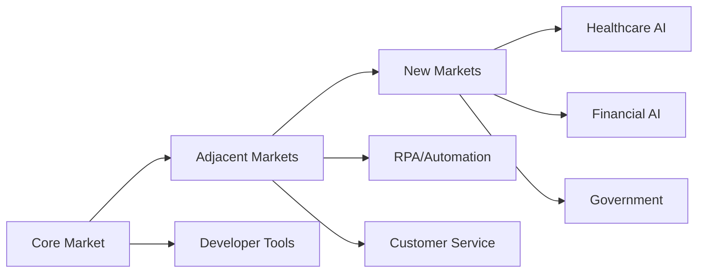

# Youtu-agent: Strategic Analysis

## 🎯 Strategic Overview
Business and technical strategy insights from Tencent's Youtu-agent framework for competitive positioning and market adoption.

---

## Market Positioning

### Competitive Landscape Analysis
```yaml
market_position:
  category: "Agent Configuration Frameworks"
  
  competitors:
    langchain:
      strength: "Ecosystem size"
      weakness: "Complexity"
      market_share: 35%
    
    autogen:
      strength: "Microsoft backing"
      weakness: "Limited flexibility"
      market_share: 20%
    
    crewai:
      strength: "Multi-agent focus"
      weakness: "Learning curve"
      market_share: 15%
    
    youtu_agent:
      strength: "YAML simplicity"
      weakness: "Late entrant"
      target_share: 25%
```

### Unique Value Proposition
```python
class YoutuAgentStrategy:
    uvp = {
        'primary': "Configure AI agents in minutes with YAML",
        'secondary': "Meta-agents that create themselves",
        'tertiary': "Enterprise-grade performance from Tencent"
    }
    
    differentiation = {
        'technical': "YAML-first, code-optional",
        'business': "10x faster agent deployment",
        'ecosystem': "Compatible with existing tools"
    }
```

---

## Go-to-Market Strategy

### Phase 1: Developer Adoption (Months 1-6)
```yaml
developer_strategy:
  channels:
    - github: Open source release
    - documentation: Comprehensive guides
    - tutorials: Video walkthroughs
    - hackathons: Developer competitions
  
  metrics:
    github_stars: 5000
    contributors: 100
    npm_downloads: 50000
    
  tactics:
    - "Release high-quality examples"
    - "Respond to issues within 24h"
    - "Weekly community calls"
    - "Integration bounties"
```

### Phase 2: Enterprise Penetration (Months 6-12)
```python
class EnterpriseStrategy:
    def __init__(self):
        self.target_segments = [
            "Financial Services",  # High value, compliance needs
            "Healthcare",         # Process automation
            "Retail",            # Customer service
            "Technology"         # Early adopters
        ]
    
    def entry_approach(self, segment):
        return {
            'pilot': f"30-day POC in {segment}",
            'value_prop': self.segment_specific_value(segment),
            'pricing': self.tiered_pricing(segment),
            'support': 'White-glove onboarding'
        }
    
    def segment_specific_value(self, segment):
        values = {
            'Financial Services': "Compliance-ready agent configs",
            'Healthcare': "HIPAA-compliant automation",
            'Retail': "Customer service in YAML",
            'Technology': "Developer productivity boost"
        }
        return values[segment]
```

---

## Business Model Innovation

### Revenue Streams
```yaml
revenue_model:
  open_source_core:
    price: Free
    features:
      - Basic agent configuration
      - Standard tools
      - Community support
    
  enterprise_edition:
    price: "$5,000-50,000/year"
    features:
      - Advanced meta-agents
      - Priority support
      - Security features
      - Compliance tools
    
  cloud_platform:
    price: "$0.01-0.10 per agent call"
    features:
      - Managed hosting
      - Auto-scaling
      - Monitoring
      - Analytics
    
  marketplace:
    model: "20% revenue share"
    products:
      - Pre-built agents
      - Custom tools
      - Industry templates
```

### Unit Economics
```python
class UnitEconomics:
    def calculate_ltv(self, customer_type):
        ltv = {
            'open_source': 0,      # Marketing value
            'startup': 15000,      # $5K * 3 years
            'enterprise': 150000,  # $50K * 3 years
            'cloud_user': 6000     # $500/month * 12 months
        }
        return ltv[customer_type]
    
    def calculate_cac(self, customer_type):
        cac = {
            'open_source': 10,     # GitHub/docs costs
            'startup': 2000,       # Sales + marketing
            'enterprise': 15000,   # Direct sales
            'cloud_user': 500      # Digital marketing
        }
        return cac[customer_type]
    
    def ltv_cac_ratio(self, customer_type):
        return self.calculate_ltv(customer_type) / self.calculate_cac(customer_type)
```

---

## Strategic Partnerships

### Technology Partners
```yaml
partnerships:
  cloud_providers:
    aws:
      integration: "AWS Bedrock"
      benefit: "Distribution channel"
      terms: "Revenue share"
    
    azure:
      integration: "Azure OpenAI"
      benefit: "Enterprise reach"
      terms: "Co-marketing"
    
    google:
      integration: "Vertex AI"
      benefit: "Technical validation"
      terms: "Technology exchange"
  
  model_providers:
    deepseek:
      integration: "Native support"
      benefit: "Performance optimization"
      terms: "Preferred partner"
    
    openai:
      integration: "GPT models"
      benefit: "Market standard"
      terms: "API integration"
```

### Strategic Alliances
```python
class AllianceStrategy:
    priorities = {
        1: {
            'partner': 'Tencent Cloud',
            'rationale': 'Parent company synergy',
            'value': 'Infrastructure and distribution'
        },
        2: {
            'partner': 'DeepSeek',
            'rationale': 'Model optimization',
            'value': 'Performance leadership'
        },
        3: {
            'partner': 'GitHub',
            'rationale': 'Developer ecosystem',
            'value': 'Community growth'
        },
        4: {
            'partner': 'Enterprise SaaS',
            'rationale': 'B2B channels',
            'value': 'Customer acquisition'
        }
    }
```

---

## Competitive Strategy

### Differentiation Strategy
```yaml
differentiation_pillars:
  simplicity:
    youtu_agent: "YAML-only configuration"
    competitors: "Code-heavy setup"
    advantage: "10x faster deployment"
  
  meta_agents:
    youtu_agent: "Self-creating agents"
    competitors: "Manual configuration"
    advantage: "Autonomous improvement"
  
  performance:
    youtu_agent: "71.47% on WebWalkerQA"
    competitors: "60-65% average"
    advantage: "Proven superiority"
  
  enterprise_ready:
    youtu_agent: "Tencent scale proven"
    competitors: "Startup risk"
    advantage: "Production validated"
```

### Defensive Strategy
```python
def defend_market_position():
    strategies = {
        'network_effects': build_ecosystem_moat(),
        'switching_costs': create_migration_barriers(),
        'brand_loyalty': invest_in_community(),
        'continuous_innovation': maintain_technical_lead(),
        'patent_portfolio': protect_key_innovations()
    }
    
    def build_ecosystem_moat():
        return {
            'marketplace': 'Create agent marketplace',
            'integrations': 'Build 100+ integrations',
            'community': 'Foster contributor network',
            'education': 'Certification program'
        }
    
    def create_migration_barriers():
        return {
            'proprietary_features': 'Meta-agent capabilities',
            'data_lock_in': 'Configuration history',
            'workflow_integration': 'Deep enterprise integration',
            'training_investment': 'Team knowledge'
        }
```

---

## Growth Strategy

### Market Expansion


### Product Expansion
```yaml
product_roadmap:
  current:
    - yaml_configuration
    - meta_agents
    - basic_tools
  
  6_months:
    - visual_editor
    - marketplace
    - enterprise_features
  
  12_months:
    - industry_templates
    - compliance_tools
    - advanced_analytics
  
  24_months:
    - autonomous_optimization
    - cross_platform_orchestration
    - ai_governance
```

---

## Risk Management

### Strategic Risks
```python
class RiskMatrix:
    risks = {
        'technical': {
            'probability': 'Medium',
            'impact': 'High',
            'mitigation': 'Continuous R&D, talent acquisition'
        },
        'competitive': {
            'probability': 'High',
            'impact': 'Medium',
            'mitigation': 'Fast execution, differentiation'
        },
        'regulatory': {
            'probability': 'Medium',
            'impact': 'High',
            'mitigation': 'Compliance framework, legal team'
        },
        'adoption': {
            'probability': 'Low',
            'impact': 'High',
            'mitigation': 'Developer focus, ease of use'
        }
    }
    
    def calculate_risk_score(self, risk_type):
        probability_scores = {'Low': 1, 'Medium': 2, 'High': 3}
        impact_scores = {'Low': 1, 'Medium': 2, 'High': 3}
        
        risk = self.risks[risk_type]
        return probability_scores[risk['probability']] * impact_scores[risk['impact']]
```

---

## Success Metrics

### Key Performance Indicators
```sql
-- Developer Adoption KPIs
SELECT 
    COUNT(DISTINCT developer_id) as active_developers,
    AVG(agents_created_per_dev) as productivity,
    SUM(github_stars) as community_engagement,
    COUNT(contributions) as ecosystem_health
FROM developer_metrics
WHERE period = 'last_30_days';

-- Business Performance KPIs
SELECT
    SUM(revenue) as total_revenue,
    COUNT(DISTINCT enterprise_customer) as enterprise_count,
    AVG(contract_value) as avg_deal_size,
    (churned_customers / total_customers) as churn_rate
FROM business_metrics;

-- Technical Performance KPIs
SELECT
    AVG(agent_creation_time) as ease_of_use,
    AVG(benchmark_score) as performance,
    COUNT(successful_deployments) / COUNT(*) as success_rate,
    AVG(time_to_value) as implementation_speed
FROM technical_metrics;
```

---

## Strategic Priorities

### Year 1 Priorities
1. **Developer Experience**: Best-in-class documentation and tools
2. **Performance Leadership**: Maintain benchmark superiority
3. **Enterprise Features**: Security, compliance, governance
4. **Ecosystem Growth**: 100+ integrations and tools

### Year 2 Priorities
1. **Market Leadership**: 25% market share in agent configuration
2. **Revenue Growth**: $50M ARR target
3. **Global Expansion**: US, Europe, Asia presence
4. **Platform Evolution**: Autonomous agent platform

---

## Competitive Advantages

### Sustainable Advantages
```python
class CompetitiveAdvantage:
    sustainable = {
        'tencent_backing': {
            'value': 'Resources and credibility',
            'durability': 'Long-term'
        },
        'yaml_simplicity': {
            'value': '10x easier than competitors',
            'durability': 'Hard to replicate with legacy'
        },
        'meta_agent_innovation': {
            'value': 'Self-improving agents',
            'durability': 'Technical moat'
        },
        'chinese_market_access': {
            'value': 'Largest AI market',
            'durability': 'Regulatory advantage'
        }
    }
    
    def reinforce_advantages(self):
        return {
            'continuous_innovation': 'Stay ahead technically',
            'ecosystem_building': 'Create network effects',
            'enterprise_relationships': 'Build switching costs',
            'brand_development': 'Become category leader'
        }
```

---

## Exit Strategy Options

### Strategic Scenarios
```yaml
scenarios:
  acquisition:
    potential_buyers: [Microsoft, Google, Amazon, Salesforce]
    valuation_multiple: "15-20x revenue"
    timing: "Year 3-5"
    
  ipo:
    requirements:
      revenue: "$100M+ ARR"
      growth_rate: "50%+ YoY"
      market_leadership: "Top 3 position"
    timing: "Year 5-7"
    
  strategic_merger:
    targets: [LangChain, Anthropic, Hugging Face]
    rationale: "Market consolidation"
    structure: "Merger of equals"
```

---

## Tags
#Strategy #BusinessModel #MarketAnalysis #Growth #Competitive #Youtu-agent #AI #EnterpriseSoftware

---

*Strategic Analysis Version: 1.0*
*Framework: Youtu-agent*
*Created: 2025-08-28*