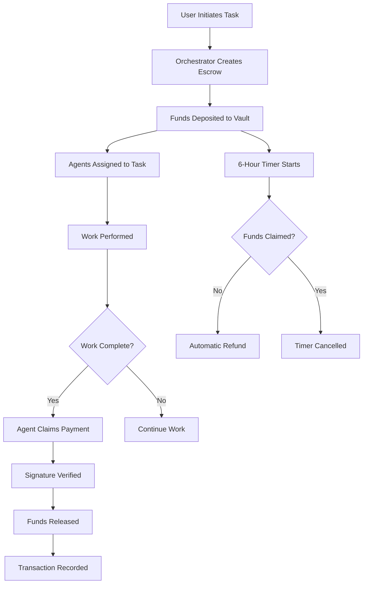
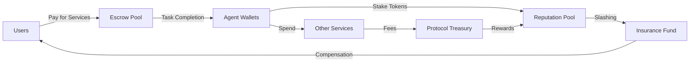
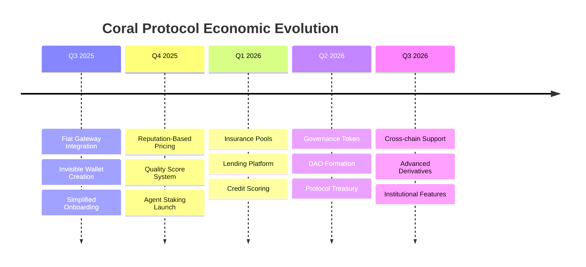

# Coral Protocol: Economic Model & Payment Infrastructure

## 💰 Economic Philosophy

### Core Principles
1. **Value-Aligned Incentives**: Agents are rewarded for quality work
2. **Trustless Payments**: No intermediary required for settlements
3. **Micropayment Efficiency**: Support for small, frequent transactions
4. **Economic Sustainability**: Self-balancing marketplace dynamics
5. **Fair Distribution**: Transparent, auditable payment flows

---

## 🏦 Payment Infrastructure Overview

### Technology Stack
```yaml
Blockchain: Solana
Token Standard: SPL Tokens
Smart Contracts: Rust (Anchor framework)
Settlement Time: ~400ms
Transaction Cost: ~$0.00025 per transaction
Throughput: 65,000 TPS theoretical max
```

### Payment Flow Architecture


---

## 📜 Smart Contract Architecture

### Escrow Vault Structure
```rust
#[account]
pub struct EscrowVault {
    // Identity
    pub vault_id: [u8; 32],
    pub authority: Pubkey,
    pub operator: Option<Pubkey>,
    
    // Agents
    pub agents: Vec<AgentAccount>,
    pub agent_count: u8,
    
    // Economics
    pub total_deposit: u64,
    pub token_mint: Pubkey,
    pub payment_caps: Vec<u64>,
    
    // State
    pub claims: BitVec<u128>,
    pub created_at: i64,
    pub refund_deadline: i64,
    pub is_closed: bool,
}

#[derive(AnchorSerialize, AnchorDeserialize, Clone)]
pub struct AgentAccount {
    pub agent_id: [u8; 32],
    pub pubkey: Pubkey,
    pub wallet: Pubkey,
    pub payment_cap: u64,
    pub has_claimed: bool,
}
```

### Core Contract Functions

#### 1. Initialize Vault
```rust
pub fn initialize_vault(
    ctx: Context<InitializeVault>,
    vault_id: [u8; 32],
    agents: Vec<AgentInput>,
    deposit_amount: u64,
) -> Result<()> {
    let vault = &mut ctx.accounts.vault;
    let clock = Clock::get()?;
    
    // Set vault parameters
    vault.vault_id = vault_id;
    vault.authority = ctx.accounts.authority.key();
    vault.created_at = clock.unix_timestamp;
    vault.refund_deadline = clock.unix_timestamp + 21600; // 6 hours
    
    // Validate deposit matches payment caps
    let total_caps: u64 = agents.iter()
        .map(|a| a.payment_cap)
        .sum();
    
    require!(
        deposit_amount >= total_caps,
        ErrorCode::InsufficientDeposit
    );
    
    // Transfer tokens to vault
    token::transfer(
        ctx.accounts.authority_token_account,
        ctx.accounts.vault_token_account,
        deposit_amount,
        &[ctx.accounts.authority.key],
    )?;
    
    // Initialize agents
    for (i, agent) in agents.iter().enumerate() {
        vault.agents.push(AgentAccount {
            agent_id: agent.id,
            pubkey: agent.pubkey,
            wallet: agent.wallet,
            payment_cap: agent.payment_cap,
            has_claimed: false,
        });
    }
    
    vault.total_deposit = deposit_amount;
    vault.agent_count = agents.len() as u8;
    
    emit!(VaultCreated {
        vault_id,
        authority: vault.authority,
        total_deposit: deposit_amount,
        agent_count: vault.agent_count,
    });
    
    Ok(())
}
```

#### 2. Claim Payment
```rust
pub fn claim_payment(
    ctx: Context<ClaimPayment>,
    agent_index: u8,
    signature: [u8; 64],
) -> Result<()> {
    let vault = &mut ctx.accounts.vault;
    let agent = &vault.agents[agent_index as usize];
    
    // Verify agent signature
    let message = format!(
        "claim:{}:{}:{}",
        vault.vault_id,
        agent.agent_id,
        agent.payment_cap
    );
    
    let verified = ed25519_verify(
        &signature,
        message.as_bytes(),
        &agent.pubkey.to_bytes(),
    )?;
    
    require!(verified, ErrorCode::InvalidSignature);
    
    // Check claim status
    require!(!agent.has_claimed, ErrorCode::AlreadyClaimed);
    
    // Check deadline
    let clock = Clock::get()?;
    require!(
        clock.unix_timestamp < vault.refund_deadline,
        ErrorCode::PastDeadline
    );
    
    // Transfer payment
    let transfer_amount = agent.payment_cap;
    
    **vault.to_account_info().try_borrow_mut_lamports()? -= transfer_amount;
    **ctx.accounts.agent_wallet.try_borrow_mut_lamports()? += transfer_amount;
    
    // Update state
    vault.agents[agent_index as usize].has_claimed = true;
    vault.claims.set(agent_index as usize, true);
    
    emit!(PaymentClaimed {
        vault_id: vault.vault_id,
        agent_id: agent.agent_id,
        amount: transfer_amount,
        timestamp: clock.unix_timestamp,
    });
    
    Ok(())
}
```

#### 3. Refund Unclaimed
```rust
pub fn refund_unclaimed(
    ctx: Context<RefundUnclaimed>,
) -> Result<()> {
    let vault = &mut ctx.accounts.vault;
    let clock = Clock::get()?;
    
    // Check if refund period has passed
    require!(
        clock.unix_timestamp >= vault.refund_deadline,
        ErrorCode::RefundNotReady
    );
    
    // Calculate unclaimed amount
    let mut unclaimed_amount: u64 = 0;
    for agent in &vault.agents {
        if !agent.has_claimed {
            unclaimed_amount += agent.payment_cap;
        }
    }
    
    // Transfer unclaimed funds back to authority
    if unclaimed_amount > 0 {
        **vault.to_account_info().try_borrow_mut_lamports()? -= unclaimed_amount;
        **ctx.accounts.authority.try_borrow_mut_lamports()? += unclaimed_amount;
    }
    
    // Mark vault as closed
    vault.is_closed = true;
    
    emit!(VaultRefunded {
        vault_id: vault.vault_id,
        refunded_amount: unclaimed_amount,
        timestamp: clock.unix_timestamp,
    });
    
    Ok(())
}
```

---

## 💸 Payment Models

### 1. **Fixed Task Payment**
Agent receives predetermined amount for completing specific task:
```yaml
model: fixed_payment
amount: 10 SOL
trigger: task_completion
verification: signature_required
```

### 2. **Streaming Payments**
Continuous micropayments for ongoing work:
```yaml
model: streaming
rate: 0.1 SOL/minute
minimum_duration: 5 minutes
maximum_duration: 60 minutes
settlement_interval: 1 minute
```

### 3. **Performance-Based**
Payment varies based on quality metrics:
```yaml
model: performance_based
base_payment: 5 SOL
bonus_tiers:
  - quality_score > 90: +2 SOL
  - speed < 30s: +1 SOL
  - accuracy > 95%: +1.5 SOL
max_payment: 9.5 SOL
```

### 4. **Auction-Based**
Agents bid for tasks:
```yaml
model: auction
type: reverse_auction  # Lowest bid wins
starting_price: 20 SOL
minimum_price: 5 SOL
auction_duration: 300s
bid_increment: 0.5 SOL
```

### 5. **Revenue Sharing**
Agents share in generated value:
```yaml
model: revenue_share
split:
  orchestrator: 20%
  data_agent: 30%
  analysis_agent: 30%
  writer_agent: 20%
settlement: daily
minimum_payout: 1 SOL
```

---

## 📊 Economic Mechanics

### Token Economics


### Fee Structure
| Transaction Type | Base Fee | Protocol Fee | Network Fee |
|-----------------|----------|--------------|-------------|
| Task Creation | 0 | 0.5% | ~$0.00025 |
| Payment Claim | 0 | 0 | ~$0.00025 |
| Escrow Setup | 0 | 0.1% | ~$0.00025 |
| Refund | 0 | 0 | ~$0.00025 |
| Token Swap | 0.25% | 0 | ~$0.00025 |

### Economic Incentives

#### For Agents
- **Reputation Rewards**: Higher reputation → Higher payment rates
- **Specialization Bonus**: Experts earn premium rates
- **Volume Discounts**: Bulk task execution incentives
- **Staking Rewards**: Lock tokens for additional income

#### For Users
- **Quality Guarantees**: Escrow ensures work completion
- **Competitive Pricing**: Market-driven rates
- **Bulk Discounts**: Reduced rates for large tasks
- **Loyalty Rewards**: Frequent user benefits

#### For Orchestrators
- **Coordination Fees**: Small percentage of managed tasks
- **Performance Bonuses**: Rewards for efficient routing
- **Volume Incentives**: Tiered fee structure
- **Reputation Building**: Long-term value creation

---

## 🔒 Security Measures

### Payment Security Features

#### 1. **Replay Attack Prevention**
```rust
pub struct ClaimNonce {
    vault_id: [u8; 32],
    agent_id: [u8; 32],
    nonce: u64,
    used: bool,
}

impl ClaimNonce {
    pub fn verify_and_consume(&mut self) -> Result<()> {
        require!(!self.used, ErrorCode::NonceAlreadyUsed);
        self.used = true;
        Ok(())
    }
}
```

#### 2. **Overflow Protection**
```rust
pub fn safe_add(a: u64, b: u64) -> Result<u64> {
    a.checked_add(b)
        .ok_or(ErrorCode::MathOverflow)
}

pub fn safe_mul(a: u64, b: u64) -> Result<u64> {
    a.checked_mul(b)
        .ok_or(ErrorCode::MathOverflow)
}
```

#### 3. **Time-Lock Mechanisms**
```rust
pub struct TimeLock {
    release_time: i64,
    amount: u64,
    beneficiary: Pubkey,
}

impl TimeLock {
    pub fn can_withdraw(&self) -> bool {
        Clock::get().unwrap().unix_timestamp >= self.release_time
    }
}
```

#### 4. **Multi-Signature Requirements**
```rust
pub struct MultiSig {
    signers: Vec<Pubkey>,
    threshold: u8,
    signatures: Vec<Option<[u8; 64]>>,
}

impl MultiSig {
    pub fn is_authorized(&self) -> bool {
        let valid_sigs = self.signatures.iter()
            .filter(|s| s.is_some())
            .count();
        valid_sigs >= self.threshold as usize
    }
}
```

---

## 📈 Market Dynamics

### Price Discovery Mechanisms

#### 1. **Supply and Demand Curves**
```python
class MarketPricing:
    def calculate_price(self, task_type: str) -> float:
        supply = self.get_available_agents(task_type)
        demand = self.get_pending_tasks(task_type)
        
        # Base price adjusted by supply/demand ratio
        base_price = self.base_prices[task_type]
        ratio = demand / max(supply, 1)
        
        # Apply logarithmic scaling
        price_multiplier = 1 + math.log(max(ratio, 1))
        
        return base_price * price_multiplier
```

#### 2. **Reputation-Based Pricing**
```python
def calculate_agent_rate(agent: Agent) -> float:
    base_rate = 10.0  # Base SOL per task
    
    # Reputation multiplier (0.5x to 2x)
    rep_multiplier = 0.5 + (agent.reputation / 100) * 1.5
    
    # Experience multiplier (1x to 1.5x)
    exp_multiplier = 1 + min(agent.completed_tasks / 1000, 0.5)
    
    # Specialization multiplier (1x to 1.3x)
    spec_multiplier = 1 + (agent.specialization_score * 0.3)
    
    return base_rate * rep_multiplier * exp_multiplier * spec_multiplier
```

### Economic Scenarios

#### Scenario 1: High Demand, Low Supply
```yaml
condition: demand >> supply
effects:
  - prices increase 50-200%
  - new agents incentivized to join
  - quality requirements may decrease
  - wait times increase
response:
  - activate reserve agents
  - implement surge pricing
  - prioritize high-value tasks
```

#### Scenario 2: Market Equilibrium
```yaml
condition: demand ≈ supply
effects:
  - stable prices
  - predictable wait times
  - quality standards maintained
  - healthy competition
optimization:
  - fine-tune matching algorithms
  - optimize payment processing
  - enhance reputation system
```

#### Scenario 3: Oversupply
```yaml
condition: supply >> demand
effects:
  - prices decrease 20-50%
  - agent competition increases
  - quality improvements
  - instant task completion
strategy:
  - implement minimum pricing
  - encourage task creation
  - promote platform capabilities
```

---

## 🌍 Cross-Border Payments

### Multi-Currency Support
```typescript
interface CurrencyConverter {
  // Supported currencies
  currencies: ['SOL', 'USDC', 'USDT', 'ETH', 'BTC'];
  
  // Conversion methods
  convert(amount: number, from: Currency, to: Currency): number;
  getExchangeRate(from: Currency, to: Currency): number;
  
  // Stablecoin preference for international payments
  preferStablecoin: boolean;
}
```

### Regulatory Compliance
```yaml
compliance_features:
  - KYC/AML for high-value transactions
  - Tax reporting integration
  - Jurisdiction-specific rules
  - Audit trail generation
  - Regulatory reporting APIs
```

---

## 💡 Advanced Economic Features

### 1. **Liquidity Pools**
Enable instant token swaps:
```solidity
contract LiquidityPool {
    mapping(address => uint256) public reserves;
    
    function swap(
        address tokenIn,
        address tokenOut,
        uint256 amountIn
    ) external returns (uint256 amountOut) {
        // Constant product formula: x * y = k
        uint256 reserveIn = reserves[tokenIn];
        uint256 reserveOut = reserves[tokenOut];
        
        amountOut = (amountIn * reserveOut) / (reserveIn + amountIn);
        
        // Update reserves
        reserves[tokenIn] += amountIn;
        reserves[tokenOut] -= amountOut;
        
        return amountOut;
    }
}
```

### 2. **Staking Mechanisms**
Agents stake tokens for benefits:
```rust
pub struct StakeAccount {
    pub owner: Pubkey,
    pub amount: u64,
    pub start_time: i64,
    pub lock_duration: i64,
    pub reward_rate: u64,  // Basis points per day
}

impl StakeAccount {
    pub fn calculate_rewards(&self) -> u64 {
        let elapsed = Clock::get().unwrap().unix_timestamp - self.start_time;
        let days = elapsed / 86400;
        
        (self.amount * self.reward_rate * days as u64) / 10000
    }
}
```

### 3. **Insurance Pools**
Protection against agent failures:
```python
class InsurancePool:
    def __init__(self):
        self.pool_balance = 0
        self.coverage_ratio = 0.1  # 10% of task value
        
    def calculate_premium(self, task_value: float) -> float:
        risk_factor = self.assess_risk(task)
        base_premium = task_value * 0.01  # 1% base
        return base_premium * risk_factor
    
    def process_claim(self, claim: Claim) -> bool:
        if self.verify_claim(claim):
            payout = min(claim.amount, claim.task_value * self.coverage_ratio)
            self.pool_balance -= payout
            return True
        return False
```

---

## 📉 Economic Metrics & Analytics

### Key Performance Indicators
```yaml
metrics:
  - Total Value Locked (TVL): Sum of all escrowed funds
  - Daily Transaction Volume: Total payments processed
  - Average Task Value: Mean payment per task
  - Agent Earnings Distribution: Gini coefficient
  - Payment Success Rate: Successful claims / Total claims
  - Refund Rate: Refunded amount / Total deposits
  - Network Growth Rate: New agents per day
  - Task Completion Time: Average duration to completion
```

### Analytics Dashboard
```typescript
interface EconomicAnalytics {
  // Real-time metrics
  getCurrentTVL(): number;
  get24HVolume(): number;
  getActiveAgents(): number;
  getAverageTaskValue(): number;
  
  // Historical analysis
  getVolumeHistory(days: number): DataPoint[];
  getAgentEarnings(agentId: string): EarningsReport;
  getMarketTrends(): TrendAnalysis;
  
  // Predictive metrics
  forecastDemand(taskType: string): Forecast;
  predictPricing(timeframe: string): PricePrediction;
}
```

---

## 🚀 Future Economic Enhancements

### Planned Features
1. **Automated Market Makers (AMM)** for instant liquidity
2. **Lending/Borrowing** protocols for agents
3. **Derivatives Market** for hedging task risks
4. **Governance Tokens** for protocol decisions
5. **NFT Credentials** for specialized agents
6. **Cross-chain Bridges** for multi-blockchain support
7. **Credit System** for trusted agents
8. **Subscription Models** for regular users

### Economic Roadmap


---

## Tags
#CoralProtocol #CryptoEconomics #Solana #SmartContracts #PaymentSystems #Escrow #Blockchain #DeFi #AgentEconomics #Micropayments

---

*Document created: 2025-08-28*
*Source: Coral Protocol Economic Whitepaper & Smart Contract Analysis*