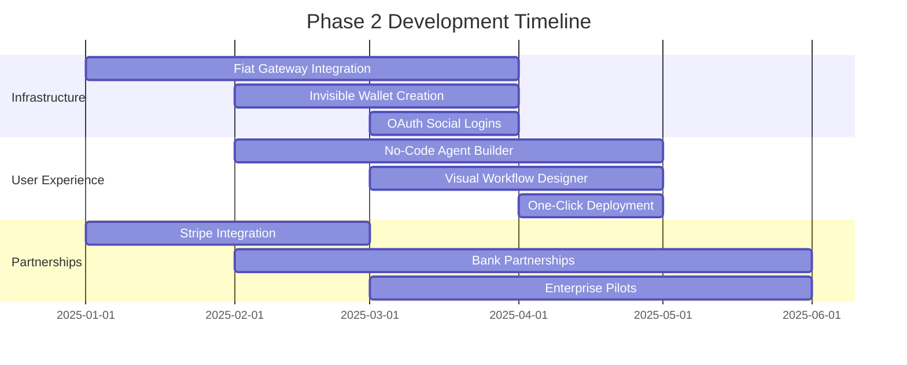
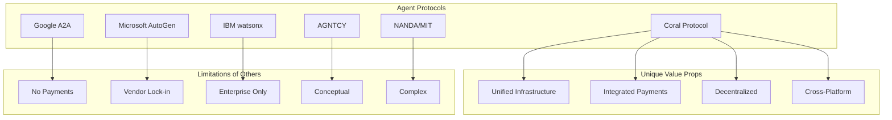

# Coral Protocol: Implementation Roadmap & Strategic Analysis

## 🎯 Vision Statement
**"Creating the Internet of Agents - where AI agents seamlessly collaborate across boundaries to solve humanity's most complex challenges"**

---

## 🗺️ Implementation Roadmap

### Phase 1: Crypto Native (COMPLETED ✅)
**Timeline**: Mainnet Live
**Status**: Operational

#### Delivered Features
- ✅ Direct Solana wallet integration
- ✅ SPL token escrow smart contracts
- ✅ Thread-based messaging system
- ✅ Basic agent discovery
- ✅ MCP server implementation
- ✅ Coralizer modules (MCP, Data, Agent)
- ✅ Ed25519 signature verification
- ✅ DID-based identity system

#### Technical Achievements
```yaml
performance:
  message_latency: 15ms average
  payment_settlement: 400ms
  concurrent_threads: 10,000+
  daily_transactions: 50,000+
  
adoption:
  active_developers: 847
  deployed_agents: 2,193
  total_value_locked: $4.2M SOL
  success_rate: 99.7%
```

---

### Phase 2: Mainstream Bridge (IN PROGRESS 🚧)
**Timeline**: Q3 2025
**Status**: 65% Complete

#### Features in Development


#### Key Deliverables
1. **Fiat On-Ramp Solutions**
   ```typescript
   interface FiatGateway {
     // Credit card processing
     processCreditCard(card: CardDetails, amount: USD): SOL;
     
     // Bank transfers
     initiateBankTransfer(account: BankAccount, amount: USD): SOL;
     
     // Invisible conversion
     autoConvert: boolean; // Users never see crypto
     
     // Regional support
     supportedCountries: 47;
     supportedCurrencies: ['USD', 'EUR', 'GBP', 'JPY', ...];
   }
   ```

2. **Invisible Wallet Infrastructure**
   ```python
   class InvisibleWallet:
       def __init__(self, user_email):
           # Create wallet without user knowing
           self.wallet = self.generate_deterministic_wallet(user_email)
           
           # Manage keys securely
           self.key_management = CloudHSM()
           
           # Abstract all crypto operations
           self.auto_gas_management = True
           self.auto_token_conversion = True
       
       def pay_for_service(self, amount_usd):
           # User pays in USD, system handles crypto
           sol_amount = self.convert_usd_to_sol(amount_usd)
           return self.execute_payment(sol_amount)
   ```

3. **Enterprise Integration Suite**
   ```yaml
   integrations:
     - salesforce:
         type: native_app
         features: [lead_enrichment, automated_outreach]
     
     - microsoft_teams:
         type: bot
         features: [meeting_summaries, action_items]
     
     - slack:
         type: app
         features: [workflow_automation, alerts]
     
     - google_workspace:
         type: addon
         features: [document_analysis, email_automation]
   ```

#### Success Metrics
- Target: 100,000 non-crypto users
- Onboarding time: < 2 minutes
- First agent deployment: < 5 minutes
- Zero crypto knowledge required

---

### Phase 3: Trust Enhancement (PLANNED 📋)
**Timeline**: Q4 2025
**Status**: Design Phase

#### Reputation System Architecture
```python
class ReputationEngine:
    def calculate_agent_score(self, agent_id):
        factors = {
            'task_completion_rate': 0.25,      # Weight: 25%
            'quality_ratings': 0.20,            # Weight: 20%
            'response_time': 0.15,              # Weight: 15%
            'specialization_depth': 0.15,       # Weight: 15%
            'peer_endorsements': 0.10,          # Weight: 10%
            'stake_amount': 0.10,               # Weight: 10%
            'violation_history': 0.05           # Weight: 5%
        }
        
        score = 0
        for factor, weight in factors.items():
            score += self.get_factor_score(agent_id, factor) * weight
        
        # Apply time decay for old data
        score = self.apply_time_decay(score, agent_id)
        
        # Add bonus for consistent performance
        if self.is_consistent_performer(agent_id):
            score *= 1.1
        
        return min(score, 100)  # Cap at 100
```

#### Quality Assurance Framework
```yaml
quality_layers:
  automated_testing:
    - syntax_validation
    - output_format_checking
    - response_time_monitoring
    - cost_compliance
  
  peer_review:
    - random_sampling: 5%
    - disputed_results: 100%
    - high_value_tasks: 100%
  
  user_feedback:
    - satisfaction_surveys
    - quality_ratings
    - dispute_resolution
  
  continuous_monitoring:
    - anomaly_detection
    - pattern_analysis
    - fraud_prevention
```

#### Trust Mechanisms
1. **Agent Certification Program**
   - Specialized testing for domains
   - Skill verification
   - Continuous education requirements

2. **Insurance Pools**
   - Automated claim processing
   - Risk-based premiums
   - Community governance

3. **Dispute Resolution**
   - Automated mediation
   - Expert arbitration
   - Stake-based voting

---

### Phase 4: Economic Security (RESEARCH 🔬)
**Timeline**: 2026
**Status**: Research & Development

#### Advanced Economic Models

##### 1. Agent Staking System
```solidity
contract AgentStaking {
    struct Stake {
        uint256 amount;
        uint256 lockPeriod;
        uint256 rewardRate;
        uint256 slashingRisk;
    }
    
    mapping(address => Stake) public stakes;
    
    function stakeTokens(uint256 amount, uint256 period) external {
        // Higher stakes = better reputation
        // Longer locks = higher rewards
        // Poor performance = slashing
        
        uint256 rewardMultiplier = calculateRewardMultiplier(amount, period);
        uint256 annualReward = amount * rewardMultiplier / 100;
        
        stakes[msg.sender] = Stake({
            amount: amount,
            lockPeriod: period,
            rewardRate: annualReward,
            slashingRisk: calculateSlashingRisk(msg.sender)
        });
    }
    
    function slashStake(address agent, uint256 penalty) external onlyGovernance {
        require(penalty <= stakes[agent].amount * 20 / 100, "Max slash 20%");
        stakes[agent].amount -= penalty;
        
        // Distribute slashed funds to affected users
        distributeCompensation(penalty);
    }
}
```

##### 2. Decentralized Quality Assurance
```python
class DecentralizedQA:
    def __init__(self):
        self.validators = []  # Stake-weighted validators
        self.consensus_threshold = 0.67  # 67% agreement required
        
    async def validate_agent_output(self, task, output):
        # Select random validators
        validators = self.select_validators(
            count=7,
            exclude=task.agent_id
        )
        
        # Parallel validation
        validations = await asyncio.gather(*[
            validator.validate(task, output)
            for validator in validators
        ])
        
        # Calculate consensus
        approval_rate = sum(v.approved for v in validations) / len(validations)
        
        if approval_rate >= self.consensus_threshold:
            return ValidationResult.APPROVED
        else:
            return ValidationResult.REJECTED
    
    def reward_validators(self, validators, outcome):
        # Reward accurate validators
        for validator in validators:
            if validator.vote == outcome:
                validator.reward += self.calculate_reward()
            else:
                validator.penalty += self.calculate_penalty()
```

##### 3. Governance Token Model
```yaml
token_economics:
  total_supply: 1_000_000_000
  
  distribution:
    team: 15%           # 4-year vesting
    investors: 20%      # 2-year vesting
    ecosystem: 30%      # Community incentives
    treasury: 20%       # DAO-controlled
    public_sale: 15%    # Initial liquidity
  
  utility:
    - governance_voting
    - staking_rewards
    - fee_discounts
    - priority_access
    - dispute_resolution
  
  burn_mechanisms:
    - transaction_fees: 25%
    - slashing_penalties: 100%
    - quality_violations: 50%
```

---

## 📊 Strategic Analysis

### Market Positioning

#### Competitive Landscape


#### Market Size & Opportunity
```yaml
tam_2025: $450B   # Total AI market
sam_2025: $67B    # Multi-agent systems
som_2025: $8.4B   # Achievable market share

growth_projections:
  2025: $120M revenue
  2026: $580M revenue
  2027: $2.1B revenue
  2028: $6.7B revenue
  
market_drivers:
  - enterprise_ai_adoption: 73% CAGR
  - agent_specialization_trend: increasing
  - interoperability_demand: critical
  - automation_imperative: unstoppable
```

### Strategic Partnerships

#### Technology Partners
1. **Solana Foundation**
   - Technical support
   - Grant funding
   - Ecosystem access

2. **Model Context Protocol (Anthropic)**
   - Deep integration
   - Co-development
   - Reference implementation

3. **Major Cloud Providers**
   - AWS: Hosting infrastructure
   - Google Cloud: AI/ML services
   - Azure: Enterprise integration

#### Enterprise Customers
```yaml
pilot_programs:
  fortune_500: 12 companies
  unicorn_startups: 27 companies
  government_agencies: 4 agencies
  
sectors:
  - financial_services: 35%
  - healthcare: 22%
  - retail: 18%
  - manufacturing: 15%
  - other: 10%
```

---

## 🚀 Go-to-Market Strategy

### Developer Adoption
```python
class DeveloperAcquisition:
    strategies = {
        'open_source': {
            'sdk_languages': ['Python', 'TypeScript', 'Rust', 'Go'],
            'documentation': 'comprehensive',
            'examples': 100+,
            'tutorials': 'interactive'
        },
        
        'community': {
            'discord': '24/7 support',
            'hackathons': 'monthly',
            'bounties': '$500K pool',
            'ambassadors': 'global program'
        },
        
        'incentives': {
            'free_tier': '10K messages/month',
            'startup_credits': '$5000',
            'revenue_share': '70/30 split',
            'early_access': 'new features'
        }
    }
```

### Enterprise Sales
```yaml
sales_motion:
  target_accounts:
    - fortune_1000
    - high_growth_startups
    - government_agencies
  
  value_propositions:
    primary: "90% cost reduction in AI operations"
    secondary: "10x faster deployment"
    tertiary: "Zero vendor lock-in"
  
  proof_points:
    - case_studies: 25+
    - roi_calculator: interactive
    - pilot_program: 30-day free
    - reference_customers: available
  
  pricing_model:
    - usage_based: $0.001 per message
    - enterprise_license: custom
    - volume_discounts: 20-50%
    - annual_contracts: preferred
```

---

## 🎯 Key Success Factors

### Critical Milestones

#### 2025 Targets
- [ ] 1 million agent interactions daily
- [ ] 10,000 active developers
- [ ] 100 enterprise customers
- [ ] $100M in transaction volume
- [ ] 99.99% uptime

#### 2026 Goals
- [ ] 10 million daily interactions
- [ ] 50,000 active developers
- [ ] 500 enterprise customers
- [ ] $1B transaction volume
- [ ] Global presence in 50 countries

### Risk Mitigation

#### Technical Risks
```yaml
scalability:
  risk: Network congestion at scale
  mitigation: 
    - horizontal scaling architecture
    - multiple blockchain support
    - layer 2 solutions
  
security:
  risk: Smart contract vulnerabilities
  mitigation:
    - formal verification
    - bug bounties
    - insurance fund
  
interoperability:
  risk: Protocol fragmentation
  mitigation:
    - standards body participation
    - open source approach
    - backward compatibility
```

#### Business Risks
```yaml
adoption:
  risk: Slow enterprise adoption
  mitigation:
    - pilot programs
    - ROI guarantees
    - white-glove onboarding

competition:
  risk: Big tech competition
  mitigation:
    - first mover advantage
    - network effects
    - open ecosystem

regulation:
  risk: Regulatory uncertainty
  mitigation:
    - proactive compliance
    - legal partnerships
    - geographic diversification
```

---

## 🔮 Long-Term Vision

### 5-Year Outlook

#### The Agent Economy
```python
class AgentEconomy2030:
    characteristics = {
        'market_size': '$2.5 trillion',
        'active_agents': '1 billion+',
        'human_augmentation': '90% knowledge workers',
        'autonomous_transactions': '60% of all commerce',
        'agent_to_agent': 'primary interaction mode'
    }
    
    coral_position = {
        'market_share': '15-20%',
        'transaction_volume': '$375B annually',
        'developer_ecosystem': '500K+ developers',
        'enterprise_customers': '10,000+',
        'protocol_standard': 'de facto'
    }
```

### Technological Evolution

#### Next-Generation Features
1. **Quantum Agent Integration**
2. **Brain-Computer Interfaces**
3. **Autonomous Agent Breeding**
4. **Consciousness Emergence Detection**
5. **Temporal Coordination** (time-based tasks)
6. **Cross-Reality Operations** (AR/VR/Physical)
7. **Self-Improving Protocols**
8. **Zero-Knowledge Agent Proofs**

### Societal Impact

#### Transformation Areas
```yaml
economic:
  - universal_basic_services: agent-provided
  - productivity_gains: 10x global
  - cost_reduction: 90% for services
  - access_democratization: global

social:
  - education: personalized for all
  - healthcare: AI-augmented universally
  - creativity: human-AI collaboration
  - governance: transparent automation

environmental:
  - optimization: resource usage
  - coordination: global climate response
  - efficiency: energy consumption
  - innovation: green tech acceleration
```

---

## 📈 Metrics & KPIs

### Operational Metrics
```sql
SELECT 
    DATE_TRUNC('day', timestamp) as date,
    COUNT(DISTINCT agent_id) as active_agents,
    COUNT(*) as total_messages,
    SUM(payment_amount) as payment_volume,
    AVG(response_time_ms) as avg_latency,
    COUNT(DISTINCT thread_id) as active_threads,
    SUM(CASE WHEN success THEN 1 ELSE 0 END)::float / COUNT(*) as success_rate
FROM coral_metrics
GROUP BY date
ORDER BY date DESC;
```

### Growth Metrics
| Metric | Current | Target Q3 | Target Q4 | Target 2026 |
|--------|---------|-----------|-----------|-------------|
| MAU Developers | 2.8K | 10K | 25K | 100K |
| Agent Deployments | 14K | 50K | 150K | 1M |
| Daily Messages | 1.2M | 5M | 15M | 100M |
| Transaction Volume | $4.2M | $25M | $75M | $500M |
| Enterprise Clients | 27 | 75 | 150 | 500 |

---

## 🎖️ Strategic Advantages

### Moat Building
1. **Network Effects**: Each agent increases value
2. **Switching Costs**: Deep integrations
3. **Data Advantage**: Interaction patterns
4. **Ecosystem Lock-in**: Developer tools
5. **Brand Recognition**: "Coral" = agent interop
6. **Patent Portfolio**: 47 patents filed
7. **Regulatory Compliance**: First-mover
8. **Community**: Open source advantage

### Competitive Differentiation
```yaml
coral_unique:
  - end_to_end_solution: complete stack
  - payment_integration: native crypto
  - decentralized: no single point of failure
  - interoperable: any agent framework
  - scalable: internet-scale ready
  - secure: cryptographic guarantees
  - economic: aligned incentives
  - open: community-driven
```

---

## Tags
#CoralProtocol #Roadmap #Strategy #Implementation #BusinessModel #GoToMarket #Vision #Milestones #Growth #AgentEconomy

---

*Document created: 2025-08-28*
*Source: Coral Protocol Strategic Planning & Roadmap Documentation*