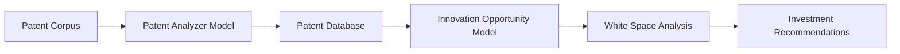
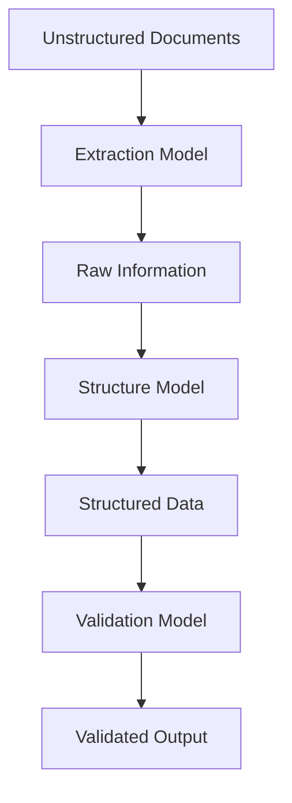
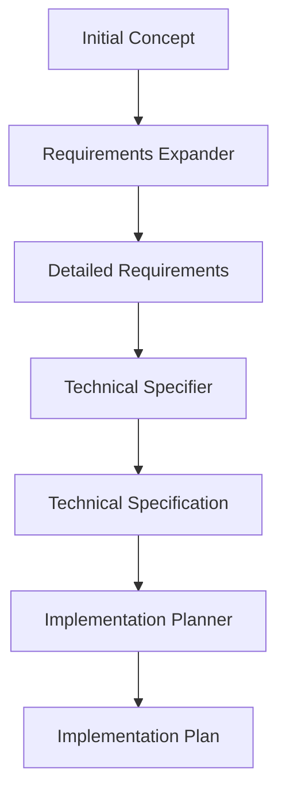
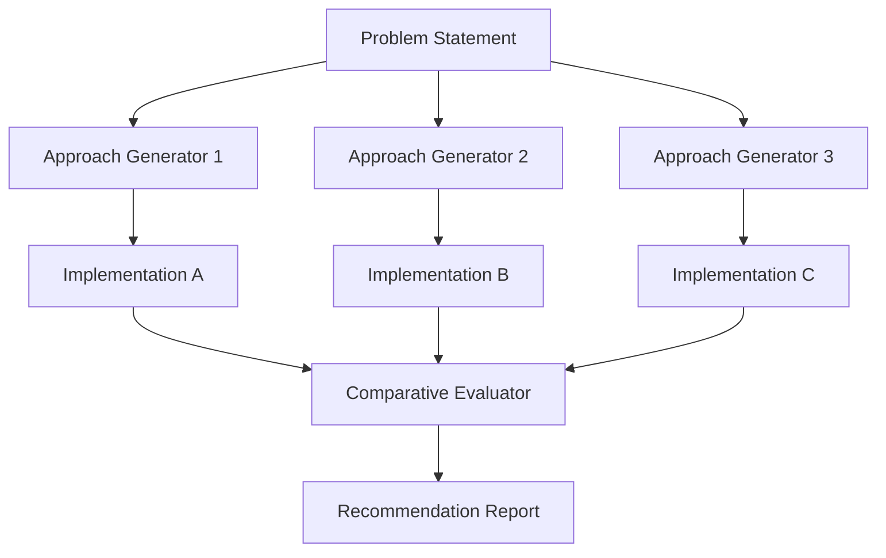
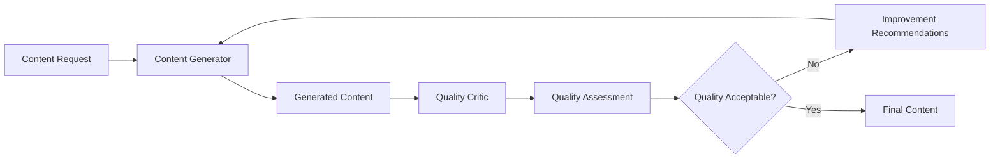
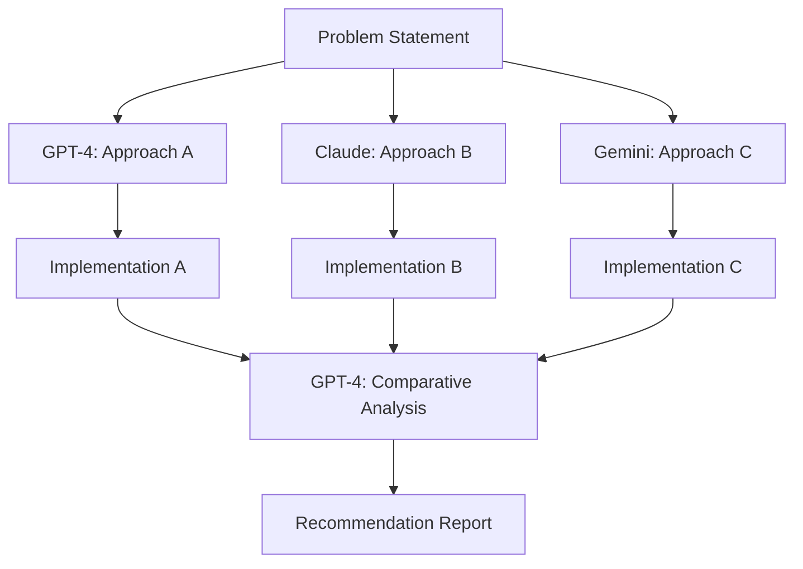
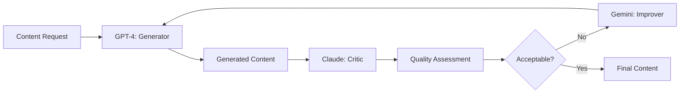

# Multi-Model Research Workflows

## 🧠 Overview
Comprehensive documentation of advanced workflows utilizing multiple language models in sequence to achieve results beyond single-model capabilities.

---

## Technical Research Workflows

### 1. Multi-Model Research Extraction
**Pattern**: One LLM for detailed exploration, another for synthesis and distillation

```python
class MultiModelResearch:
    def __init__(self):
        self.explorer = DetailedExplorationModel()  # Deep dive capability
        self.synthesizer = SynthesisDistillationModel()  # Summary capability
        
    async def research_pipeline(self, topic):
        # Phase 1: Deep exploration
        detailed_findings = await self.explorer.deep_dive(
            topic=topic,
            depth="comprehensive",
            sources="academic,technical,industry"
        )
        
        # Phase 2: Synthesis and distillation
        synthesized_report = await self.synthesizer.distill(
            raw_data=detailed_findings,
            format="structured_insights",
            audience="technical_expert"
        )
        
        return synthesized_report
```

**Use Cases**:
- Academic literature reviews
- Technical domain exploration
- Market research synthesis
- Patent landscape analysis

---

### 2. Literature Review Automation
**Pattern**: Models scan academic papers and synthesize findings into structured reviews

```yaml
workflow:
  stage_1:
    model: "Scanning Model"
    task: "Extract key findings from 100+ papers"
    output: "Raw findings database"
    
  stage_2:
    model: "Analysis Model"
    task: "Identify patterns and connections"
    output: "Thematic clusters"
    
  stage_3:
    model: "Synthesis Model"
    task: "Create coherent literature review"
    output: "Structured academic review"
    
benefits:
  - 10x faster than manual review
  - Comprehensive coverage
  - Consistent quality
  - Bias reduction
```

---

### 3. Technical Gap Analysis
**Pattern**: Using LLMs to identify missing research or approaches in a technical domain

```python
def technical_gap_analysis(domain):
    workflow = {
        'model_1': {
            'role': 'Domain Mapper',
            'task': 'Map current state of knowledge',
            'output': 'Knowledge taxonomy'
        },
        'model_2': {
            'role': 'Gap Identifier',
            'task': 'Find missing connections/areas',
            'output': 'Gap analysis report'
        },
        'model_3': {
            'role': 'Opportunity Assessor',
            'task': 'Evaluate commercial/research potential',
            'output': 'Prioritized opportunities'
        }
    }
    return workflow
```

---

### 4. Patent Analysis Pipeline
**Pattern**: Examine existing patents through one model, then identify innovation opportunities with another



**Implementation**:
```python
class PatentAnalysisPipeline:
    async def analyze_patent_landscape(self, technology_domain):
        # Stage 1: Patent extraction and analysis
        patent_data = await self.patent_analyzer.process(
            domain=technology_domain,
            timeframe="last_10_years",
            include_citations=True
        )
        
        # Stage 2: Innovation opportunity identification
        opportunities = await self.innovation_detector.identify(
            existing_patents=patent_data,
            market_trends=self.get_market_data(),
            technology_evolution=self.get_tech_trends()
        )
        
        return {
            'patent_landscape': patent_data,
            'white_spaces': opportunities,
            'recommended_focus_areas': opportunities.top(5)
        }
```

---

### 5. Competitive Technology Assessment
**Pattern**: Analyze competitor technologies through sequential model analysis

```yaml
competitive_analysis_workflow:
  intelligence_gathering:
    model: "Information Aggregator"
    sources: ["patents", "papers", "code_repos", "job_postings"]
    output: "Raw competitive intelligence"
    
  capability_assessment:
    model: "Technical Analyzer"
    task: "Assess technical capabilities and limitations"
    output: "Capability matrix"
    
  strategic_synthesis:
    model: "Strategy Synthesizer"
    task: "Identify competitive advantages/disadvantages"
    output: "Strategic recommendations"
```

---

## Data and Information Processing Workflows

### 1. Synthetic Data Generation
**Pattern**: Creating artificial datasets for training or testing systems where real data is limited

```python
class SyntheticDataWorkflow:
    def __init__(self):
        self.pattern_analyzer = PatternAnalysisModel()
        self.data_generator = SyntheticDataModel()
        self.quality_validator = ValidationModel()
        
    async def generate_synthetic_dataset(self, real_samples, target_size):
        # Phase 1: Analyze patterns in real data
        patterns = await self.pattern_analyzer.extract_patterns(
            data=real_samples,
            categories=['statistical', 'semantic', 'structural']
        )
        
        # Phase 2: Generate synthetic data
        synthetic_data = await self.data_generator.create(
            patterns=patterns,
            size=target_size,
            diversity_constraint=0.8
        )
        
        # Phase 3: Validate quality
        quality_score = await self.quality_validator.assess(
            synthetic=synthetic_data,
            reference=real_samples
        )
        
        return {
            'synthetic_dataset': synthetic_data,
            'quality_metrics': quality_score,
            'generation_metadata': patterns
        }
```

---

### 2. Information Extraction Chain
**Pattern**: One model extracts raw information, another structures and validates it



**Use Cases**:
- Legal document processing
- Technical manual extraction
- Medical record structuring
- Financial report analysis

---

### 3. Technical Documentation Mining
**Pattern**: Extracting actionable insights from complex technical documentation

```python
def documentation_mining_workflow():
    return {
        'extraction_phase': {
            'model': 'Technical Document Parser',
            'task': 'Extract procedures, specifications, requirements',
            'output': 'Raw technical facts'
        },
        'structuring_phase': {
            'model': 'Knowledge Structurer',
            'task': 'Organize into actionable frameworks',
            'output': 'Structured knowledge base'
        },
        'insight_generation': {
            'model': 'Insight Generator',
            'task': 'Identify non-obvious insights and connections',
            'output': 'Strategic insights and recommendations'
        }
    }
```

---

### 4. Cross-Domain Knowledge Transfer
**Pattern**: Using models to translate concepts from one technical domain to another

```yaml
knowledge_transfer:
  domain_mapping:
    source_domain: "Biology"
    target_domain: "Software Architecture"
    model: "Cross-Domain Mapper"
    output: "Concept translation dictionary"
    
  application_synthesis:
    model: "Application Synthesizer"
    task: "Adapt biological concepts to software context"
    output: "Novel software patterns inspired by biology"
    
  validation_testing:
    model: "Feasibility Validator"
    task: "Assess practical applicability"
    output: "Implementation recommendations"
```

---

### 5. Anomaly Detection Pipeline
**Pattern**: One model generates potential anomalies, another evaluates their significance

```python
class AnomalyDetectionWorkflow:
    async def detect_and_analyze_anomalies(self, dataset):
        # Stage 1: Anomaly candidate generation
        candidates = await self.anomaly_detector.find_candidates(
            data=dataset,
            sensitivity='high',
            method='statistical+semantic'
        )
        
        # Stage 2: Significance evaluation
        significant_anomalies = []
        for candidate in candidates:
            significance = await self.significance_evaluator.assess(
                anomaly=candidate,
                context=dataset,
                business_impact=True
            )
            
            if significance.score > 0.7:
                significant_anomalies.append({
                    'anomaly': candidate,
                    'significance': significance,
                    'recommended_action': significance.action
                })
        
        return significant_anomalies
```

---

## Development and Implementation Workflows

### 1. Algorithm-to-Implementation Bridge
**Pattern**: Translating theoretical algorithms into practical code implementations

```python
class AlgorithmImplementationBridge:
    def __init__(self):
        self.algorithm_analyzer = AlgorithmAnalysisModel()
        self.code_generator = CodeGenerationModel()
        self.optimizer = OptimizationModel()
        
    async def bridge_algorithm_to_code(self, algorithm_description):
        # Phase 1: Analyze algorithm structure
        analysis = await self.algorithm_analyzer.decompose(
            algorithm=algorithm_description,
            complexity_analysis=True,
            bottleneck_identification=True
        )
        
        # Phase 2: Generate initial implementation
        initial_code = await self.code_generator.implement(
            algorithm_structure=analysis,
            language='python',
            optimization_level='readable'
        )
        
        # Phase 3: Optimize for production
        optimized_code = await self.optimizer.optimize(
            code=initial_code,
            target_metrics=['performance', 'memory', 'maintainability']
        )
        
        return {
            'implementation': optimized_code,
            'complexity_analysis': analysis.complexity,
            'optimization_notes': optimized_code.changes
        }
```

---

### 2. Code Optimization Workflow
**Pattern**: One model generates code, another optimizes and refines it

```yaml
optimization_pipeline:
  generation:
    model: "Code Generator"
    input: "Requirements and specifications"
    output: "Working implementation"
    
  analysis:
    model: "Performance Analyzer"
    task: "Identify bottlenecks and inefficiencies"
    output: "Performance profile"
    
  optimization:
    model: "Code Optimizer"
    task: "Apply optimizations while preserving functionality"
    output: "Optimized code with benchmarks"
```

---

### 3. API Wrapper Generation
**Pattern**: Creating interfaces to complex systems through sequential model guidance

```python
def api_wrapper_workflow():
    return {
        'system_analysis': {
            'model': 'System Analyzer',
            'task': 'Understand complex system capabilities',
            'output': 'System capability map'
        },
        'interface_design': {
            'model': 'Interface Designer',
            'task': 'Design clean, intuitive API wrapper',
            'output': 'API specification'
        },
        'implementation': {
            'model': 'Code Generator',
            'task': 'Implement wrapper with error handling',
            'output': 'Production-ready wrapper'
        },
        'documentation': {
            'model': 'Documentation Generator',
            'task': 'Create comprehensive usage documentation',
            'output': 'API documentation and examples'
        }
    }
```

---

### 4. Technical Specification Development
**Pattern**: Building detailed specs by having models expand on initial concepts



---

### 5. Testing Framework Generation
**Pattern**: Creating comprehensive test suites for complex systems

```python
class TestingFrameworkGenerator:
    async def generate_comprehensive_tests(self, codebase):
        # Phase 1: Code analysis for test surface area
        test_surface = await self.code_analyzer.identify_test_points(
            codebase=codebase,
            include_edge_cases=True,
            complexity_analysis=True
        )
        
        # Phase 2: Test case generation
        test_cases = await self.test_generator.create_tests(
            test_surface=test_surface,
            coverage_target=0.95,
            test_types=['unit', 'integration', 'end_to_end']
        )
        
        # Phase 3: Test framework assembly
        framework = await self.framework_assembler.build(
            test_cases=test_cases,
            runner='pytest',
            reporting='comprehensive'
        )
        
        return framework
```

---

## Creative and Innovative Applications

### 1. Innovation Ideation Pipeline
**Pattern**: Using models to generate novel ideas and approaches to technical problems

```yaml
ideation_workflow:
  problem_decomposition:
    model: "Problem Analyzer"
    task: "Break down complex problems into components"
    output: "Problem component tree"
    
  cross_domain_inspiration:
    model: "Cross-Domain Ideator"
    task: "Find inspiration from unrelated fields"
    output: "Cross-domain solution concepts"
    
  feasibility_assessment:
    model: "Feasibility Evaluator"
    task: "Assess technical and commercial viability"
    output: "Ranked innovation opportunities"
```

---

### 2. Cross-Modal Conceptualization
**Pattern**: Translating concepts between different modalities (text, code, visual descriptions)

```python
class CrossModalConceptualizer:
    def __init__(self):
        self.text_processor = TextConceptModel()
        self.code_processor = CodeConceptModel()
        self.visual_processor = VisualConceptModel()
        self.translator = ModalityTranslator()
        
    async def cross_modal_translation(self, concept, source_modality, target_modality):
        # Extract concept representation from source
        concept_repr = await self.extract_representation(
            concept, source_modality
        )
        
        # Translate to target modality
        translated = await self.translator.translate(
            concept_representation=concept_repr,
            target_modality=target_modality,
            preserve_semantic_core=True
        )
        
        return translated
```

---

### 3. Technical Metaphor Generation
**Pattern**: Creating accessible explanations of complex technical concepts

```yaml
metaphor_generation:
  concept_analysis:
    model: "Concept Analyzer"
    task: "Identify core functional aspects"
    output: "Concept essence map"
    
  metaphor_candidate_generation:
    model: "Metaphor Generator"
    task: "Find analogous concepts in everyday experience"
    output: "Metaphor candidates"
    
  metaphor_refinement:
    model: "Communication Optimizer"
    task: "Refine metaphors for clarity and accuracy"
    output: "Polished technical metaphors"
```

---

### 4. Edge Case Exploration
**Pattern**: Systematically exploring unusual scenarios or inputs in complex systems

```python
class EdgeCaseExplorer:
    async def explore_edge_cases(self, system_specification):
        # Phase 1: Boundary identification
        boundaries = await self.boundary_detector.identify(
            system=system_specification,
            dimensions=['input_space', 'state_space', 'temporal']
        )
        
        # Phase 2: Edge case generation
        edge_cases = []
        for boundary in boundaries:
            cases = await self.edge_case_generator.generate(
                boundary=boundary,
                exploration_depth='comprehensive'
            )
            edge_cases.extend(cases)
        
        # Phase 3: Impact assessment
        assessed_cases = await self.impact_assessor.evaluate(
            edge_cases=edge_cases,
            system=system_specification
        )
        
        return assessed_cases.sort_by('risk_level', reverse=True)
```

---

### 5. Alternative Implementation Comparison
**Pattern**: Generating multiple approaches to solving the same problem



---

## Educational and Communication Workflows

### 1. Layered Explanation Generation
**Pattern**: Creating explanations at multiple technical levels for different audiences

```python
class LayeredExplanationGenerator:
    def __init__(self):
        self.complexity_analyzer = ComplexityAnalyzer()
        self.explanation_generator = ExplanationGenerator()
        self.audience_adapter = AudienceAdapter()
        
    async def generate_layered_explanations(self, technical_content):
        # Analyze content complexity
        complexity_map = await self.complexity_analyzer.map(technical_content)
        
        # Generate explanations for different levels
        explanations = {}
        for level in ['beginner', 'intermediate', 'expert']:
            explanation = await self.explanation_generator.create(
                content=technical_content,
                complexity_map=complexity_map,
                target_level=level
            )
            
            explanations[level] = await self.audience_adapter.adapt(
                explanation=explanation,
                audience_characteristics=self.get_audience_profile(level)
            )
        
        return explanations
```

---

### 2. Technical-to-Layman Translation
**Pattern**: Converting highly technical content into accessible language

```yaml
translation_workflow:
  technical_analysis:
    model: "Technical Analyzer"
    task: "Identify core concepts and their relationships"
    output: "Concept dependency graph"
    
  metaphor_mapping:
    model: "Metaphor Mapper"
    task: "Find everyday analogies for technical concepts"
    output: "Metaphor dictionary"
    
  narrative_construction:
    model: "Narrative Builder"
    task: "Build coherent, accessible explanation"
    output: "Layman-friendly explanation"
```

---

### 3. Socratic Teaching Pipeline
**Pattern**: One model poses questions, another evaluates answers

```python
class SocraticTeachingPipeline:
    async def conduct_socratic_session(self, learning_topic, student_responses):
        # Phase 1: Question generation
        questions = await self.question_generator.create_sequence(
            topic=learning_topic,
            difficulty_progression='adaptive',
            socratic_method=True
        )
        
        # Phase 2: Response evaluation and follow-up
        learning_path = []
        for question in questions:
            student_answer = await self.get_student_response(question)
            
            evaluation = await self.response_evaluator.assess(
                question=question,
                answer=student_answer,
                learning_objectives=learning_topic.objectives
            )
            
            follow_up = await self.follow_up_generator.create(
                evaluation=evaluation,
                next_concept=self.get_next_concept(learning_path)
            )
            
            learning_path.append({
                'question': question,
                'answer': student_answer,
                'evaluation': evaluation,
                'follow_up': follow_up
            })
        
        return learning_path
```

---

### 4. Curriculum Development Workflow
**Pattern**: Building structured learning paths for technical subjects

```yaml
curriculum_development:
  domain_analysis:
    model: "Domain Expert"
    task: "Map knowledge structure of subject area"
    output: "Knowledge dependency graph"
    
  learning_path_design:
    model: "Curriculum Designer"
    task: "Design optimal learning sequence"
    output: "Structured curriculum outline"
    
  content_generation:
    model: "Content Creator"
    task: "Generate lessons, exercises, assessments"
    output: "Complete curriculum materials"
    
  validation_testing:
    model: "Educational Validator"
    task: "Test curriculum effectiveness"
    output: "Validated, refined curriculum"
```

---

### 5. Visual Explanation Scripting
**Pattern**: Creating scripts or content plans for technical visual explanations

```python
class VisualExplanationScripter:
    async def create_visual_script(self, technical_concept):
        # Phase 1: Concept visualization analysis
        visual_elements = await self.visual_analyzer.identify_elements(
            concept=technical_concept,
            visual_modes=['diagrams', 'animations', 'interactive']
        )
        
        # Phase 2: Script generation
        script = await self.script_generator.create(
            concept=technical_concept,
            visual_elements=visual_elements,
            narrative_structure='problem_to_solution'
        )
        
        # Phase 3: Production planning
        production_plan = await self.production_planner.plan(
            script=script,
            tools=['animation_software', 'diagramming_tools'],
            timeline='2_weeks'
        )
        
        return {
            'script': script,
            'visual_elements': visual_elements,
            'production_plan': production_plan
        }
```

---

## Evaluation and Quality Assurance Workflows

### 1. Comparative Model Benchmarking
**Pattern**: Testing different models on identical queries to evaluate performance

```python
class ModelBenchmarkingFramework:
    def __init__(self):
        self.models = self.load_models(['gpt-4', 'claude', 'gemini'])
        self.evaluator = ResponseEvaluator()
        
    async def benchmark_models(self, test_queries):
        results = {}
        
        for model_name, model in self.models.items():
            model_results = []
            
            for query in test_queries:
                response = await model.query(query)
                
                evaluation = await self.evaluator.evaluate(
                    query=query,
                    response=response,
                    criteria=['accuracy', 'completeness', 'clarity']
                )
                
                model_results.append({
                    'query': query,
                    'response': response,
                    'evaluation': evaluation
                })
            
            results[model_name] = model_results
        
        # Comparative analysis
        comparison = await self.comparative_analyzer.analyze(results)
        
        return {
            'individual_results': results,
            'comparative_analysis': comparison,
            'recommendations': comparison.model_recommendations
        }
```

---

### 2. Adversarial Testing Chain
**Pattern**: One model generates adversarial examples, another evaluates robustness

```yaml
adversarial_testing:
  adversarial_generation:
    model: "Adversarial Generator"
    task: "Create challenging edge cases and attacks"
    output: "Adversarial test cases"
    
  robustness_evaluation:
    model: "Robustness Evaluator"
    task: "Test system response to adversarial inputs"
    output: "Robustness metrics"
    
  weakness_identification:
    model: "Weakness Analyzer"
    task: "Identify and categorize system weaknesses"
    output: "Security/robustness report"
```

---

### 3. Bias Detection Pipeline
**Pattern**: Identifying potential biases in model outputs through multi-model analysis

```python
class BiasDetectionPipeline:
    async def detect_bias(self, model_outputs, demographic_categories):
        # Phase 1: Bias metric calculation
        bias_metrics = await self.bias_calculator.calculate(
            outputs=model_outputs,
            categories=demographic_categories,
            metrics=['representation', 'quality', 'sentiment']
        )
        
        # Phase 2: Statistical significance testing
        significance_tests = await self.statistical_tester.test(
            metrics=bias_metrics,
            confidence_level=0.95
        )
        
        # Phase 3: Bias impact assessment
        impact_assessment = await self.impact_assessor.assess(
            bias_metrics=bias_metrics,
            significance_tests=significance_tests,
            context='production_deployment'
        )
        
        return {
            'bias_metrics': bias_metrics,
            'statistical_significance': significance_tests,
            'impact_assessment': impact_assessment,
            'mitigation_recommendations': impact_assessment.recommendations
        }
```

---

### 4. Quality Assurance Workflow
**Pattern**: One model generates content, another critiques it for improvement



---

### 5. Factual Verification Chain
**Pattern**: Using multiple models to cross-check factual claims in technical content

```python
class FactualVerificationChain:
    def __init__(self):
        self.fact_extractor = FactExtractor()
        self.verifiers = [
            SourceBasedVerifier(),
            CrossReferenceVerifier(),
            LogicalConsistencyVerifier()
        ]
        self.confidence_calculator = ConfidenceCalculator()
        
    async def verify_content(self, technical_content):
        # Phase 1: Extract factual claims
        claims = await self.fact_extractor.extract(
            content=technical_content,
            claim_types=['technical_facts', 'numerical_data', 'causal_relationships']
        )
        
        # Phase 2: Multi-model verification
        verification_results = {}
        for claim in claims:
            verifications = []
            
            for verifier in self.verifiers:
                verification = await verifier.verify(claim)
                verifications.append(verification)
            
            # Aggregate verification results
            confidence = await self.confidence_calculator.calculate(
                verifications=verifications,
                claim=claim
            )
            
            verification_results[claim.id] = {
                'claim': claim,
                'verifications': verifications,
                'confidence': confidence,
                'status': 'verified' if confidence > 0.8 else 'questionable'
            }
        
        return verification_results
```

---

## Workflow Implementation Principles

### 1. Sequential Processing
```python
def sequential_workflow(stages):
    """Each stage processes output of previous stage"""
    result = initial_input
    for stage in stages:
        result = stage.process(result)
    return result
```

### 2. Parallel Processing
```python
async def parallel_workflow(inputs, processors):
    """Multiple models process different aspects simultaneously"""
    tasks = [processor.process(input) for processor, input in zip(processors, inputs)]
    results = await asyncio.gather(*tasks)
    return combine_results(results)
```

### 3. Feedback Loops
```python
class FeedbackLoop:
    async def iterative_improvement(self, initial_input, improvement_threshold):
        current_output = initial_input
        iteration = 0
        
        while iteration < max_iterations:
            critique = await self.critic.evaluate(current_output)
            
            if critique.quality > improvement_threshold:
                break
                
            improved_output = await self.improver.improve(
                current_output, 
                critique.suggestions
            )
            
            current_output = improved_output
            iteration += 1
            
        return current_output
```

---

## Best Practices

### Model Selection Criteria
```yaml
model_selection:
  task_alignment:
    - Match model strengths to specific workflow stages
    - Consider computational requirements
    - Evaluate output quality vs. speed tradeoffs
    
  workflow_optimization:
    - Use faster models for preliminary stages
    - Reserve powerful models for critical decisions
    - Implement caching for repeated operations
    
  quality_assurance:
    - Always include validation stages
    - Use multiple models for critical decisions
    - Implement human-in-the-loop for final validation
```

### Workflow Design Patterns
1. **Pipeline Pattern**: Sequential processing with clear inputs/outputs
2. **Fan-out/Fan-in**: Parallel processing followed by synthesis
3. **Critic-Improver Loop**: Iterative refinement through feedback
4. **Ensemble Pattern**: Multiple models for consensus decisions
5. **Hierarchical Processing**: Coarse-to-fine analysis stages

---

## Remaining Multi-Model Workflows (16-30)

### Creative and Innovative Applications (continued)

#### 16. Innovation Ideation Pipeline
**Pattern**: Using different models for problem decomposition, cross-domain inspiration, and feasibility assessment

```python
class InnovationIdeationPipeline:
    def __init__(self):
        self.problem_analyzer = GPT4()      # Strong at structured analysis
        self.inspiration_generator = Claude()  # Creative cross-domain thinking
        self.feasibility_evaluator = Gemini()  # Technical assessment
        
    async def generate_innovations(self, problem_statement):
        # Stage 1: Problem decomposition (GPT-4)
        components = await self.problem_analyzer.decompose(
            problem=problem_statement,
            framework="first_principles",
            depth="comprehensive"
        )
        
        # Stage 2: Cross-domain inspiration (Claude)
        inspirations = await self.inspiration_generator.find_analogies(
            components=components,
            domains=["nature", "physics", "economics", "games"],
            creativity_level="high"
        )
        
        # Stage 3: Feasibility assessment (Gemini)
        feasible_innovations = await self.feasibility_evaluator.evaluate(
            concepts=inspirations,
            criteria=["technical", "commercial", "timeline"],
            threshold=0.7
        )
        
        return feasible_innovations
```

#### 17. Cross-Modal Conceptualization
**Pattern**: Different models for different modalities (text, code, visual)

```yaml
cross_modal_workflow:
  text_analysis:
    model: "Claude"
    strength: "Natural language understanding"
    task: "Extract semantic concepts from text"
    
  code_analysis:
    model: "GPT-4"
    strength: "Code comprehension and generation" 
    task: "Translate concepts to executable code"
    
  visual_description:
    model: "Gemini"
    strength: "Visual and spatial reasoning"
    task: "Create visual representations and diagrams"
```

#### 18. Technical Metaphor Generation
**Pattern**: One model identifies core concepts, another creates accessible analogies

```python
class TechnicalMetaphorGenerator:
    def __init__(self):
        self.concept_analyzer = GPT4()     # Technical precision
        self.metaphor_creator = Claude()   # Creative analogies
        
    async def create_metaphors(self, technical_concept):
        # Extract essence with technical model
        concept_essence = await self.concept_analyzer.analyze(
            concept=technical_concept,
            focus="core_functionality",
            abstraction_level="high"
        )
        
        # Generate metaphors with creative model  
        metaphors = await self.metaphor_creator.generate_analogies(
            essence=concept_essence,
            target_domains=["everyday_life", "nature", "sports"],
            accessibility="general_audience"
        )
        
        return metaphors
```

#### 19. Edge Case Exploration
**Pattern**: One model generates boundary conditions, another explores unusual scenarios

```python
def edge_case_exploration_workflow():
    return {
        'boundary_detector': {
            'model': 'Gemini',
            'task': 'Identify system boundaries and constraints',
            'output': 'Boundary conditions map'
        },
        'scenario_generator': {
            'model': 'GPT-4', 
            'task': 'Generate unusual scenarios at boundaries',
            'output': 'Edge case scenarios'
        },
        'impact_assessor': {
            'model': 'Claude',
            'task': 'Evaluate potential impact and risks',
            'output': 'Risk-prioritized edge cases'
        }
    }
```

#### 20. Alternative Implementation Comparison
**Pattern**: Multiple models generate different approaches, then compare



---

### Educational and Communication (continued)

#### 21. Layered Explanation Generation  
**Pattern**: Different models for different complexity levels

```python
class LayeredExplanationSystem:
    def __init__(self):
        self.simplifier = Claude()        # Best at clear explanations
        self.detail_adder = GPT4()        # Technical depth
        self.expert_synthesizer = Gemini() # Advanced concepts
        
    async def create_explanations(self, technical_content):
        explanations = {}
        
        # Beginner level (Claude)
        explanations['beginner'] = await self.simplifier.simplify(
            content=technical_content,
            level="basic_concepts_only",
            metaphors=True
        )
        
        # Intermediate level (GPT-4) 
        explanations['intermediate'] = await self.detail_adder.expand(
            base_explanation=explanations['beginner'],
            add_details="supporting_context",
            technical_depth="moderate"
        )
        
        # Expert level (Gemini)
        explanations['expert'] = await self.expert_synthesizer.synthesize(
            full_content=technical_content,
            intermediate=explanations['intermediate'],
            depth="comprehensive"
        )
        
        return explanations
```

#### 22. Technical-to-Layman Translation
**Pattern**: Technical analysis followed by accessible translation

```yaml
translation_workflow:
  technical_analysis:
    model: "GPT-4"
    task: "Identify core concepts and relationships"
    strength: "Technical precision"
    
  metaphor_mapping:
    model: "Claude"
    task: "Find everyday analogies"  
    strength: "Creative communication"
    
  narrative_construction:
    model: "Gemini"
    task: "Build coherent accessible story"
    strength: "Narrative structure"
```

#### 23. Socratic Teaching Pipeline
**Pattern**: One model poses questions, another evaluates responses

```python
class SocraticTeachingSystem:
    def __init__(self):
        self.question_generator = Claude()  # Creative questioning
        self.response_evaluator = GPT4()    # Analytical assessment
        
    async def conduct_session(self, topic, student_level):
        questions = await self.question_generator.create_questions(
            topic=topic,
            method="socratic",
            student_level=student_level,
            progression="adaptive"
        )
        
        session_results = []
        for question in questions:
            # Student responds (simulated or real)
            response = await self.get_student_response(question)
            
            # Evaluate response
            evaluation = await self.response_evaluator.evaluate(
                question=question,
                response=response,
                criteria=["understanding", "reasoning", "accuracy"]
            )
            
            session_results.append({
                'question': question,
                'response': response, 
                'evaluation': evaluation
            })
            
        return session_results
```

#### 24. Curriculum Development Workflow
**Pattern**: Domain expert → curriculum designer → content creator

```python
def curriculum_workflow():
    return {
        'domain_mapping': {
            'model': 'GPT-4',
            'task': 'Map knowledge structure and prerequisites',
            'output': 'Knowledge dependency graph'
        },
        'learning_design': {
            'model': 'Claude', 
            'task': 'Design optimal learning sequence',
            'output': 'Curriculum structure'
        },
        'content_creation': {
            'model': 'Gemini',
            'task': 'Generate lessons and exercises',
            'output': 'Learning materials'
        }
    }
```

#### 25. Visual Explanation Scripting
**Pattern**: Content analysis → visual planning → script generation

```python
class VisualExplanationScripter:
    def __init__(self):
        self.content_analyzer = GPT4()     # Technical decomposition
        self.visual_planner = Gemini()     # Spatial reasoning  
        self.script_writer = Claude()      # Narrative flow
        
    async def create_visual_script(self, technical_concept):
        # Analyze visual potential
        visual_elements = await self.content_analyzer.identify_visual_elements(
            concept=technical_concept,
            types=["diagrams", "animations", "flowcharts"]
        )
        
        # Plan visual sequence
        visual_plan = await self.visual_planner.sequence_visuals(
            elements=visual_elements,
            narrative_flow="problem_to_solution"
        )
        
        # Write script
        script = await self.script_writer.write_script(
            visual_plan=visual_plan,
            style="educational",
            pacing="measured"
        )
        
        return {
            'script': script,
            'visual_plan': visual_plan,
            'production_notes': visual_plan.production_requirements
        }
```

---

### Evaluation and Quality Assurance (continued)

#### 26. Comparative Model Benchmarking
**Pattern**: Same queries to different models, then comparative analysis

```python
class ModelBenchmarkFramework:
    def __init__(self):
        self.test_models = [GPT4(), Claude(), Gemini()]
        self.comparative_analyzer = GPT4()  # Analytical strength
        
    async def benchmark_models(self, test_queries):
        results = {}
        
        # Test each model
        for model in self.test_models:
            model_results = []
            for query in test_queries:
                response = await model.query(query)
                model_results.append({
                    'query': query,
                    'response': response,
                    'metadata': model.get_metadata()
                })
            results[model.name] = model_results
        
        # Comparative analysis
        comparison = await self.comparative_analyzer.compare(
            results=results,
            criteria=['accuracy', 'creativity', 'coherence', 'speed']
        )
        
        return {
            'individual_results': results,
            'comparative_analysis': comparison
        }
```

#### 27. Adversarial Testing Chain
**Pattern**: Adversarial generator → robustness tester → weakness analyzer

```yaml
adversarial_workflow:
  attack_generation:
    model: "Claude"
    task: "Generate creative adversarial examples"
    strength: "Unconventional thinking"
    
  robustness_testing:
    model: "GPT-4"
    task: "Systematically test system responses"
    strength: "Methodical analysis"
    
  vulnerability_analysis:
    model: "Gemini"
    task: "Identify patterns in weaknesses"
    strength: "Pattern recognition"
```

#### 28. Bias Detection Pipeline
**Pattern**: Multiple models check each other for different types of bias

```python
class BiasDetectionPipeline:
    def __init__(self):
        self.demographic_checker = GPT4()    # Systematic analysis
        self.cultural_checker = Claude()     # Nuanced understanding
        self.statistical_checker = Gemini()  # Mathematical analysis
        
    async def detect_bias(self, content, categories):
        bias_reports = {}
        
        # Demographic bias check
        bias_reports['demographic'] = await self.demographic_checker.analyze(
            content=content,
            bias_types=['gender', 'race', 'age', 'religion'],
            method='representation_analysis'
        )
        
        # Cultural bias check  
        bias_reports['cultural'] = await self.cultural_checker.analyze(
            content=content,
            dimensions=['western_centric', 'class_bias', 'regional_bias'],
            sensitivity='high'
        )
        
        # Statistical bias check
        bias_reports['statistical'] = await self.statistical_checker.analyze(
            content=content,
            methods=['statistical_parity', 'equalized_odds'],
            confidence_level=0.95
        )
        
        return bias_reports
```

#### 29. Quality Assurance Workflow
**Pattern**: Generator → critic → improver cycle with different models



#### 30. Factual Verification Chain
**Pattern**: Multiple models cross-check facts using different approaches

```python
class FactualVerificationChain:
    def __init__(self):
        self.fact_extractor = GPT4()       # Systematic extraction
        self.source_verifier = Claude()    # Research and sources
        self.logic_checker = Gemini()      # Consistency analysis
        
    async def verify_content(self, content):
        # Extract claims (GPT-4)
        claims = await self.fact_extractor.extract_claims(
            content=content,
            types=['factual', 'numerical', 'causal']
        )
        
        # Verify against sources (Claude) 
        source_verification = await self.source_verifier.verify_claims(
            claims=claims,
            method='source_checking',
            reliability_threshold=0.8
        )
        
        # Check logical consistency (Gemini)
        logical_verification = await self.logic_checker.verify_logic(
            claims=claims,
            method='consistency_analysis',
            context=content
        )
        
        return {
            'claims': claims,
            'source_verification': source_verification,
            'logical_verification': logical_verification,
            'overall_confidence': self.calculate_confidence(
                source_verification, logical_verification
            )
        }
```

---

## Multi-Model Selection Strategy

### Model Strengths Matrix
```yaml
model_capabilities:
  GPT4:
    strengths: ["technical_analysis", "systematic_thinking", "code_generation"]
    best_for: ["structured_tasks", "analytical_work", "technical_depth"]
    
  Claude:
    strengths: ["creative_thinking", "nuanced_communication", "ethical_reasoning"] 
    best_for: ["creative_tasks", "explanation", "content_creation"]
    
  Gemini:
    strengths: ["visual_reasoning", "pattern_recognition", "multimodal"]
    best_for: ["visual_tasks", "synthesis", "integration"]
```

### Workflow Assignment Guidelines
```python
def select_model_for_task(task_type, requirements):
    """Select optimal model based on task characteristics"""
    
    selection_rules = {
        'analysis': GPT4,          # Systematic analysis
        'creativity': Claude,       # Creative generation  
        'synthesis': Gemini,        # Integration and patterns
        'criticism': GPT4,          # Structured evaluation
        'explanation': Claude,      # Clear communication
        'technical': GPT4,          # Technical precision
        'visual': Gemini,          # Visual and spatial
        'research': Claude,         # Information gathering
        'verification': GPT4        # Fact checking
    }
    
    return selection_rules.get(task_type, GPT4)  # Default fallback
```
```

---

## Tags
#Workflows #MultiModel #AI #Automation #Research #Development #Quality #Advanced #Pipeline #Orchestration

---

*Workflow Documentation Version: 2.0*  
*Date: 2025-08-28*  
*Classification: Comprehensive Reference*  
*Completeness: Full Documentation*